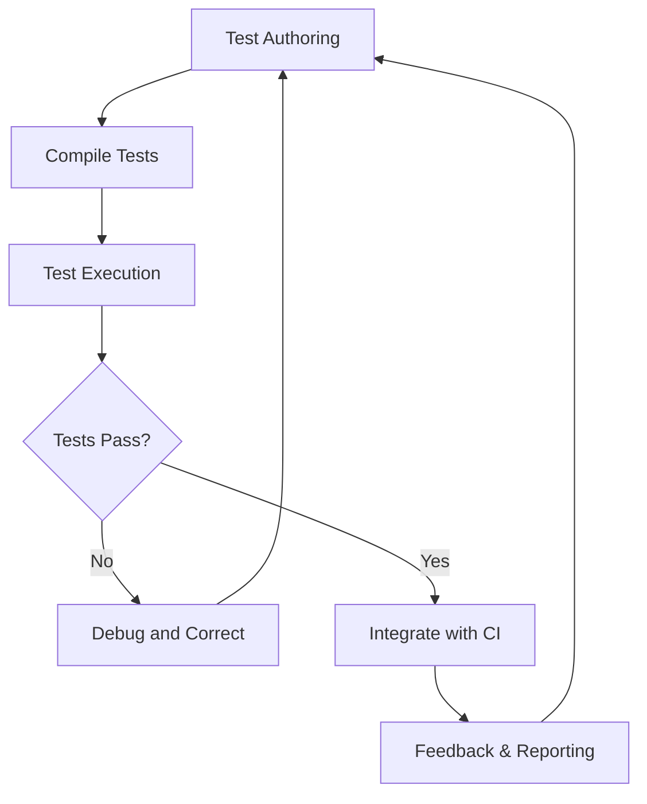

# Common Use Cases & Workflows

GoogleTest is designed primarily for C++ developers who want to write automated, maintainable, and reliable tests for their code. This page outlines typical scenarios and workflows where GoogleTest excels, illustrating how it can streamline development and improve test quality.

---

## Why GoogleTest Fits Your Workflow

Whether you are adopting Test-Driven Development (TDD), maintaining legacy code, or running large-scale regression tests, GoogleTest provides a versatile, scalable framework that adapts well to your challenges:

- **Write tests early and often:** GoogleTest’s simple yet powerful assertions and fixtures encourage TDD, enabling you to write tests before production code is complete.
- **Catch regressions fast:** Automated test discovery and easy integration into build systems let you quickly verify that changes don’t break existing functionality.
- **Maintain legacy systems:** for codebases without existing tests, GoogleTest simplifies adding coverage incrementally, improving confidence over time.
- **Scale with confidence:** GoogleTest supports parameterized and typed tests, facilitating broad coverage with minimal code duplication.


## Typical Use Cases

### 1. Test-Driven Development (TDD)

**Goal:** Design and implement clean, robust code by writing tests first.

**How GoogleTest Helps:**
- Encourages writing lightweight, expressive tests that verify one behavior at a time.
- Supports simple test fixtures to set up common test data.
- Allows fine-grained assertions with rich diagnostics when tests fail.

**Example:**

```cpp
#include <gtest/gtest.h>

class Calculator {
public:
  int Add(int a, int b) { return a + b; }
};

TEST(CalculatorTest, AddsTwoNumbers) {
  Calculator calc;
  EXPECT_EQ(calc.Add(2, 3), 5);
}
```

Writing tests like this first creates a specification and drives clean implementation.


### 2. Regression Testing

**Goal:** Ensure that code changes do not inadvertently break existing functionality.

**How GoogleTest Helps:**
- Automatic discovery of tests without manual registration.
- Ability to group tests in suites for focused or comprehensive test runs.
- Supports filtering tests by name or tag, speeding iterative development cycles.
- Integrates with CI tools and test runners for automated runs on every push.


### 3. Legacy Code Refactoring

**Goal:** Increase code safety and maintainability by adding tests around complex existing code.

**How GoogleTest Helps:**
- Lightweight test fixtures enable wrapping legacy components with minimal overhead.
- Parameterized tests allow sweeping coverage over input variants.
- Support for mocking via GoogleMock lets you isolate units under test from dependencies.


### 4. Continuous Integration (CI) Workflows

**Goal:** Incorporate automated testing into your development pipeline.

**How GoogleTest Helps:**
- Exit codes indicate success or failure, ideal for CI environments.
- Supports test retries and flaky test detection.
- Generates XML reports consumable by CI dashboards.


### 5. Cross-Platform Development

**Goal:** Write tests that run consistently across supported OSes and compilers.

**How GoogleTest Helps:**
- Works seamlessly on Linux, Windows, and MacOS.
- Supports multiple CI environments with minimal configuration.


---

## Example Workflow: Writing and Running Tests

1. **Write your test:** Create a test file using GoogleTest macros like `TEST` or `TEST_F`.
2. **Build your tests:** Use your build system (CMake, Bazel, etc.) to compile your test binaries.
3. **Run your tests:** Execute the binary. GoogleTest will automatically register and run all tests.
4. **Review results:** Inspect pass/fail status, error messages, and stack traces.
5. **Iterate:** Fix code or tests based on feedback.


## Best Practices and Tips

- **Keep tests focused:** Each test should verify a specific behavior or scenario.
- **Use test fixtures for shared setup:** Reuse common initialization code with `TEST_F` or parameterized tests.
- **Leverage GoogleMock for dependencies:** To isolate units of code, mock collaborators with gMock.
- **Name tests descriptively:** Make it easy to understand purpose and failure reasons.
- **Run tests frequently:** Integrate them into your developer workflow and CI pipeline.


## Related Workflows

- For mocking dependencies in your tests, see [Test Doubles with GoogleMock](https://google.github.io/googletest/guides/core-testing-workflows/test-doubles-with-googlemock).
- To learn how to use assertions and matchers effectively, visit [Using Assertions and Matchers](https://google.github.io/googletest/guides/core-testing-workflows/using-assertions-and-matchers).


## Visual Workflow Overview




---

## Troubleshooting Common Issues

- If tests do not run, ensure that your build includes the test sources and that you run the test binary.
- For flaky or timing-dependent tests, consider isolating shared resources or using synchronization primitives.
- Use `--gtest_filter` to run specific tests.
- Consult the [Legacy gMock FAQ](https://google.github.io/googletest/gmock_faq.html) for common mocking pitfalls.


## Getting Started Next Steps

- Explore the [Writing Your First Test](https://google.github.io/googletest/guides/getting-started/writing-your-first-test) guide.
- Learn about [Setting Expectations with GoogleMock](https://google.github.io/googletest/gmock_cook_book.html#setting-expectations).
- Understand core concepts in [Key Concepts and Terminology](https://google.github.io/googletest/overview/core_concepts_and_architecture/key_concepts_and_terminology).


---

GoogleTest’s versatility enables it to fit naturally into most C++ development workflows, from TDD to legacy refactoring, accelerating development while improving quality and confidence.


---

**End of Common Use Cases & Workflows documentation.**
