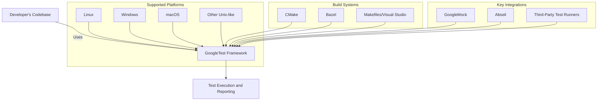

# Supported Platforms and Integration Ecosystem

GoogleTest is designed for seamless adoption across diverse C++ development environments. This documentation page details which platforms and build systems GoogleTest supports, highlights key integrations with popular tools like Abseil, Bazel, and CMake, and explores its cross-platform compatibility that ensures robustness and ease of use regardless of your operating system or development toolchain.

---

## Why This Matters

In today’s heterogeneous development landscape, testing frameworks must fit smoothly into your platform and tooling ecosystem. GoogleTest’s broad platform and build system support empowers you to write, build, and run tests consistently whether on Linux, Windows, or macOS, using your preferred build system or integrating with other key libraries and test runners.

This page helps you understand exactly where GoogleTest fits into your environment, so you can skip trial and error and focus on writing meaningful tests.

---

## Platforms Supported by GoogleTest

GoogleTest strictly follows Google's [Foundational C++ Support Policy](https://opensource.google/documentation/policies/cplusplus-support), ensuring compatibility with widely used operating systems and compilers. It supports:

- **Operating Systems:** Linux, Windows (including MinGW), macOS, and other Unix-like systems.
- **Compilers:** GCC (various stable versions), Clang, Microsoft Visual Studio (from VS2015 onward), and more.
- **Mobile and Embedded:** Limited support, with some features disabled on mobile or embedded platforms due to OS limitations.

GoogleTest uses internal macros to detect platforms and compiler features automatically, but users can override detection if necessary (e.g., to enforce multithreaded support or disable pthreads).

For detailed platform support and compiler versions, see the [Supported Platforms document](https://github.com/google/oss-policies-info/blob/main/foundational-cxx-support-matrix.md).

---

## Build Systems Integration

GoogleTest is easy to build and integrate using a variety of popular C++ build tools, making it adaptable to your project’s needs.

### CMake Integration

- **Native CMake Support:** GoogleTest ships with a comprehensive `CMakeLists.txt` enabled for a wide range of platforms.
- **Standalone Build:** You can clone the GoogleTest repository and build it independently using CMake.

```bash
mkdir build
cd build
cmake ..
make
sudo make install
```

- **Embed in Existing Projects:** Add GoogleTest to your CMake project with `add_subdirectory()` or by using `FetchContent` to download it during configuration phase.

- **Flags:** Requires C++17 standard. CMake handles compiler/linker settings, including threading and runtime library options.

### Bazel

- GoogleTest integrates tightly with Bazel, Google's build engine. You can declare dependencies on GoogleTest targets within Bazel WORKSPACE and BUILD files.
- It supports Bazel's caching and parallel execution, optimizing test builds and runs.

### Other Build Systems

- Integration with makefiles, Visual Studio projects, and other build systems is straightforward by pointing to GoogleTest source and include directories.

- GoogleTest provides clear guidance on compiler flags, exception handling, and linking strategies for smooth builds.

---

## Key Integration Partners

GoogleTest is often part of a larger testing and development ecosystem. It includes or works seamlessly with:

- **Abseil:** A foundational C++ library from Google providing utilities, including flags parsing and string utilities. When built with Abseil, GoogleTest uses Abseil’s flag management and regex libraries for improved performance and consistency.

- **GoogleMock:** GoogleTest's mocking framework is included automatically when building GoogleTest with GoogleMock enabled, allowing rich mocking capabilities in tests.

- **Build Tools:** Both CMake and Bazel, as described above, offer native or near-native support.

- **Third-Party Test Runners:** GoogleTest’s output formats enable integration with CI systems and test dashboard tools.

---

## Cross-Platform Compatibility Details

GoogleTest's internals abstract away platform-specific details:

- Uses conditional macros to enable features (e.g., exceptions, threading) only on supported platforms.
- Detects or requires pthread support on POSIX systems and Windows threading APIs where appropriate.
- Includes ways to disable or adapt features on limited platforms (mobile, embedded).
- Supports UTF-16 and standard string usage depending on platform encoding.

This ensures consistent test behavior and reporting regardless of underlying OS or compiler.

### Example: Enabling Multi-threaded Tests

GoogleTest detects pthread availability automatically but can be forced via compiler definitions:

```bash
-DGTEST_HAS_PTHREAD=1  # Force enable pthread support
-DGTEST_HAS_PTHREAD=0  # Force disable pthread support
```

When enabled, tests are thread-safe, which is critical for concurrent testing scenarios in many environments.

---

## Practical Tips for Platform and Integration Success

- Always verify your compiler supports at least C++17 to avoid build failures.
- Use CMake’s `FetchContent` or Bazel’s workspace declarations to manage GoogleTest as an external dependency.
- On Windows, be mindful of the runtime linkage flags (`gtest_force_shared_crt`) to avoid linker conflicts.
- For mobile or embedded platforms, check compatibility and consider disabling features like death tests if unsupported.
- Monitor the [Supported Platforms](https://github.com/google/oss-policies-info/blob/main/foundational-cxx-support-matrix.md) document for updates and official support changes.

---

## Getting Started Preview

To integrate GoogleTest into your project:

1. Identify your platform and preferred build system.
2. Follow build instructions to clone and build GoogleTest or link it as a submodule/dependency.
3. Configure your build scripts (e.g., CMakeLists.txt) according to your platform’s requirements.
4. Optionally, enable GoogleMock if mocking is needed.
5. Start writing and running tests using the GoogleTest framework.

For detailed setup guidance, see:

- [Prerequisites and System Requirements](/getting-started/setup-intro/prerequisites-system-requirements)
- [Installation Methods](/getting-started/setup-intro/installation-methods)
- [Setting Up with CMake and Bazel](/guides/integration-best-practices/setting-up-with-cmake-and-bazel)

---

## Troubleshooting Common Integration Issues

<AccordionGroup title="Common Integration Pitfalls">
<Accordion title="Compiler Version Issues">
Ensure your compiler supports C++17 or higher. GoogleTest will not build with older standards.
</Accordion>
<Accordion title="Linker Conflicts on Windows">
Windows users often face runtime library conflicts when mixing dynamic and static runtimes. Use the `gtest_force_shared_crt` CMake option to align runtime linkage.
</Accordion>
<Accordion title="Pthread Detection Problems">
If GoogleTest doesn't detect pthread support correctly, manually define `-DGTEST_HAS_PTHREAD=1` or `0` depending on your environment.
</Accordion>
<Accordion title="Mobile Platform Feature Restrictions">
Some features such as death tests or stream redirection are disabled on embedded/limited platforms. Check platform macros and adapt accordingly.
</Accordion>
</AccordionGroup>

---

## Visual Overview Diagram



---

For full integration and platform details, refer to the official GoogleTest repository and the [Supported Platforms](https://github.com/google/oss-policies-info/blob/main/foundational-cxx-support-matrix.md) matrix.


<Callout>
Note: This page complements other introduction and setup documentation such as the [Product Overview](../introduction-and-core-concepts/product-overview), [Feature Overview](../features-and-getting-started/feature-overview), and [Setting Up with CMake and Bazel](../../guides/integration-best-practices/setting-up-with-cmake-and-bazel).
</Callout>

---

## References

- [GoogleTest Repository - README & Build Instructions](https://github.com/google/googletest/blob/main/README.md)
- [Supported Platform Policy & Matrix](https://github.com/google/oss-policies-info/blob/main/foundational-cxx-support-matrix.md)
- [GoogleTest Primer](../../docs/primer.md)
- [Customization Points & Compiler Support](internal/gtest-port.h, internal/gtest-port-arch.h)

---

End of Supported Platforms and Integration Ecosystem documentation.
