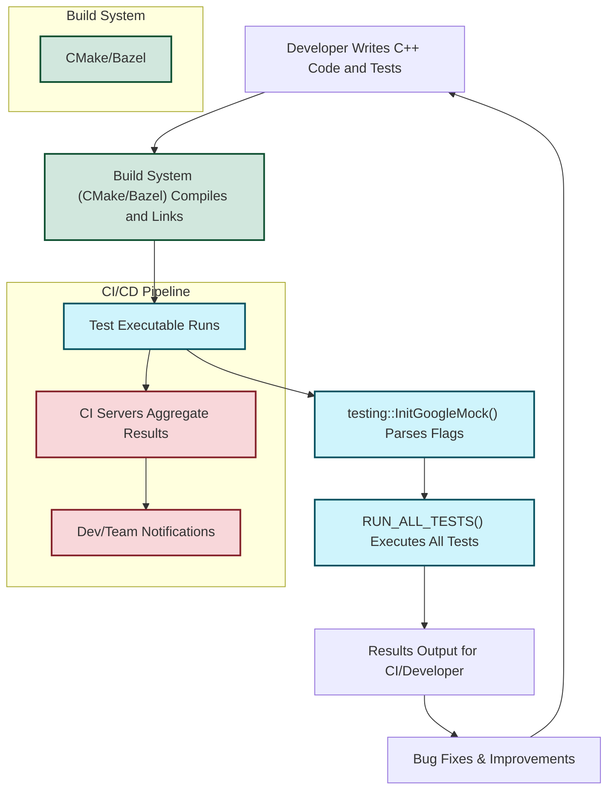

# Integration & Extensibility

GoogleTest and GoogleMock are designed to integrate seamlessly with modern C++ build ecosystems and to fit naturally into complex development workflows. This page outlines the straightforward integration processes with popular build tools like CMake and Bazel, details supported platforms, and explains how GoogleTest supports extensibility to meet diverse testing needs in Continuous Integration (CI/CD) and open source environments.

---

## Effortless Integration with C++ Build Tools

GoogleTest and GoogleMock prioritize simplicity in build integration, ensuring developers can focus on writing tests rather than navigating complex setup.

### CMake Support

While Google uses other internal build systems, GoogleTest and GoogleMock provide community-supported CMake build scripts that enable quick compilation and linking within CMake-based projects.

- The `gmock` and `gmock_main` libraries are defined and compiled via CMake, with options to build Google Mock’s own test suite.
- Users can link either against `gmock` for full control or `gmock_main` if they want Google Mock to provide the `main()` function automatically.
- Header directories for Google Test and Google Mock are added to include paths, enabling easy access to all testing facilities.
- The build options allow for toggling shared library builds and tests.

#### Example: Linking GoogleMock in your CMakeLists.txt
```cmake
find_package(GTest REQUIRED)
add_executable(my_tests test_main.cpp my_tests.cpp)
target_link_libraries(my_tests PRIVATE gmock_main)
```
This example shows linking against `gmock_main`, which provides the main function and initializes GoogleMock.

### Bazel Integration

GoogleTest has native support for Bazel, Google's own build tool, which ensures tight integration and performance optimizations in Bazel build environments. Users can easily add GoogleTest and GoogleMock to Bazel `BUILD` files and harness its capabilities in large-scale projects.


---

## Supported Platforms

GoogleTest supports a wide range of platforms, ensuring consistent test execution across different environments:

- Linux, Windows, and macOS as primary desktop platforms.
- Embedded systems such as ESP8266, ESP32, and NRF52 (with Arduino) supported via custom `setup()` and `loop()` handling instead of traditional `main()`.
- Support for cutting-edge and legacy platforms with specific considerations, including thread safety precautions on certain OSes.

This broad platform coverage ensures tests written once can be reliably run and verified anywhere, facilitating portable and maintainable codebases.

---

## Fit Within Larger CI/CD and Open Source Workflows

GoogleTest is engineered to integrate naturally within Continuous Integration and delivery pipelines, enabling automated quality assurance:

- Automatic test discovery and registering means no manual enumeration of tests for runners or CI tools.
- Test runs report detailed failure information, supports filtering, repetition, and output customization to fit any reporting or dashboarding needs.
- The `RUN_ALL_TESTS()` mechanism ensures consistent test execution with exit codes reflecting test results, perfect for CI success/failure detection.
- The community has extended GoogleTest with many integrations and wrappers to fit popular CI services and dashboards.

Open source projects widely use GoogleTest and GoogleMock due to their permissive BSD-style licensing and portability, combined with rich features that suit complex projects.

---

## Extending GoogleTest: Tools and Related Extensions

GoogleTest’s extensibility is a key asset, allowing it to adapt to various testing scenarios:

- **GoogleMock:** Comes integrated with GoogleTest and adds ability to create mock classes with rich expectation and verification capabilities. Mocking is crucial for isolating units and verifying interactions.
- **Custom Matchers and Actions:** Users can extend GoogleMock’s matcher and action sets to tailor test conditions and behaviors.
- **Flag Control:** Command-line flags parsed via `InitGoogleTest()` and `InitGoogleMock()` allow controlling verbose output, mock behaviors, and test settings dynamically with no code changes.
- **Community Extensions:** Other open source tools leverage GoogleTest’s architecture to provide plugins, IDE integration, and reporting facilities.

---

## Best Practices for Integration and Extensibility

- Prefer linking to `gtest_main` or `gmock_main` libraries when possible to avoid writing a custom `main()` function.
- Use the `testing::InitGoogleTest(&argc, argv);` or `testing::InitGoogleMock(&argc, argv);` initialization to properly parse and remove GoogleTest/GoogleMock-specific flags before running tests.
- Utilize CMake options to customize build types, threading libraries, or shared/static linking depending on your project needs.
- Combine GoogleMock's mocking features for sophisticated interaction testing in your projects seamlessly.
- Explore GoogleTest's flag options to customize verbosity and test execution parameters suited for CI environments.

---

## Troubleshooting Integration Issues

<AccordionGroup title="Common Integration Pitfalls">
<Accordion title="CMake Can't Find GoogleTest or GoogleMock">
Make sure that the CMake `find_package(GTest REQUIRED)` locates your installed GoogleTest package. Alternatively, add GoogleTest and GoogleMock as subdirectories or use FetchContent to include sources directly.
</Accordion>
<Accordion title="Linking Errors When Using gmock_main">
Check that your linker links against `gmock_main` and all dependencies properly. If using MSVC, ensure no conflicts with UNICODE or `_tmain` errors.
</Accordion>
<Accordion title="Test Flags Not Recognized in CI Environment">
Ensure that you call `InitGoogleTest()` or `InitGoogleMock()` with correct `argc` and `argv` from your test `main()` function to properly parse flags.
</Accordion>
</AccordionGroup>

---

## Get Started with Integration Now

To kick off integrating GoogleTest and GoogleMock into your project:

1. Choose your build system (CMake or Bazel).
2. Add GoogleTest and GoogleMock libraries to your build targets.
3. Link against `gmock_main` if you want automatic `main()` support.
4. Initialize your test program with `testing::InitGoogleMock(&argc, argv);`.
5. Build and run your tests.

From here, explore writing your first tests using the [GoogleTest Primer](https://github.com/google/googletest/blob/main/docs/primer.md) and adding mock objects per the [Mocking Reference](https://github.com/google/googletest/blob/main/docs/reference/mocking.md).

---

### Additional Resources

- [CMake Integration Script for GoogleMock](googlemock/CMakeLists.txt)
- [GoogleMock Main Source (`gmock_main.cc`)](googlemock/src/gmock_main.cc)
- [GoogleTest Primer](docs/primer.md)
- [Mocking Reference](docs/reference/mocking.md)
- [GoogleMock Overview](googlemock/README.md)
- [CI/CD Integration Guide (Advanced Usage)](/guides/advanced_usage_best_practices/test_integration_build)

---

### How GoogleTest Fits in the Build and Release Workflow



This flowchart illustrates where integration and extensibility play critical roles—from build system setup to test execution and CI integration.

---