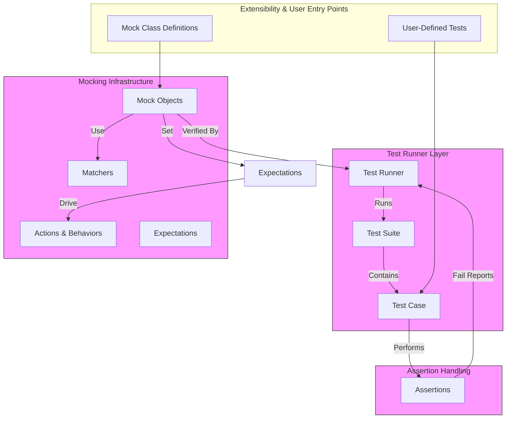

# System Architecture (with Diagram)

## Understanding GoogleTest's Internal Structure

GoogleTest is a powerful and flexible C++ testing framework designed to help developers write, organize, and run unit tests efficiently. Beneath its user-facing simplicity lies a thoughtfully composed system of interrelated components that manage key testing functionalities such as assertions, test execution, matchers, and mocks.

This page delves into GoogleTest's internal architecture, providing a clear understanding of how its major components collaborate to enable robust, extensible testing workflows. By grasping this architecture, you can better appreciate GoogleTest's design choices and extend or troubleshoot your tests more effectively.

---

## High-Level System Components

At the heart of GoogleTest's architecture are several pivotal modules that work together:

- **Assertions**: The mechanisms enabling test conditions to be checked and failures to be reported accurately.
- **Test Runners**: Core engines responsible for discovering, executing, and managing test cases.
- **Matchers**: Flexible predicates used for validating argument values in mock function calls.
- **Mocks**: Infrastructure enabling the creation of mock objects to simulate and verify behavior of code dependencies.

Each plays a unique role:

- **Assertions** confirm test expectations.
- **Runners** orchestrate test execution lifecycle.
- **Matchers** provide expressive power to specify call argument conditions.
- **Mocks** enable separation of testing concerns through dependency isolation.

---

## Data Flow and Interaction

The following diagram illustrates the high-level data flow and interaction points between major components within GoogleTest:

---

## Component Descriptions

### Assertions
Assertions form the backbone of verifying individual test expectations. They evaluate test conditions and report success or failure with rich diagnostic messages. Assertions seamlessly integrate with the test runner to influence test results.

### Test Runner
The test runner is the executive layer managing the entire test lifecycle from discovery to reporting. It iterates over suites and test cases, executes assertions, collects results, and communicates status back to users.

### Matchers
Matchers provide an expressive DSL allowing tests to specify fine-grained conditions on function call arguments within mocks. They support a broad range of built-in matchers and enable custom definitions for complex argument validation.

### Mocking
GoogleTest’s mock framework (gMock) facilitates behavioral testing by allowing developers to create mock classes. These mocks capture interaction patterns, specify method call expectations, control behavior through actions, and verify outcomes automatically.

---

## Extensibility Points and User Integration

GoogleTest was designed with extensibility as a core principle. You can introduce your own test cases and mock classes seamlessly.

- **Writing Tests**: Users define tests in C++ using supplied macros. These map into the test runner’s `TestCase` and `TestSuite` structures.
- **Creating Mocks**: Using provided macros (e.g., `MOCK_METHOD`), users define mock classes which integrate within the mocking layer.

Such design ensures a consistent developer experience while providing powerful underlying infrastructure.

---

## Practical Example: Mocking a Turtle Interface

Consider a graphics application drawing shapes using a `Turtle` interface. GoogleTest allows you to create a `MockTurtle` class that simulates this interface, verifies correct method call sequences, and controls return values. This example highlights how the system components interact:

1. The **user defines** `MockTurtle` using `MOCK_METHOD` macros.
2. In a test, **expectations** are set on the mock object's methods.
3. The test code exercises the mocked interface.
4. The **mocking infrastructure** tracks calls, validating them against matchers and expectations.
5. **Assertions** verify the outcomes, and the **test runner** collects results.

This rigorous but flexible interaction shows the synergy among all system components.

---

## Key Takeaways

- GoogleTest’s architecture is layered, separating concerns between assertion handling, test execution, and mocking.
- The mocking framework is a powerful, integral part that offers extensive configurability for simulating complex interactions.
- Extensibility is achieved through clear interfaces and macros that simplify user contributions.
- Understanding these connections empowers advanced usage, debugging, and extensions of your testing workflows.

---

## Next Steps

1. Explore the [Core Concepts and Terminology](../intro-concepts/core-concepts-terminology.md) documentation to understand key testing terms.
2. Review the [Quick Feature Overview](../features-architecture/feature-overview.md) for a broader perspective on GoogleTest’s capabilities.
3. Dive deeper into [Advanced Mocking Techniques](../../guides/advanced-usage-and-integration/advanced-mocking.md) to harness the full power of gMock.

---

## References

- [GoogleMock Documentation](https://github.com/google/googletest/tree/main/googlemock)
- [gMock for Dummies](https://google.github.io/googletest/gmock_for_dummies.html)
- [GoogleTest GitHub Repository](https://github.com/google/googletest)

---

