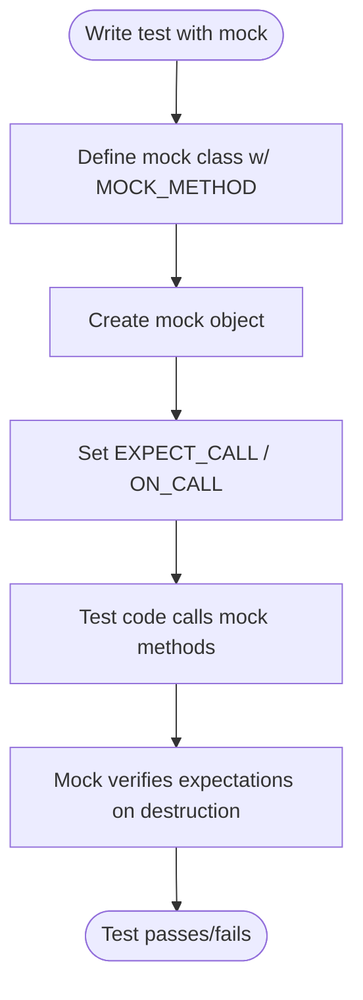

# GoogleMock & Advanced Testing

## Introduction

GoogleMock (gMock) is Google’s powerful C++ framework that simplifies creating and managing mock objects for unit testing. It extends the GoogleTest framework with expressive Domain Specific Languages (DSLs) for specifying mock behaviors, expectations, and strictness policies on test doubles.

This page details what distinguishes GoogleMock in the C++ mocking ecosystem: its rich components for specifying actions and matchers, mechanisms to control mock strictness, and how it integrates seamlessly within GoogleTest's environment.

---

## Mock Classes and Methods

### Defining Mock Classes

GoogleMock lets you create mock classes by inheriting from your interface and using the `MOCK_METHOD` macro to declare mock methods. This macro mirrors your method declarations, making mocks straightforward and type-safe.

For example, given an interface:

```cpp
class Foo {
 public:
  virtual ~Foo();
  virtual int GetSize() const = 0;
  virtual std::string Describe(const char* name) = 0;
};
```

you define a mock like:

```cpp
class MockFoo : public Foo {
 public:
  MOCK_METHOD(int, GetSize, (), (const, override));
  MOCK_METHOD(std::string, Describe, (const char* name), (override));
};
```

Mock methods are always declared in the `public:` section regardless of the original method’s visibility. This enables GoogleMock’s internal mechanisms to invoke and monitor calls properly.

### Mocking Overloads & Templates

GoogleMock supports overloaded methods and class templates without special syntax beyond standard C++ template and override declarations. Overloads can be disambiguated using matchers or by explicitly specifying the expected qualifier.

### Actions and Expectations

Mocks don’t provide real implementations by default. Instead, you specify their behavior and expected usage via expectations (`EXPECT_CALL`) and default behaviors (`ON_CALL`).

- `EXPECT_CALL(mock, Method(args))` sets an expectation the method must be called with specified matchers.
- `ON_CALL(mock, Method(args))` sets the default behavior when no explicit expectations apply.

You can describe how the mock should react (return values, side effects) using **actions** like `Return()`, `Invoke()`, and many others detailed in the [Actions Reference](actions.md).

---

## Matchers and Argument Verification

Matchers express what arguments the mock methods are expected to receive during the test. GoogleMock provides an extensive set of built-in matchers such as `_` (wildcard), `Eq()`, `Ge()`, and combinators like `AllOf()`, allowing precise control.

You can also define custom matchers using matchers macros (`MATCHER`, `MATCHER_P`) or implement matcher classes for complex validation logic.

Example usage:

```cpp
using ::testing::_;
using ::testing::Ge;
EXPECT_CALL(mock, DoSomething(Ge(5), _));
```

This expects the first argument to be at least 5 and the second argument to be anything.

---

## Strictness Policies: Nice, Naggy, and Strict Mocks

GoogleMock provides three wrapper templates to adjust the strictness of mocks around uninteresting calls (calls to mock methods without expectations):

- `NiceMock<T>`: Suppresses warnings about uninteresting calls.
- `NaggyMock<T>` *(default)*: Prints warnings for uninteresting calls.
- `StrictMock<T>`: Treats uninteresting calls as test failures.

For example, to create a nice mock:

```cpp
using ::testing::NiceMock;
NiceMock<MockFoo> mock_foo;
```

This flexibility helps you control noise during testing. Use `NiceMock` for tests where you want to ignore harmless calls, `StrictMock` to enforce tight expectations, and `NaggyMock` (default) to get warnings without breaking tests.

### Example: Strictness in Action

```cpp
EXPECT_CALL(mock_foo, DoThis());
mock_foo.DoThis();              // Allowed
mock_foo.DoThat();             // Warns if NaggyMock, fails if StrictMock, silent if NiceMock
```

---

## Sequences and Ordering

GoogleMock supports specifying _order constraints_ on expected calls.

- `InSequence`: Group expectations to ensure calls occur in a specified sequence.

```cpp
{
  ::testing::InSequence s;
  EXPECT_CALL(mock, Step1());
  EXPECT_CALL(mock, Step2());
}
```

Here, `Step1()` must occur before `Step2()`, otherwise an error is reported.

- `After`: Specify that an expectation should only be matched _after_ other expectations are satisfied.

This helps model complex partial orders in interactions.

---

## Default Values and Behavior Control

GoogleMock automatically provides default return values for mocked methods:

- `void` methods do nothing.
- Numeric methods return `0`.
- `bool` returns `false`.
- Default-constructible types return a default-constructed value.

You can customize these defaults globally or per type using `DefaultValue<T>::Set()` or per mock method with `ON_CALL()`.

---

## Advanced Features

### Delegation

Mocks can delegate calls to real implementations or fake objects to blend mock verification with actual behaviors.

### Side Effects

Actions such as `SetArgPointee()` let you mock methods that modify arguments.

### Asynchronous Testing

GoogleMock supports patterns to test asynchronous behavior deterministically using synchronization primitives.

---

## Integration with GoogleTest Ecosystem

GoogleMock is tightly integrated into the GoogleTest ecosystem. It leverages GoogleTest’s assertion macros, test runners, and provides detailed diagnostics when expectations fail.

Tests using GoogleMock behave like regular GoogleTest tests, with extra expressive power to verify interactions.

---

## Common User Workflows

1. Define and generate mock classes using `MOCK_METHOD` in your mock.
2. In your test:
   - Create mock objects (optionally wrapped as `NiceMock` or `StrictMock`).
   - Use `EXPECT_CALL` to define expectations.
   - Use `ON_CALL` to specify default behaviors.
   - Exercise the system under test.
3. GoogleMock will verify expectations automatically on mock destruction.

---

## Examples

### Declaring a Mock Class

```cpp
class MockFoo : public Foo {
 public:
  MOCK_METHOD(int, Bar, (int x, std::string y), (override));
  MOCK_METHOD(void, Baz, (), (override));
};
```

### Setting Expectations

```cpp
MockFoo mock;
EXPECT_CALL(mock, Bar(testing::_)).WillOnce(testing::Return(10));
mock.Bar(5);  // Returns 10
```

### Using Strict Mock

```cpp
StrictMock<MockFoo> strict_mock;
EXPECT_CALL(strict_mock, Baz());
strict_mock.Baz();
strict_mock.Baz();  // Fails test: called more than expected
```

### Ordering Calls

```cpp
{
  InSequence s;
  EXPECT_CALL(mock, Step1());
  EXPECT_CALL(mock, Step2());
}
mock.Step1();
mock.Step2();
```

---

## Troubleshooting

### Common Pitfalls

- Forgetting to set expectations before the calls happen can cause undefined behavior.
- Overly strict expectations can make tests brittle.
- Ignoring uninteresting calls through `NiceMock` reduces noise but might hide bugs.
- Pay attention to mock object lifetimes to ensure proper verification.

### Debugging Tips

- Use `--gmock_verbose=info` to enable detailed tracing of mock calls and expectations.
- Ensure your mocked methods are `virtual` and have virtual destructors.

---

## External Resources and Next Steps

- [gMock Cookbook](gmock_cook_book.md) — Practical recipes
- [gMock Cheat Sheet](gmock_cheat_sheet.md) — Quick syntax reference
- [gMock For Dummies](gmock_for_dummies.md) — Beginner-friendly introduction
- [Mocking Reference](reference/mocking.md) — API details

Explore the [GoogleTest overview](overview/features-at-a-glance/feature-overview) and relevant guides under the "Guides" tab for comprehensive learning.


---

## Diagram: GoogleMock Workflow Overview



---

For further details on mock strictness implementations and integration points, see [gmock-nice-strict.h](googlemock/include/gmock/gmock-nice-strict.h) and related test files.
