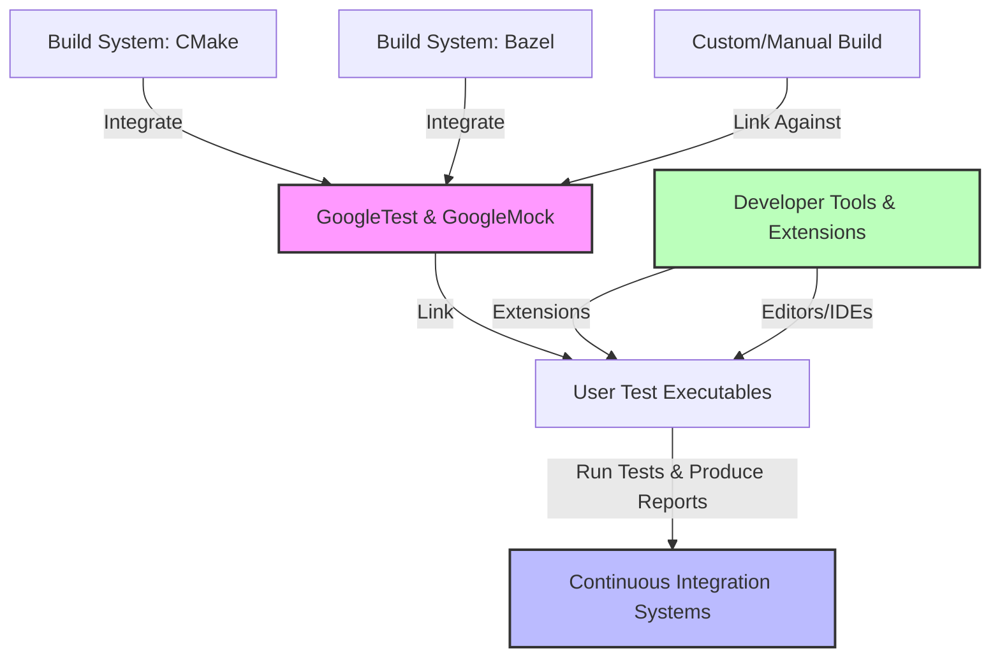

# Ecosystem & Build Integration

## Seamless Integration With Your Build and Test Environment

GoogleTest and GoogleMock are designed to blend effortlessly into modern C++ development workflows. Whether you are working on a small project or a large, complex codebase, they support your preferred build systems, continuous integration setups, and essential developer tools to ensure smooth onboarding and productivity.

### Supported Build Systems

- **CMake:** Fully supported with provided build scripts and exemplary integration patterns. GoogleTest and GoogleMock can be either built as standalone projects or included as subdirectories within your own CMake build, preserving compiler and linker consistency.

- **Bazel:** Native support exists to incorporate GoogleTest and GoogleMock as dependencies, enabling you to leverage Bazel’s caching and parallelism for efficient test builds.

- **Manual and Custom Builds:** If your project does not follow CMake or Bazel, GoogleTest supports manual compilation and integration using source files directly. This flexibility allows compatibility with a variety of legacy or bespoke build systems.


<Tip>
For CMake integration, you can use `FetchContent` to download and incorporate GoogleTest automatically, ensuring that the testing framework and your project share the same compiler settings and environment.
</Tip>

### Continuous Integration (CI) Compatibility

GoogleTest and GoogleMock integrate naturally with CI pipelines.

- Runners easily execute tests discovered automatically by GoogleTest.
- Test outputs are clean and structured, facilitating automated test result parsing.
- GoogleTest includes command-line flags to control verbosity, isolate flaky tests, and adjust failure behaviors in a CI context.


### Language and Platform Portability

GoogleTest supports C++17 or later, ensuring compatibility with modern standards. Platform portability macros and build flexibility ensure your tests work across desktop OSes, embedded environments, and even constrained platforms when properly configured.


## Popular Extensions and Adapters

To extend GoogleTest’s reach and interoperate smoothly with tools developers love, several extensions and adapters exist:

- **Visual Studio Code:** Integration plugins offer test discovery, inline test status, and navigation.

- **TAP Format:** Test Anything Protocol (TAP) adapters exist to emit test results in a standardized format, helping integrate with external test harnesses.

- **Parallel Test Runners:** Support for parallel test execution is available, either via GoogleTest’s own sharding mechanisms or external runners, enabling faster feedback loops.


### Typical User Flow for Build Integration

1. **Select your build system:** Choose between CMake, Bazel, or other supported environments.
2. **Incorporate GoogleTest/GoogleMock:** Use submodule, subdirectory, or package manager tools to add GoogleTest sources.
3. **Configure your targets:** Link your test executables against GoogleTest and GoogleMock libraries.
4. **Run tests:** Execute tests with auto-discovery by GoogleTest, optionally using test filters and command-line options.
5. **Integrate with CI:** Set up automated triggers to run your tests on push or pull request.


## Practical Examples

### Example: Adding GoogleTest to a CMake Project

```cmake
include(FetchContent)
FetchContent_Declare(
  googletest
  URL https://github.com/google/googletest/archive/5376968f6948923e2411081fd9372e71a59d8e77.zip
)
set(gtest_force_shared_crt ON CACHE BOOL "" FORCE)
FetchContent_MakeAvailable(googletest)

add_executable(my_tests test_main.cpp)
target_link_libraries(my_tests GTest::gtest_main GTest::gmock_main)
add_test(NAME my_tests COMMAND my_tests)
```

This configuration lets you build GoogleTest and GoogleMock as part of your project, linking and running tests seamlessly.

### Example: Running Tests in Parallel Using Sharding

GoogleTest supports test sharding to distribute tests across processes or machines.

```bash
# Run tests shard 1 of 3.
./my_tests --gtest_shard_index=0 --gtest_total_shards=3

# Run tests shard 2 of 3.
./my_tests --gtest_shard_index=1 --gtest_total_shards=3

# Run tests shard 3 of 3.
./my_tests --gtest_shard_index=2 --gtest_total_shards=3
```

This enables faster test execution in parallel CI environments or locally on multicore machines.


## Tips and Best Practices

- **Prefer declarative build integration:** Adding GoogleTest as a subdirectory or using `find_package` ensures better compatibility and maintenance.
- **Use `gtest_force_shared_crt` on Windows:** Prevents runtime conflicts related to dynamic versus static C runtimes.
- **Set C++ standard in your build:** GoogleTest needs at least C++17; ensure your project reflects this.
- **Silence uninteresting call warnings selectively:** Based on your test strategy, use NiceMocks or appropriate `EXPECT_CALL` to manage mock behaviors.
- **Leverage test filtering:** Use GoogleTest flags to run subsets of tests during development or CI.


## Troubleshooting Common Build Integration Issues

<AccordionGroup title="Common Issues">  
<Accordion title="Linker Errors When Using Visual Studio">  
**Problem:** Linker error due to runtime library mismatch (`MTd_StaticDebug` vs `MDd_DynamicDebug`).

**Solution:** Enable the CMake option `gtest_force_shared_crt` to match project's Crt linkage.

```cmake
set(gtest_force_shared_crt ON CACHE BOOL "" FORCE)
```

This harmonizes the C runtime library linkage between GoogleTest and your project.
</Accordion>  
<Accordion title="Tests Not Discovered or Executed">  
**Problem:** Tests appear to build but are not running or found.

**Solution:** Verify that your test binary links against `GTest::gtest_main` or provides a `main()` that calls `RUN_ALL_TESTS()`.

Also check command-line options for test filters that may skip all tests.
</Accordion>  
<Accordion title="Wrong Compiler Standard or Flags">  
**Problem:** Build fails due to unsupported C++ features or conflicting options.

**Solution:** Ensure your compiler uses at least C++17. In CMake, set:

```cmake
set(CMAKE_CXX_STANDARD 17)
set(CMAKE_CXX_STANDARD_REQUIRED ON)
```

Check that your project's flags are consistent, especially when integrating GoogleTest as a subproject.
</Accordion>  
</AccordionGroup>


## How GoogleTest and GoogleMock Fit in the Ecosystem




## Next Steps

- Visit [Installation with CMake](/getting-started/prerequisites-installation/installation-cmake) for a detailed walkthrough.
- Explore [Installation with Bazel](/getting-started/prerequisites-installation/installation-bazel) if using Bazel.
- Review [Basic Configuration & Project Setup](/getting-started/configuration-first-test/basic-configuration) to configure your test environment after integrating the framework.
- Consult [Solving Common Setup Problems](/getting-started/troubleshooting/common-errors) if you encounter difficulties integrating the test framework.


---

*For richer understanding of GoogleMock’s usage, consider reading the [Mocking Reference](reference/mocking.md) and [gMock for Dummies](gmock_for_dummies.md).*

<Check>
To optimize your integration experience, ensure your C++ environment supports at least C++17 and prefer the official build integration methods targeting CMake or Bazel.
</Check>
