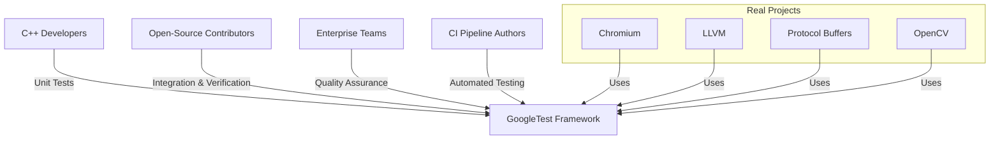

# Who Uses GoogleTest? Target Audiences & Use Cases

## Unlocking Value for Diverse C++ Development Communities

GoogleTest empowers a wide spectrum of users and projects with its robust and flexible C++ testing capabilities. Whether you're an individual developer aiming for bulletproof code, a contributor to complex open-source projects, or part of an enterprise team ensuring quality across sprawling codebases, GoogleTest is your testing ally.

### Key Audiences Benefiting from GoogleTest

- **Individual C++ Developers:** Quickly write, organize, and run unit tests to catch bugs early and maintain code health.
- **Open-source Project Contributors:** Facilitate rigorous testing in large projects, enabling reliable contributions and collaborative development.
- **Enterprise Teams:** Integrate GoogleTest across large-scale projects to enforce code quality, regression prevention, and continuous integration pipelines.
- **CI Pipeline Authors:** Employ GoogleTest in automated test suites to validate code on every commit, ensuring stability and continuous delivery.

## Real-World Use Cases: Proven at Scale

### Chromium

The Chromium project leverages GoogleTest extensively to maintain stability across its massive codebase. Developers use GoogleTest to define fine-grained unit tests that isolate modules, enabling confident incremental changes. With features such as parameterized tests and death tests, Chromium's test suites cover a wide variety of cases efficiently.

### LLVM

LLVM uses GoogleTest to construct rigorous tests for its compiler components. Contributors validate transformations and optimizations with clear, maintainable test cases that catch nuanced regressions. The framework’s flexibility aids in mocking compiler interfaces to simulate complex scenarios.

### Protocol Buffers

As a core serialization library, Protocol Buffers employs GoogleTest to guarantee backward compatibility and data integrity. Testing is integrated deeply in their development process, supporting multiple platforms and configurations effortlessly through GoogleTest’s rich set of assertions and test fixtures.

### OpenCV

OpenCV utilizes GoogleTest to ensure reliability of its computer vision algorithms. Developers craft tests that verify algorithm correctness across various input conditions, leveraging GoogleTest’s parameterized tests and custom assertions for detailed validation.

## Why GoogleTest? Tangible Benefits Across Use Cases

- **Comprehensive Testing Support:** Enables building tests that cover simple functions to complex subsystems.
- **Integration with Existing Workflows:** Fits seamlessly into build systems and continuous integration.
- **Enhanced Developer Productivity:** Minimal overhead in writing and maintaining tests.
- **Clarity and Maintainability:** Expressive macros and assertions lead to readable and descriptive test code.
- **Scalability:** Powers testing in projects from small libraries to large-scale, multi-million-line codebases.

## Summary

This page clarifies who benefits most from GoogleTest by spotlighting key user groups and illustrating concrete projects where it is a critical component. The detailed use cases from Chromium, LLVM, Protocol Buffers, and OpenCV demonstrate GoogleTest’s versatility and practical value. Whether you’re setting up your first unit tests or scaling tests in a worldwide collaborative project, GoogleTest is engineered to meet your needs.

---

<Callout title="Jumpstart Your Testing Journey">
Ready to see GoogleTest in action? Start with our [What is GoogleTest?](overview/product-intro/what-is-googletest) page for foundational knowledge, then explore [Mocking Basics](googletest-guides/advanced-mocking/mocking-basics) to build powerful test doubles.
</Callout>

---

### Additional Recommended Reading

- [Key Features Overview](overview/features-usecases/feature-tour) — for insight into GoogleTest’s primary capabilities.
- [Integration with Platforms and Tools](overview/features-usecases/integration-overview) — to learn how GoogleTest fits into your development ecosystem.
- [Architecture Overview](overview/product-intro/architecture-overview) — to understand the system’s modular design.

---

## Frequently Asked Questions

<AccordionGroup title="Who is GoogleTest designed for?">
<Accordion title="Is GoogleTest suitable for small projects or only large ones?">
GoogleTest scales beautifully — you can start using it for simple test cases in small projects and expand to large, integrated test suites in massive codebases.
</Accordion>
<Accordion title="Can GoogleTest be used in continuous integration environments?">
Absolutely, its design ensures tests integrate seamlessly into CI pipelines, providing immediate feedback on code quality.
</Accordion>
<Accordion title="Are there examples of successful enterprise adoption?">
Yes, many enterprise projects rely on GoogleTest for rigorous testing and fast iteration cycles.
</Accordion>
</AccordionGroup>

---

## Practical Tips for Users

- Begin by writing tests for critical components and incrementally cover your codebase.
- Use GoogleTest’s richness, like parameterized tests, to avoid duplication and enhance coverage.
- Leverage mocking (see [Mocking Reference](docs/reference/mocking.md)) to isolate units under test.
- Integrate GoogleTest reporting with your build and CI tools to maximize test visibility.

---

## Troubleshooting & Common Pitfalls

- **Missing Virtual Destructors:** Ensure interfaces that you mock have virtual destructors to avoid unexpected behavior.
- **Overly Rigid Tests:** Use parameterized and flexible matchers to prevent brittle tests.
- **Uninteresting Mock Calls Warnings:** Learn about NiceMock and StrictMock policies to manage mock call warnings effectively.

---

## Overview Diagram: GoogleTest Ecosystem Users

---