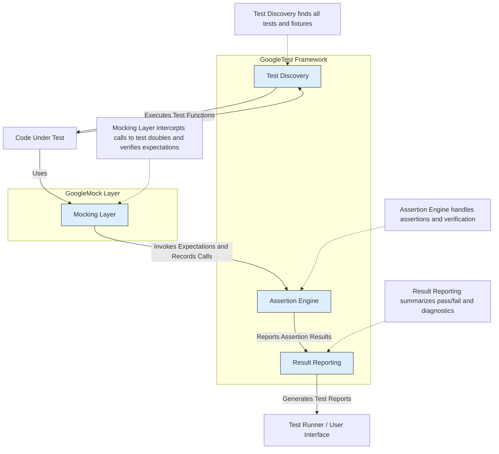

# System Architecture Overview

## Understanding the Core Components of GoogleTest and GoogleMock

This page provides a high-level architectural diagram of GoogleTest and GoogleMock, along with a clear explanation of their primary components, their interactions, and the flow of control and data during test execution. This overview will give you a conceptual foundation of how the testing and mocking framework pieces fit together, helping you to better understand its behavior and design.

---

## Key Value Proposition

GoogleTest and GoogleMock work cohesively to streamline C++ testing by providing a robust test discovery mechanism, an expressive assertion engine, comprehensive result reporting, and a powerful mocking subsystem. Understanding their architecture empowers you to write, execute, and troubleshoot tests effectively, making test management less complex and tests more reliable.

### Core Components

- **Test Discovery:** Automatically finds all test cases and test fixtures defined in your codebase without needing manual registration.
- **Assertion Engine:** Executes your test assertions with rich failure reporting to highlight mismatches precisely.
- **Result Reporting:** Collects, summarizes, and reports on test outcomes in a structured fashion.
- **Mocking Layer (GoogleMock):** Facilitates creating mock classes and setting expectations, actions, and behaviors seamlessly.

### Intended Audience

This overview is meant for developers, testers, and software architects who want to grasp the internal structure and interplay of the GoogleTest framework and GoogleMock for improved usage and troubleshooting.

---

## Architecture Diagram

---

## How It Works: The User Journey Through the Framework

### 1. Test Discovery

GoogleTest automatically scans your compiled test binaries to identify all tests and test fixtures. This discovery process eliminates the need to register tests manually, enabling an effortless build of test suites from scattered source files.

*Example:* When you build and run your tests, GoogleTest identifies every `TEST` and `TEST_F` without additional input.

### 2. Test Execution and Assertions

Once discovered, tests are executed, invoking the test code you wrote. During execution, GoogleTest evaluates your assertion statements. If an assertion fails, GoogleTest captures detailed information about the failure (expected vs actual values, source file, line number).

*Example:* If `EXPECT_EQ(foo, bar)` fails, the Assertion Engine pinpoints the exact location and prints a helpful message.

### 3. Mocking Layer Integration

Within test functions, GoogleMock allows you to create mock objects and define expectations on their behavior. When your test exercises these mocks, calls to mocked methods are intercepted, matched against defined expectations, and actions are executed (such as returning stub values, invoking callbacks).

*Example:* You set `EXPECT_CALL(mock, Foo()).WillOnce(Return(42));` in your test, and when `mock.Foo()` is called, GoogleMock verifies this call and returns `42`.

### 4. Result Reporting

Upon test completion, GoogleTest aggregates test outcomes, including passed and failed tests, and any assertion or mock verification failures. It produces structured reports and console output, allowing you to quickly grasp test coverage and failing points.

*Example:* The test runner shows summarized counts of tests run, passed, and failed, along with failure details.

---

## Component Highlights

### Test Discovery

- Scans for tests and fixtures at runtime.
- Supports test filters to selectively execute tests.

### Assertion Engine

- Provides expressive macros (e.g., `EXPECT_EQ`, `ASSERT_TRUE`).
- Handles fatal and non-fatal assertion types.
- Integrates with matchers for flexible argument evaluation.

### Result Reporting

- Captures detailed failure context.
- Supports XML output for tools integration.
- Provides hooks for custom listeners.

### Mocking Layer (GoogleMock)

- Enables defining mock classes using `MOCK_METHOD` macros.
- Supports setting expectations with `EXPECT_CALL`.
- Facilitates default behavior specification via `ON_CALL`.
- Verifies call orders, cardinalities, and argument matchers.
- Integrates with GoogleTest's assertion and reporting.

---

## Practical Tips

- **Write clear expectations with `EXPECT_CALL` to precisely verify interactions.**
- **Use `ON_CALL` for setting default mock behaviors without verification.**
- **Leverage sequences and `.After()` clauses to enforce call order.**
- **Use verbosity flags (`--gmock_verbose`) to troubleshoot unexpected calls.**
- **Call `Mock::VerifyAndClearExpectations()` if you need to verify mocks early.**

---

## Troubleshooting Common Scenarios

- **Unexpected Calls:** If a mock method is called with unexpected arguments, GoogleMock generates detailed failure messages. Use `--gmock_verbose=info` to trace calls.
- **Too Many Calls:** If a mock is called more than the expected number of times, an error is raised.
- **Uninteresting Calls:** Warnings appear when mock methods are called without expectations. Use `NiceMock` to suppress warnings when appropriate.

---

## Next Steps

Once you have this architectural overview, deepen your mastery by exploring:

- [Creating and Running Tests](/api-reference/core-apis/test-creation)
- [Defining Mock Objects and Expectations](/api-reference/mocking/mock-objects)
- [Using Matchers and Actions to Customize Behavior](/api-reference/mocking/mock-expectations-actions)

Understanding this overview will provide context and help you grasp the detailed technical guidance and use cases in those sections.

---

## References

- [GoogleTest Product Introduction: What is GoogleTest?](/overview/product-introduction/what-is-googletest)
- [Mocking Reference: Expectations, Actions, and Cardinalities](/api-reference/mocking/mock-expectations-actions)
- [gMock for Dummies](https://google.github.io/googletest/gmock_for_dummies.html)

---

*By understanding the flow from test discovery through mocking to result reporting, you are equipped to leverage the full power of GoogleTest and GoogleMock in your development cycles.*