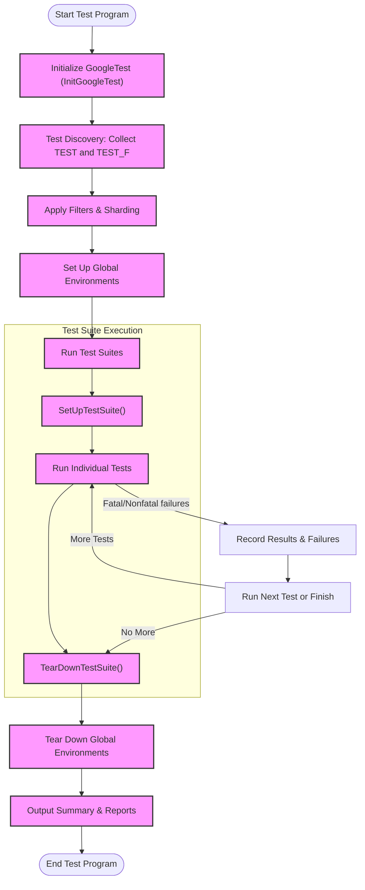

# Quick Feature Overview

Welcome to a rapid walkthrough of GoogleTest's core and advanced features. This page distills GoogleTest's rich capabilities into a concise snapshot, enabling you to understand what makes this framework uniquely powerful and versatile for C++ testing.

---

## What GoogleTest Offers at a Glance

GoogleTest is built on a firm xUnit foundation and enhanced with features designed to accelerate and simplify your testing workflow. Here are its highlights:

- **xUnit Architecture:** Organize tests into suites reflecting your code’s structure, improving readability and maintainability.

- **Automatic Test Discovery:** No need to manually register tests; GoogleTest finds and executes all your defined tests.

- **Rich Assertions:** Comprehensive set of assertion macros—equality, inequality, boolean conditions, floating-point comparisons, string matching, and exception testing—tailored for clear, informative failure messages.

- **User-Defined Assertions:** Define your own predicates and assertion results to tailor test feedback precisely to your needs.

- **Death Tests Support:** Easily verify that code exits as expected on fatal conditions, ensuring robust error handling.

- **Value-Parameterized Tests:** Run the same test logic across multiple input values without duplicating code, ideal for data-driven testing.

- **Type-Parameterized Tests:** Execute test logic against varied data types, verifying template-based code across use cases.

- **Flexible Test Execution Control:** Filter tests by name, shuffle test order, run subsets in parallel, manage disabled tests, and repeat tests to hunt down flakiness.

- **Custom Event Listeners:** Extend or replace output formats with custom listeners for integrating with build systems, CI, or GUIs.

- **Resource Sharing:** Setup and teardown shared fixtures at test suite or environment level to optimize costly resource management.

---

## Key Feature Highlights with Examples

### Assertions and Expectations
GoogleTest offers macros `EXPECT_*` (non-fatal) and `ASSERT_*` (fatal) to verify conditions:

```cpp
// Basic equality assertion
EXPECT_EQ(result, expected) << "Result doesn't match expected!";

// Boolean condition
ASSERT_TRUE(pointer != nullptr) << "Pointer should not be null";

// Exception checking
EXPECT_THROW(DoSomething(), std::runtime_error);
```

### User-Defined Predicate Assertions
To improve diagnostics for complex conditions:

```cpp
// Predicate returning AssertionResult with custom messages
testing::AssertionResult IsEven(int n) {
  if ((n % 2) == 0) return testing::AssertionSuccess() << n << " is even";
  else return testing::AssertionFailure() << n << " is odd";
}

// Usage
EXPECT_TRUE(IsEven(4));  // Passes
EXPECT_TRUE(IsEven(3));  // Fails with message: "3 is odd"
```

### Death Tests
Verify that code aborts or exits as expected:

```cpp
TEST(DeathTest, CrashesOnInvalidInput) {
  ASSERT_DEATH({ Process(-1); }, "Invalid input detected");
}
```

### Parameterized Tests
Run a test repeatedly against different input values:

```cpp
class FactorialTest : public ::testing::TestWithParam<int> {};

TEST_P(FactorialTest, CorrectFactorial) {
  int n = GetParam();
  EXPECT_EQ(Factorial(n), ExpectedFactorial(n));
}

INSTANTIATE_TEST_SUITE_P(Range, FactorialTest, testing::Range(0, 10));
```

### Typed Tests
Test template-based code over multiple types:

```cpp
template <typename T>
class NumericTest : public testing::Test {
  // Test logic using TypeParam
};

using MyTypes = testing::Types<int, double, float>;
TYPED_TEST_SUITE(NumericTest, MyTypes);

TYPED_TEST(NumericTest, IsPositiveAfterInit) {
  TypeParam value = TypeParam(1);
  EXPECT_GT(value, 0);
}
```

### Test Filtering and Execution Control
Run selective tests or control execution flow with flags:

- Use `--gtest_filter=TestSuiteName.TestName` to run specific tests.

- Disable a test or test suite by prefixing names with `DISABLED_`.

- Repeat tests with `--gtest_repeat=N` to catch flaky behavior.

- Randomize order using `--gtest_shuffle` to expose hidden dependencies.

---

## Practical Tips

- Use non-fatal `EXPECT_*` to continue testing after failures; use fatal `ASSERT_*` when further progress doesn’t make sense.

- Apply `SCOPED_TRACE()` to add context to failures inside loops or subroutines.

- Share expensive resources with `SetUpTestSuite()` and clean up with `TearDownTestSuite()`.

- Extend printing for your custom types by defining `AbslStringify()` or `PrintTo()` for clearer logs.

- Skip tests at runtime with `GTEST_SKIP()` when preconditions aren’t met.

---

## Visualization: How Test Discovery and Execution Flow



---

## Troubleshooting Common Issues

- **Tests Not Running:** Ensure tests are properly registered and not disabled with prefix `DISABLED_`.

- **Unexpected Test Failures After Changes:** Confirm fixtures are stateless between tests. Use `SetUp()` and `TearDown()` correctly.

- **Death Test Failures:** Validate your death tests use correct patterns; remember they run in separate processes.

- **Test Names with Underscores:** GoogleTest discourages underscores in test suite and test names to promote compatibility.

---

## Next Steps

To deepen your mastery, explore:

- [Core Concepts and Terminology](../foundations-and-architecture/core-concepts-and-terminology) for essential vocabulary.
- [System Architecture Overview](../foundations-and-architecture/architecture-overview) to understand internals.
- [Writing and Running Tests](../../../api-reference/core-apis/test-creation) for practical test development.
- [Assertion Reference](../../../api-reference/core-apis/assertions) to use assertions effectively.
- [Advanced Features](../advanced) for more on parameterized, typed, death, and custom tests.

---

This Quick Feature Overview is your gateway to leveraging GoogleTest's comprehensive C++ testing capabilities with confidence and efficiency.