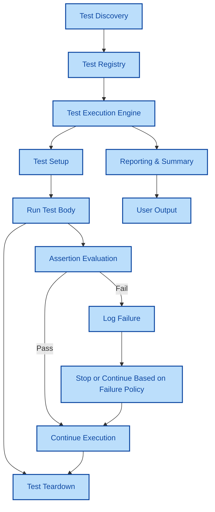

# System Architecture Overview

## Understanding GoogleTest's Core Components and Interactions

This page provides a clear visualization of how the essential components of GoogleTest collaborate during test discovery, execution, assertion evaluation, and reporting. Understanding these interactions can help you grasp how tests are managed, diagnose issues more effectively, and optimize your test setup.

### Why This Matters

When working with GoogleTest, knowing the flow of control and data between its components empowers you to write better tests, troubleshoot failures faster, and appreciate the design choices that make GoogleTest efficient and extensible. This overview ties together the workflow from test discovery to final reporting, providing an essential roadmap for both new users and experienced developers.

---

## Core Architecture of GoogleTest

GoogleTest operates through several interacting components, which together create a seamless, automated test framework:

- **Test Discovery**: Automatically identifies all registered tests and test cases.
- **Test Execution Engine**: Handles running tests, managing test lifecycles, and aggregating results.
- **Assertion Handlers**: Evaluate test conditions, capture failures, and control test flow based on verification outcomes.
- **Reporting Module**: Summarizes test outcomes, generates logs, and provides detailed failure reports.

At a high level, GoogleTest manages these components through a common flow:

1. Scans the codebase to discover registered tests.
2. Executes individual tests, invoking setup and teardown workflows.
3. Evaluates assertions to detect failures and logs.
4. Aggregates results and generates summary reports for the user.

### Visualizing This Flow

This diagram captures the backbone of GoogleTest's architecture, illustrating how components interconnect during a test run.

---

## Detailed Component Descriptions

### Test Discovery & Registration
- **What it does**: Automatically registers all tests as they are defined in your code using GoogleTest macros.
- **User benefit**: No manual test listing or registration is necessary, letting you focus on writing tests.

### Test Execution Engine
- **What it does**: Orchestrates running each test, including setup and teardown of test fixtures.
- **User benefit**: Ensures consistent environment per test and manages test lifecycle transparently.

### Assertion Evaluation
- **What it does**: Handles the verification of expectations and conditions in tests.
- **User benefit**: Immediate feedback when tests fail, with rich failure messages tied to the specific assertion.

### Reporting & Summary
- **What it does**: Collects pass/fail status, logs messages, and presents a comprehensive test outcome summary.
- **User benefit**: Clear, actionable test feedback facilitating rapid diagnosis and debugging.

---

## How This Fits With Other GoogleTest Documentation

- This overview connects with the [What is GoogleTest?](overview/product-introduction-and-value/what-is-googletest) page by elaborating on the internal flow beneath the high-level introduction.
- For those using mocking facilities, this flow integrates with [GoogleMock documentation](docs/gmock_for_dummies.md) by explaining how tests and mocks are part of the overall lifecycle.
- To move from architecture to practice, users can consult the [Getting Started guides](getting-started/first-test-experience/writing-your-first-test) to see these components in action via writing and running tests.

---

## Practical Tips & Best Practices

- **Understanding Failures**: Knowing that assertion evaluation immediately controls test flow helps when you see tests stopping prematurely; check which assertions failed.
- **Extending Tests**: Write custom setup and teardown within your tests, knowing they neatly wrap around test execution managed by the engine.
- **Performance Considerations**: Because GoogleTest manages tests independently, you can parallelize test execution without breaking the lifecycle.

---

## Troubleshooting Common Scenarios

<AccordionGroup title="Troubleshooting Test Lifecycle Issues">
<Accordion title="Test Not Running Despite Definition">
Ensure your test uses the correct GoogleTest macros to register, which interacts with the Test Registry component to discover it.
</Accordion>
<Accordion title="Tests Fail Prematurely or Skip Assertions">
Verify that none of the earlier assertions cause test abortion; by default, GoogleTest continues after failures, but fatal failures abort the test method.
</Accordion>
<Accordion title="Missing Failure Message or Report Details">
Check if the Reporting component is correctly configured; ensure output streams and environment variables affecting verbosity are set appropriately.
</Accordion>
</AccordionGroup>

---

## Getting Started Preview

To see this architecture in action:

1. Write your first test using the GoogleTest macros.
2. Run the test executable.
3. Observe the console output generated by the Reporting component reflecting execution and assertion results.

For detailed instructions, see [Writing & Running Your First Test](getting-started/first-test-experience/writing-your-first-test).

---

This understanding of GoogleTest's system architecture primes you to navigate its features more confidently and troubleshoot effectively.

---

*For more details about mocking and interaction testing, please refer to the [GoogleMock Documentation](docs/gmock_for_dummies.md) and [Mocking Reference](docs/reference/mocking.md).*

---

## Source

<Source url="https://github.com/google/googletest" paths={[{"path": "googlemock/src/gmock-spec-builders.cc", "range": "1-468"}]} />
