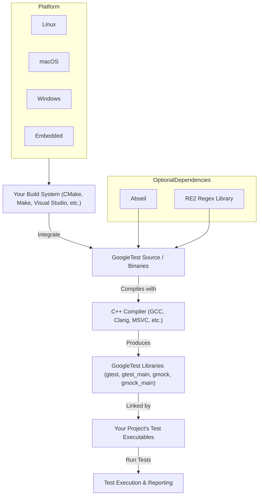

# Integration and External Dependencies

GoogleTest is designed to fit seamlessly into a wide range of C++ development environments. This page outlines how GoogleTest integrates with your existing codebase, build systems, and third-party dependencies, detailing supported platforms and highlighting upcoming shifts such as optional reliance on Abseil. Whether you're working on a simple unit test framework or integrating GoogleTest within a complex CI/CD pipeline, understanding these integration points empowers you to maximize reliability and maintainability.

---

## Broad Platform Support

GoogleTest supports a diverse set of platforms and compiler ecosystems, enabling developers to confidently write tests across multiple operating systems and hardware configurations. This includes, but is not limited to:

- Linux distributions
- macOS
- Windows (including Visual Studio environments)
- Embedded and specialized systems with varying compiler capabilities

This wide compatibility ensures GoogleTest can be used in nearly any C++ project regardless of platform constraints.

## Build System Compatibility and Strategies

GoogleTest is flexible in how it can be incorporated into your build process. Its CMake support is community-driven but robust, offering tailored approaches to suit different project needs.

### Standalone Builds vs. Integration

You can build GoogleTest as a standalone project or incorporate it directly into an existing CMake-based build:

- **Standalone Build:** Clone the repository, create a build directory, run CMake to generate native build files, then build using your platform's native tools (e.g., `make` on Linux/macOS, Visual Studio on Windows).
- **Integrated Build:** Add GoogleTest source as a subdirectory in your CMake project using `add_subdirectory()`. This ensures consistent compiler and linker flags, enhancing compatibility especially on Windows where runtime conflicts are common.

### Finding Installed Packages

If GoogleTest libraries are installed on your system, you can import them using CMake’s `find_package()` command:

```cmake
find_package(GTest CONFIG REQUIRED)
# Link your test targets
target_link_libraries(your_test_target GTest::gtest GTest::gtest_main)
```

This method is ideal for projects that prefer to rely on system-installed GoogleTest packages.

### Dynamic vs. Static Runtime Linking on Windows

Visual Studio users may encounter runtime library conflicts due to GoogleTest linking statically by default while new projects often link dynamically. This is addressable by enabling the CMake option `gtest_force_shared_crt`, which forces GoogleTest to link against the dynamic runtime, avoiding linker errors and binary incompatibilities.

## Upcoming Dependencies: Abseil and RE2

GoogleTest is evolving to optionally leverage Abseil and RE2 libraries for enhanced features and performance. These dependencies are currently disabled by default but can be enabled if your project already incorporates Abseil and RE2:

```cmake
option(GTEST_HAS_ABSL "Use Abseil and RE2" OFF)
if(GTEST_HAS_ABSL)
  find_package(absl REQUIRED)
  find_package(re2 REQUIRED)
endif()
```

Using these modern libraries can improve regex handling and provide integration advantages in new development environments.

## Threading and Synchronization

GoogleTest adapts to your platform’s threading capabilities:

- It automatically detects pthread support on POSIX systems and integrates accordingly.
- On Windows, it uses native synchronization primitives.
- Provides macros to configure thread safety if automatic detection is insufficient.

This ensures that your multithreaded tests behave reliably without requiring manual configuration in most environments.

## Configurable Build Flags

GoogleTest supports customization through compiler macros that control features such as:

- Enabling or disabling pthread support
- Building GoogleTest as a shared or static library
- Avoiding macro name clashes by prefix renaming

Careful use of these flags allows GoogleTest to adapt to special use cases and complex build environments.

## Integration Examples

### Adding GoogleTest via FetchContent in CMake

Including GoogleTest sources directly into your project provides uniformity and ease of maintenance:

```cmake
include(FetchContent)
FetchContent_Declare(
  googletest
  URL https://github.com/google/googletest/archive/5376968f6948923e2411081fd9372e71a59d8e77.zip
)
set(gtest_force_shared_crt ON CACHE BOOL "" FORCE)
FetchContent_MakeAvailable(googletest)

add_executable(example example.cpp)
target_link_libraries(example gtest_main)
add_test(NAME example_test COMMAND example)
```

This approach automatically downloads, configures, and builds GoogleTest alongside your code.

### Visual Studio Solution Generation

When using CMake on Windows with Visual Studio, CMake generates solution and project files (`gtest.sln`, `.vcproj`), allowing you to build and debug GoogleTest from the IDE seamlessly.

---

## Summary Diagram of Integration Flow



This diagram shows GoogleTest's role as a compiled library integrated via your build system, optionally enhanced by Abseil and RE2, across supported platforms.

---

## Practical Tips & Best Practices

- **Consistent Compiler Flags:** When embedding GoogleTest source in your project, ensure your compiler flags are consistent across your project and GoogleTest to avoid runtime mismatches.
- **Use CMake Integration:** Favor `add_subdirectory()` or `FetchContent` for integrating GoogleTest rather than manual copying for better maintainability.
- **Manage Runtime Library Settings on Windows:** Use `gtest_force_shared_crt` to align GoogleTest's runtime linkage with your project.
- **Enable Thread Safety Explicitly:** If you encounter threading issues, verify or set the `-DGTEST_HAS_PTHREAD` macro explicitly.
- **Avoid Macro Clashes:** Use macros like `-DGTEST_DONT_DEFINE_TEST=1` if your project or dependencies define conflicting macros.

## Troubleshooting Common Integration Issues

- **Build Failures with Mismatched Runtimes:** Ensure that `gtest_force_shared_crt` matches your project’s runtime flags on Windows.
- **Linker Errors Missing pthread:** On POSIX systems, confirm your linker flags include pthread (`-lpthread`) if you're not using the provided CMake scripts.
- **Version Conflicts:** When GoogleTest is embedded as a submodule or via source, regularly update it to keep compatibility with compilers and dependencies.

---

## Next Steps

After understanding integration and dependencies, enhance your testing workflows by exploring:

- [What is GoogleTest?](overview/product-introduction-and-value/what-is-googletest)
- [Core Features at a Glance](overview/product-introduction-and-value/core-features-at-a-glance)
- [Project Setup & Configuration](getting-started/first-test-experience/project-setup)
- [Writing & Running Your First Test](getting-started/first-test-experience/writing-your-first-test)

These resources provide comprehensive guidance on leveraging GoogleTest in real-world projects.

---

<Source url="https://github.com/google/googletest" branch="main" paths={[{"path": "README.md", "range": "0-278"},{"path": "cmake/internal_utils.cmake", "range": "1-176"}]} />
