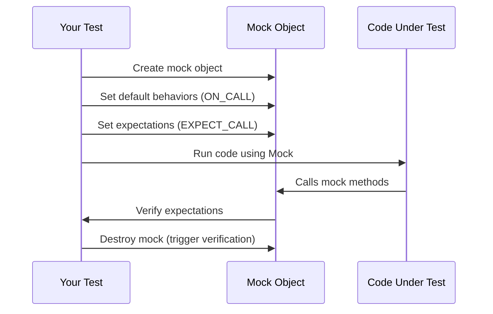

# Quickstart & Typical Workflow

Welcome to your fast track for getting started with GoogleTest and GoogleMock! This guide lays out the essential steps to set up your environment, write your first mock-enabled test, and run it to gain instant feedback. Whether you're new to unit testing in C++ or integrating mocking into your workflow, this page guides you through a clear path to productivity.

---

## Why This Workflow? 

Embarking on writing tests with GoogleTest and GoogleMock can seem daunting, especially if you’re unfamiliar with their setup and usage patterns. This page focuses on what you really need to do to get a test running quickly — avoiding distractions around deep implementation details so you can feel productive immediately.

---

## Getting Ready: Prerequisites

Before you dive into writing tests, ensure:

- Your development environment supports your platform (Linux, Windows, Mac).
- GoogleTest and GoogleMock libraries are installed and accessible in your project.
- You have a C++ project with virtual interfaces or classes you'd like to test or mock.

For detailed installation instructions, see the [System Requirements](../../getting-started/prerequisites-installation/system-requirements) and [Installation (All Platforms)](../../getting-started/prerequisites-installation/installation-platforms) pages.

---

## Step 1: Include GoogleTest and GoogleMock Headers

To write tests and mocks, start by including the essential headers.

```cpp
#include <gtest/gtest.h>
#include <gmock/gmock.h>
```

These bring in the necessary macros, classes, and utilities for defining tests and mocks.

---

## Step 2: Define Your Mock Class

Mocks are the heart of interaction-based testing. Define a mock class by inheriting from the interface or base class you want to mock and applying `MOCK_METHOD` macros for each virtual method.

For example, for an interface `Foo`:

```cpp
class Foo {
 public:
  virtual ~Foo() {}
  virtual int GetSize() const = 0;
  virtual std::string Describe(const char* name) = 0;
  virtual bool Process(int x, double y) = 0;
};

class MockFoo : public Foo {
 public:
  MOCK_METHOD(int, GetSize, (), (const, override));
  MOCK_METHOD(std::string, Describe, (const char* name), (override));
  MOCK_METHOD(bool, Process, (int x, double y), (override));
};
```

**Key Tips:**
- Place all `MOCK_METHOD` declarations in the `public:` section, even if base methods are protected or private.
- Use the `override` qualifier for clarity and safety.

---

## Step 3: Write a Test Using Your Mock

Use `TEST` or `TEST_F` macros to define test cases. Within the test,

1. Instantiate your mock object.
2. Define expectations with `EXPECT_CALL` — specifying how many times and with what arguments methods will be called.
3. Optionally, specify behavior with actions like `.WillOnce(Return(value))`.
4. Exercise the code under test.
5. Verify outcomes using assertions.

Example:

```cpp
using ::testing::Return;
using ::testing::_;

TEST(FooTest, GetSizeReturnsValue) {
  MockFoo mock_foo;

  EXPECT_CALL(mock_foo, GetSize())
      .Times(1)
      .WillOnce(Return(10));

  int size = mock_foo.GetSize();
  EXPECT_EQ(size, 10);
}
```

---

## Step 4: Run Your Tests

Initialize the GoogleTest framework and invoke all registered tests with:

```cpp
int main(int argc, char **argv) {
  ::testing::InitGoogleTest(&argc, argv);
  return RUN_ALL_TESTS();
}
```

Compile and run your test executable; GoogleTest will discover and run all tests.

If everything is set up correctly, you should see output indicating your test passed or failed.

---

## Best Practices and Tips

- **Set expectations before exercising the mock:** `EXPECT_CALL` must be called before the mock methods are invoked; otherwise, behavior is undefined.
- **Use matchers for argument validation:** Use `_` to accept any argument or specific matchers to assert specific argument constraints.
- **Choose mock strictness wisely:** Use `NiceMock` to suppress warnings on unexpected calls or `StrictMock` to treat unexpected calls as failures.
- **Leverage sequences and ordering:** Use `InSequence` or `Sequence` objects to enforce call order when necessary.
- **Set default actions with `ON_CALL`:** To specify behavior without asserting calls, set default actions which won't cause test failures if calls aren't made.

---

## Troubleshooting Common Issues

<AccordionGroup title="Common Quickstart Issues">
<Accordion title="Test Not Running or Found">
Make sure your test functions use the `TEST` or `TEST_F` macros correctly and are linked into your test executable. Confirm `RUN_ALL_TESTS()` is called in your `main()`.
</Accordion>
<Accordion title="Expectations Not Verified">
Mock objects verify expectations on destruction. Ensure mocks are not leaked and are properly scoped or deleted to trigger verification.
</Accordion>
<Accordion title="Unexpected Call Warnings">
If your mock receives calls not covered by `EXPECT_CALL`, you'll get warnings. Consider adding an `EXPECT_CALL(mock, Method(_)).Times(AnyNumber())` or use `NiceMock`.
</Accordion>
<Accordion title="Compilation Errors Related to MOCK_METHOD">
Verify method signatures and qualifiers (`const`, `override`, etc) match exactly.
Wrap complex types involving commas in extra parentheses to avoid macro parsing errors.
</Accordion>
</AccordionGroup>

---

## Summary Flow of a Typical GoogleMock Test Workflow


```

---

## Next Steps

With this quickstart and workflow in hand, refine your understanding by exploring:

- [Writing & Running Your First Test](../../getting-started/first-steps-usage/writing-running-first-test) for a deeper dive.
- [System Requirements](../../getting-started/prerequisites-installation/system-requirements) if setup issues arise.
- [Using Mocks: Patterns and Best Practices](../../guides/mocking-and-advanced-techniques/using-mocks) to master mock design.
- [Matchers Reference](../../reference/matchers-and-actions/argument-matchers) for powerful argument validations.

Continue experimenting with mock expectations and actions to fully harness the power of GoogleMock in your C++ tests.

---

### Callouts

<Tip>
Start simple, write a single test case with a mocked interface method, and gradually build complexity with multiple expectations and sequences.
</Tip>

<Note>
MOCK_METHOD macros should be placed in public sections to ensure proper accessibility for gMock.
</Note>

<Warning>
Expectations must be set before invoking mock methods; setting expectations afterward leads to undefined behavior.
</Warning>

<Check>
Use `NiceMock` if you want to suppress warnings on uninteresting calls and `StrictMock` to fail on unexpected calls.
</Check>
