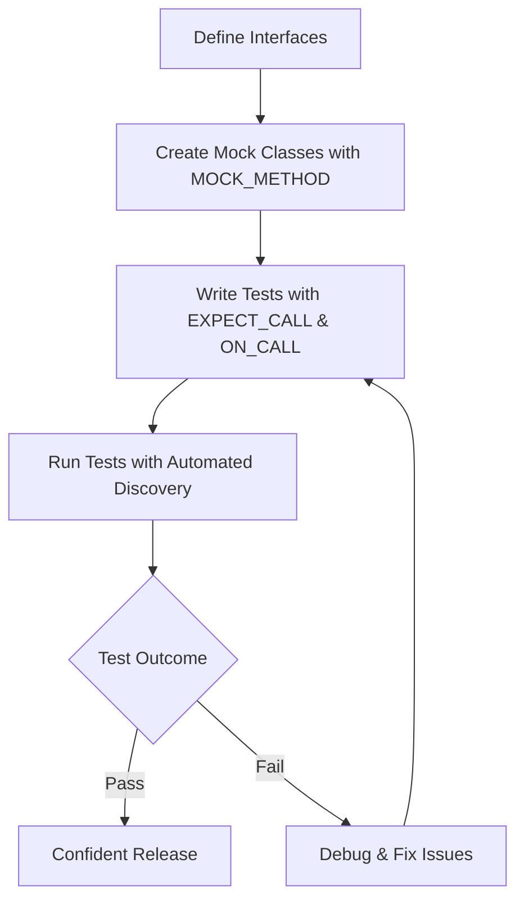

# Value Proposition and Typical Use Cases

## Unlocking the Power of Robust C++ Testing with GoogleTest and GoogleMock

GoogleTest and GoogleMock together form a comprehensive framework designed to elevate your C++ testing experience. They provide a rich ecosystem for writing precise, automated unit and integration tests, empowering developers to validate application logic thoroughly and with confidence.

### Key Benefits at a Glance

- **Robust Unit and Integration Testing:** Validate individual components and their interactions reliably to ensure correctness and stability.
- **Automated Test Discovery:** Seamlessly locate and execute tests without manual registration, streamlining your testing workflow.
- **Rich Assertions Library:** Leverage an extensive set of built-in assertions to check for varied conditions, improving test expressiveness.
- **Powerful Mocking Support:** Use GoogleMock's intuitive syntax for creating mocks to simulate complex behaviors and dependencies.
- **Smooth Continuous Integration Integration:** Incorporate tests into automated CI pipelines effortlessly, enhancing development speed and reliability.

### Who Benefits Most?

This page is tailored for C++ developers, QA engineers, and teams aiming to adopt advanced testing methodologies, improve code quality through automated tests, and support effective collaboration in large projects.

---

## What Is This Page About?

This documentation focuses specifically on communicating the core advantages and common applications of GoogleTest and GoogleMock. It explains why these tools are crucial for modern C++ testing and how they fit into real-world development scenarios. By the end, you will understand the practical reasons to adopt these frameworks and the problems they effectively solve.

---

## The Value of GoogleTest and GoogleMock

GoogleTest serves as the backbone for writing automated tests in C++, offering a clean, expressive syntax to verify program behavior accurately. Paired with GoogleMock, which specializes in mocking classes and interfaces, this combination lets you isolate units under test while simulating interactions with complex dependencies.

By integrating these tools, you unlock the ability to:

- Detect regression errors earlier and more precisely.
- Facilitate design improvements through interaction-based testing.
- Confidently refactor code with immediate feedback on contract violations.
- Scale testing efforts to accommodate large codebases and teams without sacrificing speed or clarity.

### Unique Advantages

- **Automated Test Discovery:** Forget about tedious manual test lists; just write and run.
- **Interaction-Based Testing:** Precisely define and verify expected calls and outcomes.
- **Flexible Mock Behaviors:** Specify detailed mock actions and responses for complex scenarios.
- **Ordering and Cardinality Control:** Enforce strict or flexible call sequences and counts as needed.
- **Support for Overloaded and Template Methods:** Mock even complex C++ constructs transparently.

---

## Typical Use Cases: Why You Need GoogleTest and GoogleMock

GoogleTest and GoogleMock shine in diverse testing conditions typical in C++ projects. Here are some concrete examples that illustrate their benefits.

### 1. Validating Core Application Logic

Ensure your functions and classes behave properly by verifying output correctness under varied inputs.

*Example:* Testing a mathematical library’s functions for correctness over boundary values.

### 2. Enabling Safe Refactoring

With well-defined and automated tests, refactor code confidently, knowing your changes won't break existing behavior.

*Example:* Reorganizing class hierarchies while verifying that all interactions remain consistent.

### 3. Supporting Large-Team Development

When multiple developers work concurrently, automated tests act as a safety net, catching integration issues early.

*Example:* A networked system where mock servers simulate complex external dependencies, allowing frontend and backend teams to test independently.

### 4. Isolation of Dependencies Through Mocks

Mock objects replace real collaborators in tests, controlling and verifying the interactions precisely.

*Example:* Replacing database connections with mocks to simulate query results, facilitating tests of business logic without needing an actual database.

### 5. Continuous Integration and Automated Testing Pipelines

Integrate tests seamlessly into CI workflows to enforce quality gates and reduce regressions from code changes.

*Example:* Automatically running the full test suite on every code commit to the repository.

---

## Before and After GoogleTest

| Scenario                          | Without GoogleTest & GoogleMock                              | With GoogleTest & GoogleMock                                              |
|----------------------------------|-------------------------------------------------------------|---------------------------------------------------------------------------|
| Testing                          | Manual or ad-hoc, limited coverage, prone to errors          | Automated, repeatable, comprehensive test suites                         |
| Test Maintenance                | High effort, brittle tests                                  | Clear, stable, and easy-to-update tests                                  |
| Collaboration                   | Difficult due to inconsistent tests                         | Shared, trusted test practices with explicit behavior verification      |
| Feedback Speed                  | Slow, hard to diagnose                                      | Immediate feedback on code behavior during development                   |
| Dependency Handling             | Requires real resources or complex setups                   | Mocks simulate dependencies easily, enabling isolated testing           |

---

## Getting Started Preview

Using this value proposition and use cases documentation as your guide, you're now ready to explore practical implementation details. The next steps include learning how to define mocks, set expectations, and write efficient tests that leverage the full power of GoogleMock's mocking capabilities.

For a hands-on introduction, proceed to the [Getting Started with GoogleMock](https://google.github.io/googletest/gmock_for_dummies.html) guide and the [gMock Cookbook](https://google.github.io/googletest/gmock_cook_book.html).

---

## Practical Tips for Success

- **Start small:** Begin with unit tests for critical parts, gradually expanding coverage.
- **Use mocks judiciously:** Don’t mock everything; focus on external dependencies.
- **Keep tests isolated:** Design tests to run without relying on external systems.
- **Leverage default actions and expectations:** Use `ON_CALL` for default mock behavior and `EXPECT_CALL` for behavior verification.
- **Use sequences and cardinalities:** Control call order and counts to verify complex interactions.
- **Review test failures in detail:** Utilize verbose flags for debugging mismatches.

---

## Common Pitfalls to Avoid

- Over-specifying mocks leading to brittle tests.
- Forgetting to declare virtual destructors in interface classes.
- Mixing expectations setup with mock calls causing undefined behavior.
- Ignoring uninteresting calls warnings that might signal overlooked calls.

---

## Additional Resources

- [gMock Cheat Sheet](https://google.github.io/googletest/gmock_cheat_sheet.html): Quick syntax reference.
- [gMock Cookbook](https://google.github.io/googletest/gmock_cook_book.html): Recipes and patterns.
- [Mocking Reference](https://google.github.io/googletest/reference/mocking.html): Detailed API.
- [Legacy gMock FAQ](https://google.github.io/googletest/gmock_faq.html): Common questions answered.

---

## Diagram: Typical User Workflow

This user flow illustrates how GoogleTest and GoogleMock integrate into your development lifecycle, from defining interfaces to confidently releasing tested code.
