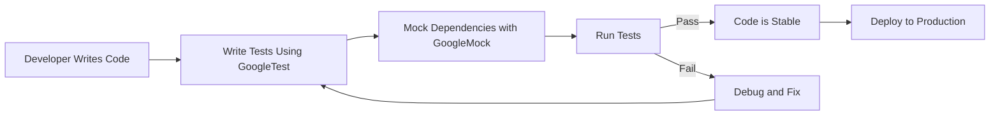

# Target Audience & Use Cases

GoogleTest is a versatile and robust C++ testing framework designed to meet the diverse needs of developers, QA engineers, and open-source maintainers. Whether you're working on application logic, platform-level code, embedded systems, or large-scale enterprise projects, GoogleTest offers the precision and flexibility necessary to create fast, expressive, and maintainable test suites.

## Who Should Use GoogleTest?

- **C++ Developers:** Looking to validate business logic rigorously, ensure code correctness, and build reliable unit tests.
- **QA Engineers:** Seeking efficient automation tools to implement regression checks and maintain high software quality.
- **Open-Source Maintainers:** Needing comprehensive testing frameworks that integrate well into continuous integration workflows and provide clear failure diagnostics.

## Why GoogleTest Matters for Your Projects

GoogleTest addresses a wide spectrum of testing challenges:

- **Validating Business Logic:** Create precise tests that verify the correctness of functions, classes, and modules.
- **Safeguarding Complex Algorithmic Code:** Ensure your intricate algorithms perform as expected through detailed test cases.
- **Automating Regression Checks:** Automatically detect undesired behavior changes as your code evolves.
- **Enabling Test-First and Test-Driven Development (TDD):** Support iterative design with immediate feedback from tests.

## Common Use Cases

1. **Unit Testing in Diverse Environments:** Including embedded systems where resources are limited, to large desktop or server applications.
2. **Integration Testing:** Verifying the correct interaction between components and modules.
3. **Continuous Integration & Delivery:** Automated testing pipelines requiring quick and clear test results.
4. **Legacy Code Refactoring:** Safely modifying and modernizing large codebases with confidence through comprehensive tests.

## Using GoogleTest in Your Workflow

1. **Write Expressive Tests:** Use rich assertions and parameterized tests to cover wide input scenarios.
2. **Mock Dependencies:** With integrated GoogleMock, simulate interactions with external systems or complex collaborators.
3. **Automate and Scale:** Easily integrate with build systems and continuous integration servers.
4. **Analyze and Debug:** Benefit from detailed failure reports and stack traces.


<AccordionGroup title="Practical Tips and Best Practices">
<Accordion title="Targeting Your Tests Effectively">
Focus your tests on verifying behaviors that are critical to your application’s correctness. Use GoogleTest’s diverse assertion macros to capture various conditions clearly and meaningfully.
</Accordion>
<Accordion title="Leveraging GoogleMock for Dependencies">
Use GoogleMock to create mock objects that specify expected interactions and behaviors. This helps isolate your unit tests and enforce contract adherence between components.
</Accordion>
<Accordion title="Balancing Strictness and Flexibility">
Control test strictness using Google's mock modes like NiceMock and StrictMock to suppress unnecessary warnings or to enforce call expectations rigorously.
</Accordion>
<Accordion title="Scaling Tests for Large Projects">
Structure your tests using parameterized and typed tests for reusable test logic across multiple data types or configurations, improving coverage without duplication.
</Accordion>
</AccordionGroup>


## Next Steps

To get the most out of GoogleTest, consider exploring:

- [Product Introduction & Value](../overview/getting-started-value/product-intro) for core insights and capabilities.
- [Feature Overview](../overview/getting-started-value/quick-features) to understand the key functionalities small to large teams rely on.
- [gMock for Dummies](https://google.github.io/googletest/gmock_for_dummies.html) to learn about mocking with GoogleMock, an integral part of GoogleTest.

Start crafting your test suites with GoogleTest today and ensure your C++ code is as reliable and maintainable as possible.

---

## Code Snippet: Testing a Function with GoogleMock

```cpp
#include <gmock/gmock.h>
#include <gtest/gtest.h>

using ::testing::AtLeast;
using ::testing::_;

class MockTurtle {
 public:
  MOCK_METHOD(void, PenDown, (), ());
  MOCK_METHOD(void, Forward, (int distance), ());
};

TEST(PainterTest, DrawsCircleCorrectly) {
  MockTurtle turtle;

  // Expect PenDown() to be called at least once.
  EXPECT_CALL(turtle, PenDown()).Times(AtLeast(1));

  // Expect Forward() to be called with any integer.
  EXPECT_CALL(turtle, Forward(_));

  // ... code under test that uses turtle ...
}
```

This example illustrates how GoogleMock integrates into your test workflow, letting you specify expectations flexibly.

---

## Visualizing GoogleTest's Role in Testing Workflows



This flow shows how GoogleTest and GoogleMock fit naturally into rapid development cycles, enabling robust test-driven development.

---

<Note>
GoogleTest is a comprehensive C++ testing solution covering unit, integration, and system tests, suitable for a broad range of domains and project sizes.
</Note>

<Callout>
**Tip:** For new users, start with the "gMock for Dummies" guide to learn mocking essentials.
</Callout>

<Check>
Check out "Feature Overview" and "Product Introduction & Value" pages for a foundational understanding.
</Check>
