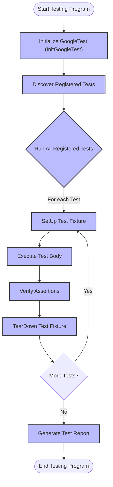

# Introduction to GoogleTest

## Unlocking Reliable C++ Testing with GoogleTest

GoogleTest is Google’s open-source C++ testing and mocking framework designed to empower developers to write reliable, maintainable, and portable tests efficiently. It serves as a foundational tool in the developer’s toolkit for producing high-quality C++ code by simplifying how tests are written, organized, and executed.

### Why GoogleTest Matters to You

- **Reliability Through Isolation:** Each test runs independently, helping you track down issues without test interference.
- **Organized Testing:** Easily group related tests into suites that mirror your codebase, enhancing clarity and maintainability.
- **Portability:** Supports multiple platforms and compilers, so your tests run consistently across environments.
- **Comprehensive Feedback:** Failure messages are rich and detailed, enabling rapid diagnosis without stopping the entire test suite.
- **Automated Test Management:** No need to manually register or enumerate tests – GoogleTest handles discovery and execution.
- **Speed and Efficiency:** Enables fast test development and execution through shared setup and teardown mechanisms.

### Who Should Use This Page

This introduction is meant for C++ developers new to GoogleTest, team leads evaluating testing frameworks, and anyone interested in understanding why GoogleTest is the industry standard for C++ testing.

---

## What is GoogleTest?

GoogleTest is a unified C++ testing and mocking framework developed and maintained by Google. It evolved to meet Google’s stringent requirements for reliable and fast testing across large, complex codebases.

### Solving Real Testing Challenges

- It alleviates debugging pain caused by interdependent or flaky tests by enforcing test independence.
- Simplifies test grouping that helps teams maintain clarity in large projects.
- Provides cross-platform and compiler compatibility ensuring your tests work wherever your code runs.

### What Makes GoogleTest Stand Out

- Based on the well-known xUnit architecture, it’s familiar to many but tailored extensively for C++.
- Supports varied testing styles: simple unit tests, parameterized tests, typed tests, and more.
- Its assertion macros give precise control over test success criteria with informative failure messages.
- Supports mocking through GoogleMock, enabling behavioral testing of complex or external dependencies.

At a high level, GoogleTest operates by automatically registering tests written with its macros and executing them through a simple, consistent lifecycle — from setup to teardown — reporting results with detailed context.

---

## Key Features & Capabilities

- **Test Macros (`TEST`, `TEST_F`, `TEST_P`)**: Quickly define tests and parameterized test suites with minimal boilerplate.
- **Assertions**: Over 40 built-in assertion macros for precise checks, with fatal and non-fatal variants.
- **Test Fixtures**: Share setup and teardown code across multiple related tests.
- **Parameterized and Typed Tests**: Run tests against multiple sets of input or types to avoid duplication.
- **Test Discovery and Execution**: Automatically discovers all registered tests at runtime.
- **Customizable Execution**: Allows filtering which tests to run and supports test iteration and sharding.
- **Extensible Event Listeners**: Attach custom actions or reporters to test events.

### Example: A Simple Test

```cpp
#include <gtest/gtest.h>

// A basic test checking simple logic.
TEST(FactorialTest, HandlesZeroInput) {
  EXPECT_EQ(1, Factorial(0));
}
```

This small snippet defines a test named `HandlesZeroInput` inside the test suite `FactorialTest`. Running it immediately integrates into GoogleTest’s framework, providing output on success or failure.

---

## Why Should You Care?

Adopting GoogleTest means faster detection of bugs early in the development cycle, higher confidence in releases, and streamlined collaboration across teams through organized and maintainable tests.

### Use Cases

- Validating core algorithm correctness across platforms.
- Regression testing when refactoring or extending code.
- Behavioral testing using mocks for classes interacting with external dependencies.
- Running batch tests during continuous integration pipelines.

### Benefits

- Minimize debugging time via clearer failure diagnostics.
- Maintain code quality as your project scales confidently.
- Easily integrate into existing C++ toolchains and build systems.

Before GoogleTest, managing test lifecycles, sharing setup code, and diagnosing failures were more manual and error-prone. GoogleTest automates these to let you focus on test logic rather than test infrastructure.

---

## Getting Started Preview

To begin with GoogleTest, you typically:

1. Add the GoogleTest headers and libraries to your project.
2. Write tests using the provided `TEST()` and `TEST_F()` macros.
3. Initialize GoogleTest in your `main()` function by calling `testing::InitGoogleTest(&argc, argv);`.
4. Run all tests with `RUN_ALL_TESTS()`.

Here is an example minimal main function:

```cpp
#include <gtest/gtest.h>

int main(int argc, char **argv) {
  testing::InitGoogleTest(&argc, argv);
  return RUN_ALL_TESTS();
}
```

Once you have this setup, explore the GoogleTest Primer to learn how to write effective assertions and test fixtures.

---

For a smooth onboarding, consider visiting the [GoogleTest Primer](../primer.md), and to deepen your knowledge, explore [Writing and Running Tests](../api-reference/core-apis/writing-tests.md) and [Assertions Reference](../api-reference/core-apis/assertions.md).


---

## Diagram: GoogleTest High-Level Flow



---

## Practical Tips

- Use `ASSERT_*` assertions when failure should abort the current test function.
- Use `EXPECT_*` assertions to continue testing despite failures within a test.
- Group related tests using `TEST_F` with fixtures for shared setup.
- Utilize parameterized tests (`TEST_P`) to avoid code duplication.
- Instantiate tests via `INSTANTIATE_TEST_SUITE_P` to cover various data-driven scenarios.
- Use the `SCOPED_TRACE` macro to add context to failures within loops or complex tests.

## Common Pitfalls

- Misspelling `SetUp()` as `Setup()` prevents code execution—use `override` to catch this.
- Forgetting to call `InitGoogleTest()` before `RUN_ALL_TESTS()` results in missing command-line flag parsing.
- Not using test fixtures leads to repetitive code and harder maintenance.
- Ignoring return value of `RUN_ALL_TESTS()` can mislead automated test status checks.

---

Embrace GoogleTest to write robust C++ tests with confidence and efficiency. This page sets you on the path; dive deeper into the user guide to master the framework.