# Supported Platforms

## Ensuring Compatibility with Your C++ Stack

GoogleTest is designed to provide comprehensive C++ testing capabilities across a wide range of platforms, compilers, and environments. This page details the officially supported platforms, underlying compiler compatibility, and environmental requirements to help you verify that GoogleTest will work seamlessly within your development stack.

By understanding which platforms and compilers GoogleTest supports, you can confidently integrate it into your projects, avoiding compatibility pitfalls and building reliable, maintainable tests on top of a stable foundation.

---

## What Platforms Does GoogleTest Support?

GoogleTest supports an extensive set of operating systems and environments, adhering to Google's [Foundational C++ Support Policy](https://opensource.google/documentation/policies/cplusplus-support). This ensures reliability and consistency across its supported platforms.

### Primary Supported Platforms Include:

- **Linux** (various distributions and kernel versions)
- **Windows** (Desktop and MinGW environments)
- **Mac OS X and iOS**
- **FreeBSD**
- **OpenBSD**
- **NetBSD**
- **Solaris**
- **QNX**
- **Fuchsia** (experimental, not officially supported)

Platforms such as **Cygwin**, **DragonFlyBSD**, and others benefit from ongoing community support but may not have the same level of official backing.

## Compiler and Language Requirements

GoogleTest requires an environment that supports **C++17 or newer**, as enforced during compilation. It supports building with a variety of modern compilers, including:

- **GCC:** Minimum version supporting C++17 features
- **Clang:** Including Apple Clang with Xcode
- **MSVC (Visual Studio):** Version 2017 Update 3 (MSVC >= 19.11) and later

If you're consistently hitting issues related to compiler versions or C++ language support, you should verify that your toolchain complies with these requirements.

## Build System and Environment Notes

GoogleTest can be built using standard build systems like **CMake** and **Bazel**. The build scripts automatically detect and adapt to your platform and compiler settings, including threading support and exceptions.

Key considerations include:

- On POSIX systems, **pthreads** are detected and used to provide thread safety.
- Windows builds adapt to MSVC and MinGW nuances, including runtime library linkage (static vs. dynamic).
- For shared library builds, appropriate compiler flags like `-DGTEST_CREATE_SHARED_LIBRARY=1` must be set.

Also note that some platforms, such as Windows Mobile and embedded systems, have limited or no support for features like stream redirection or death tests due to platform constraints.

## Integration with Your Development Workflow

Understanding platform support helps you plan your integration:

- Use `googletest/include/gtest/internal/gtest-port-arch.h` to inspect platform-specific macros and verify that GoogleTest recognizes your OS.
- Check that your compiler supports features like exceptions and RTTI which GoogleTest requires for full functionality.
- On non-supported embedded platforms, core testing capabilities might still work but with disabled features.

## Practical Tips and Best Practices

- Ensure your compiler supports **C++17 or higher** to avoid compilation errors.
- When building on Windows, consider the `gtest_force_shared_crt` option in CMake to resolve runtime library linkage issues.
- Explicitly specify platform macros if GoogleTest’s automatic detection fails in your build environment.
- Use **pkg-config** to simplify compilation and linking flags across platforms (refer to [Using GoogleTest from various build systems](docs/pkgconfig.md)).
- For cross-compilation scenarios, make sure your sysroot and toolchain settings propagate correctly to compiler and linker flags.

<Info>
Remember: GoogleTest’s platform support aligns with Google's official C++ support policy, ensuring long-term stability but also limiting support on niche or out-of-date platforms.
</Info>

## Common Pitfalls to Avoid

- Attempting to build GoogleTest with compilers that don't fully support C++17.
- Linking GoogleTest statically while your project links CRT dynamically on Windows without setting `gtest_force_shared_crt`.
- Using GoogleTest features reliant on a file system or threading on platforms where those are unavailable (like certain embedded systems).
- Skipping initializing GoogleTest with `testing::InitGoogleTest()` which may affect platform-specific flag setups.

## Summary Diagram: Platform Support Flow

```mermaid
flowchart TD
  Start([Start: Build GoogleTest]) --> DetectOS{Detect Operating System}

  DetectOS -->|Linux| LinuxOS["Linux"]
  DetectOS -->|Windows| WindowsOS["Windows"]
  DetectOS -->|Mac OS X / iOS| MacIOS["Mac OS / iOS"]
  DetectOS -->|BSD variants| BSDOS["BSD Family"]
  DetectOS -->|Solaris| SolarisOS["Solaris"]
  DetectOS -->|QNX| QNXOS["QNX"]
  DetectOS -->|Fuchsia| FuchsiaOS["Fuchsia (Experimental)"]
  DetectOS -->|Other/unrecognized| UnsupportedOS["Unsupported Platform"]

  LinuxOS --> CheckCompilerLinux{Supports C++17 Compiler?}
  WindowsOS --> CheckCompilerWin{Supports C++17 Compiler?}
  MacIOS --> CheckCompilerMac{Supports C++17 Compiler?}
  BSDOS --> CheckCompilerBSD{Supports C++17 Compiler?}
  SolarisOS --> CheckCompilerSolaris{Supports C++17 Compiler?}
  QNXOS --> CheckCompilerQNX{Supports C++17 Compiler?}
  FuchsiaOS --> CheckCompilerFuchsia{Supports C++17 Compiler?}

  CheckCompilerLinux -->|Yes| BuildReadyLinux["Build Configured with pthreads if available"]
  CheckCompilerLinux -->|No| FailLinux["Build Fail: Upgrade Compiler"]

  CheckCompilerWin -->|Yes| BuildReadyWin["Build Configured with MSVC/MinGW settings"]
  CheckCompilerWin -->|No| FailWin["Build Fail: Upgrade Compiler"]

  CheckCompilerMac -->|Yes| BuildReadyMac["Build Configured with Clang and Xcode"]
  CheckCompilerMac -->|No| FailMac["Build Fail: Upgrade Compiler"]

  CheckCompilerBSD -->|Yes| BuildReadyBSD["Build Configured"]
  CheckCompilerBSD -->|No| FailBSD["Build Fail: Upgrade Compiler"]

  CheckCompilerSolaris -->|Yes| BuildReadySolaris["Build Configured"]
  CheckCompilerSolaris -->|No| FailSolaris["Build Fail: Upgrade Compiler"]

  CheckCompilerQNX -->|Yes| BuildReadyQNX["Build Configured"]
  CheckCompilerQNX -->|No| FailQNX["Build Fail: Upgrade Compiler"]

  CheckCompilerFuchsia -->|Yes| BuildReadyFuchsia["Experimental Build"]
  CheckCompilerFuchsia -->|No| FailFuchsia["Build Fail: Upgrade Compiler"]

  UnsupportedOS --> FailUnsupported["Build Fail: Unsupported Platform"]

  BuildReadyLinux & BuildReadyWin & BuildReadyMac & BuildReadyBSD & BuildReadySolaris & BuildReadyQNX & BuildReadyFuchsia --> BuildSuccess["Successful Build"]

  FailLinux & FailWin & FailMac & FailBSD & FailSolaris & FailQNX & FailFuchsia & FailUnsupported --> BuildFail["Build Failed"]

  classDef success fill:#d4edda,stroke:#155724,stroke-width:2px;
  classDef fail fill:#f8d7da,stroke:#721c24,stroke-width:2px;
  class BuildSuccess success;
  class BuildFail fail;

```

## Next Steps

Now that you know which platforms and compilers are officially supported, proceed to:

- [Installation Guide](/getting-started/prereq-install/installation-guide) to set up GoogleTest in your environment.
- [Configuration Basics](/getting-started/prereq-install/configuration-basics) for customizing build options related to platform specifics.
- [Overview of Core Features](/overview/getting-to-know-googletest/core-features-and-value) to understand the features unlocked by correct platform integration.

---

For detailed build instructions and adjustments based on your environment, see the [googletest/README.md](https://github.com/google/googletest/blob/main/README.md) in the source repository.

You may also want to review the platform-specific macros and utilities in the `gtest-port-arch.h` and `gtest-port.h` headers to debug platform detection and feature toggles.

---

<Applying these guidelines enables you to build and run GoogleTest reliably across your supported platforms, unlocking its powerful testing capabilities for your C++ projects. />