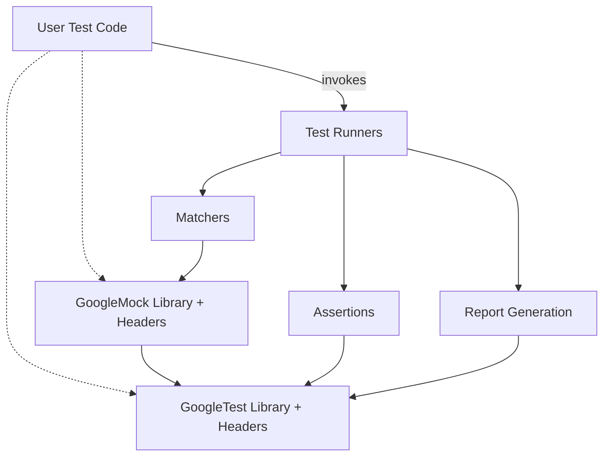

# System Architecture

## Understanding GoogleTest's Structure as a Library and Headers

GoogleTest is thoughtfully designed as both a comprehensive **library** and a modular set of **header files**. This dual nature enables it to be flexible and efficient, serving users who want quick inclusion of testing features through headers alone, as well as those who require the power and extensibility offered by the compiled library.

At the highest level, GoogleTest empowers you, the user, to write test code that integrates seamlessly into your workflow. Your test code drives the framework, invoking test runners, using assertions for verification, leveraging matchers to express expected values, and finally benefiting from the rich report generation system that communicates test results in clear and actionable formats.

### Top-Level Components

- **User Test Code**: Your actual test cases and fixtures, written in C++, exercising the system under test.
- **Test Runners**: Orchestrate the execution of tests, managing lifecycle events such as test setup, execution, and teardown.
- **Assertions**: The core of testing, checking numeric values, strings, exceptions, and more, providing precise failure information.
- **Matchers**: Allow expressive, readable checks against expected outcomes, enhancing clarity and maintainability.
- **Report Generation**: Summarizes test outcomes, supports multiple output formats such as console, XML, and JSON, enabling integration with CI/CD pipelines.

### Relationship Between GoogleTest and GoogleMock

GoogleMock (`googlemock/`) is tightly integrated with GoogleTest (`googletest/`) but serves a complementary purpose: it provides **mocking capabilities** that enable you to simulate and verify interactions with dependencies of the components you're testing.

- GoogleTest provides the testing scaffolding —  test cases, assertions, and reporting.
- GoogleMock extends test writing by offering mock objects, matchers, and expectations.

Together, they form a comprehensive ecosystem that covers **unit testing** and **mock-based testing**, improving test modularity and precision.

---

## Architectural Overview Diagram

---

## How It Works for You

When you write tests using GoogleTest, you primarily engage with **User Test Code** referencing headers and linking against the GoogleTest library. Your test code calls into GoogleTest’s **test runners** to execute tests.

During test execution:

1. The **test runners** coordinate test lifecycle: calling `SetUpTestSuite()`, running each test’s `TestBody()`, then `TearDownTestSuite()`.
2. Within each test, you use **assertions** (`EXPECT_EQ`, `ASSERT_TRUE`, etc.) to validate expected behavior.
3. Assertions leverage **matchers** to express expectations more naturally.
4. After tests complete, the **report generation** component collects results and formats them for user-friendly output.

If your tests require mocking dependencies, you incorporate **GoogleMock**, which in turn integrates tightly with GoogleTest’s assertion and runner components.

---

## Practical Insights

- The **library** part provides precompiled binaries implementing core functionalities such as test runners and report generation. This ensures efficiency and uniform behavior across tests.
- The **header files** expose APIs to write tests, define assertions, and create mocks without needing to delve into internal implementation.
- You can selectively include GoogleMock if your testing needs extend to mocking.

---

### Tips

- Always link against `gtest` and optionally `gtest_main` for standard test entry points.
- When using mocks, link in `gmock` for the mocking capabilities alongside GoogleTest.
- Understand the flow from **test code → test runner → assertions/matchers → reporting**, which can help troubleshoot test failures.
- GoogleTest separates test logic and execution from reporting, so you can customize output formats without changing test code.

---

## Summary

This page presents an architectural overview of GoogleTest as a combined **library and header set**, showing how your test code interacts primarily with test runners, assertions, matchers, and reporting components. It clarifies GoogleMock’s position as an extension for mocking that integrates into the GoogleTest ecosystem.

Explore the next documentation pages such as [Integrating with Your Build & CI](/overview/inside-googletest/integration-points) and [Test Structure and Lifecycle](/api-reference/core-testing-apis/test-structure-and-lifecycle) for deeper understanding and practical guidance.

---
