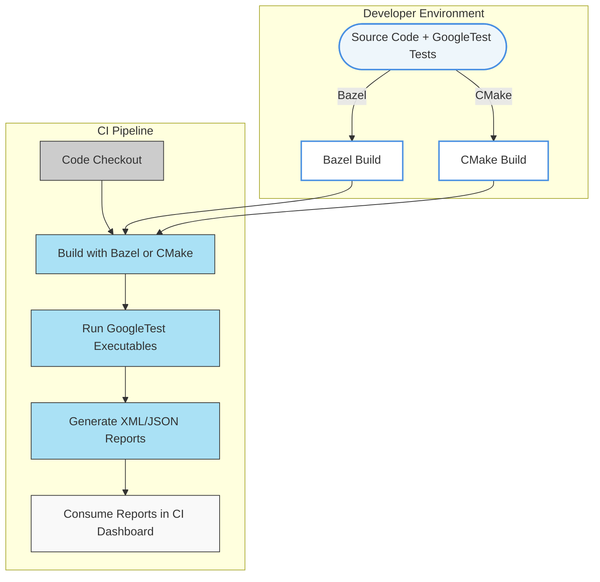

# Integration with Build and CI Systems

## Streamlined Integration with Popular Build Tools

GoogleTest offers seamless and robust integration with widely-used build systems like **Bazel** and **CMake**. This out-of-the-box compatibility ensures that your tests are easy to build, run, and manage in both local and automated environments. By leveraging these build tools, developers can accelerate test-driven development and continuously verify their code changes with minimal friction.

### Bazel Integration

- **Native Support:** GoogleTest is fully supported by Bazel, Google's build tool. Bazel’s `cc_test` rules integrate GoogleTest binaries cleanly, allowing for scalable and reproducible builds.
- **Incremental Builds:** Bazel’s incremental and cached builds speed up test execution by rebuilding only what’s necessary.
- **Parallel Test Execution:** Bazel can distribute and parallelize your GoogleTest runs across build shards and machines, maximizing CI throughput.

### CMake Integration

- **Predefined Modules:** GoogleTest provides a standard `FindGTest` CMake module, simplifying the discovery and linkage in your CMakeLists.
- **Modern CMake Usage:** The recommended modern CMake usage directs users to use `FetchContent` or install GoogleTest as an external dependency.
- **Configurable Test Targets:** Easily create and manage GoogleTest executable targets with customizable properties, flags, and dependencies.

## Continuous Integration (CI) Pipeline Compatibility

GoogleTest’s architecture supports smooth incorporation into your CI workflows. Whether you use Jenkins, GitHub Actions, GitLab CI, or another platform, GoogleTest facilitates reliable test automation.

- **Command Line Execution:** Tests can be executed headlessly with straightforward command line calls through `RUN_ALL_TESTS()`, allowing easy scripting.
- **Filtering and Selection:** Use `--gtest_filter` flags to select specific tests or test suites, optimizing pipeline runtime by running subsets of tests.
- **Parallel and Distributed Testing:** Leverage test sharding with environment variables `GTEST_TOTAL_SHARDS` and `GTEST_SHARD_INDEX` to distribute tests efficiently across CI workers.
- **Test Reporting:** GoogleTest can output results in **XML** or **JSON** formats, compatible with most CI dashboards and reporting tools. Just specify the `--gtest_output=xml:<file>` or `--gtest_output=json:<file>` flag.

## Getting Started Quickly

Ready to onboard GoogleTest into your build and CI environment? Check out the linked [Quickstart](../getting-started/installation/installation-cmake.md) and [Bazel Setup](../getting-started/installation/installation-bazel.md) guides for step-by-step instructions that take you from zero to running tests.

<Tip>
Starting with the recommended integration approach for your build system sets a solid foundation for maintainable and scalable tests.
</Tip>

## Best Practices for Integration Success

- **Keep Test Dependencies Minimal:** Minimize extra dependencies in your test targets to ensure fast, reliable builds.
- **Use Test Sharding for Large Suites:** When your test suite grows, distribute tests across machines using sharding to reduce total runtime.
- **Leverage CMake's FetchContent:** For CMake users, prefer using `FetchContent` to include GoogleTest to avoid manual installation hassles.
- **Automate Reporting:** Configure your CI to consume GoogleTest XML or JSON reports for automated pass/fail analytics and history tracking.

## Troubleshooting Common Integration Issues

<AccordionGroup title="Troubleshooting Integration Issues">
<Accordion title="Build Failures Due to Missing Includes or Linkage">
Ensure your build target correctly includes the GoogleTest headers and links against the GoogleTest libraries. For CMake, confirm that `find_package(GTest REQUIRED)` is called, and target link libraries include `GTest::gtest` and `GTest::gtest_main`.
</Accordion>
<Accordion title="Tests Not Discovered or Running in CI">
Verify that your CI calls `InitGoogleTest()` before `RUN_ALL_TESTS()`. Also, check that your test executables have the correct permissions and are called with appropriate flags for discovery.
</Accordion>
<Accordion title="Slow Test Execution in CI">
Consider enabling test sharding or filtering tests using `--gtest_filter`. Also, verify that tests don't have unintended shared state causing serial bottlenecks.
</Accordion>
</AccordionGroup>

---

### Diagram: Integration Workflow with Build Tool and CI

---

## See Also

- [Install with CMake](../../getting-started/installation/installation-cmake.md) - Guide on integrating GoogleTest with CMake.
- [Install with Bazel](../../getting-started/installation/installation-bazel.md) - Bazel build setup instructions.
- [Running Tests in CI Pipelines](../../guides/integration-advanced/platforms-cross-env.md) - Best practices for CI integration.
- [Testing Reference](../../reference/testing.md) - Detailed API for test definitions.

---

## Summary

This page details best practices for integrating GoogleTest with key build systems and CI pipelines, spotlighting native support with Bazel and CMake. It emphasizes quickstart onboarding, test execution strategies, and automation-friendly reporting. Users are guided towards maintaining efficient, scalable testing workflows that align well with continuous integration demands.

<Tip>
Leverage the natural compatibility of GoogleTest with your existing build and CI tools to enhance both developer productivity and test reliability.
</Tip>
