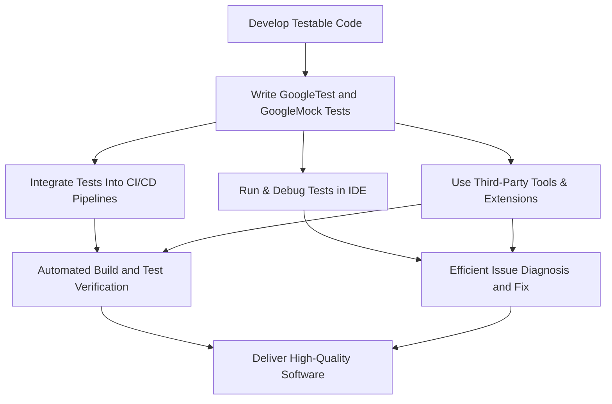

# Ecosystem Integration

Explore how GoogleTest seamlessly extends into your development workflow by integrating with Continuous Integration (CI) systems, popular Integrated Development Environments (IDEs), and complementary third-party tools. This page guides you through leveraging these integrations to maximize testing efficiency and harness community-driven open-source projects that build upon GoogleTest's powerful core.

---

## Why Ecosystem Integration Matters

In modern software development, automated testing fits deeply into continuous delivery and developer workflows. GoogleTest’s ecosystem integration ensures your tests are not just standalone artifacts but integral to your build pipelines, IDE productivity, and diagnostic tooling. Integration accelerates feedback loops, simplifies test management, and enriches your ability to detect and fix issues early.

## Integrating GoogleTest with CI Workflows

### Streamlined Automated Testing
Incorporate GoogleTest into your CI/CD pipelines to automatically build, run, and report on tests for every code change. Not only does this enforce quality gates, but it also provides fast, consistent feedback across your team.

### Key Benefits
- **Automated Execution:** Run your GoogleTest suites on every push, pull request, or scheduled build.
- **Rich Reporting:** Generate detailed test reports including pass/fail status, logs, and failure diagnostics consumable by CI dashboards.
- **Flexible Configuration:** Easily integrate with CI services such as Jenkins, GitHub Actions, GitLab CI, Travis CI, and others.

> While GoogleTest itself does not manage CI configuration files, its command-line friendly nature and customizable output formats encourage straightforward integration.

### Best Practices
- Use GoogleTest’s XML output (`--gtest_output=xml:`) to feed reports into your CI system.
- Enable verbose logging in early build phases with `--gmock_verbose=info` for debugging flaky tests.
- Use test filters (`--gtest_filter=`) to run targeted tests in complex projects efficiently.

## Enhancing Developer Productivity: IDE Integration

GoogleTest integrates smoothly with a broad range of popular IDEs, enhancing your day-to-day development experience.

### Supported IDEs include:
- **Visual Studio:** Integrated test discovery, execution, and debugging support.
- **CLion:** Built-in support for GoogleTest with intuitive test runners and code templates.
- **Eclipse CDT:** Plugins provide test-launch configurations and result visualization.
- **VS Code:** Extensions enable running and debugging tests inline with source code.

### What IDE Integration Enables
- Run and debug tests directly from the editor.
- Instant navigation from test failures to source lines.
- Smart test case and test suite management.
- Interactive test coverage highlighting.

### Tips for Best Use
- Install and configure GoogleTest plugins or extensions tailored to your IDE.
- Organize your test files with standard naming conventions (`*_test.cc` or `test_*.cpp`) to enable automatic test discovery.
- Combine with source control integration to run tests on files changed.

## Leveraging Third-Party Tools and Open-Source Projects

The vibrant open-source ecosystem around GoogleTest adds functionality and ease of use through third-party tools and projects.

### Tooling Examples
- **Test Result Reporters:** Tools converting GoogleTest output into human-readable dashboards or integrating with visualization platforms.
- **Mocking Extensions:** Libraries that complement GoogleMock with additional matchers or actions.
- **Code Coverage Tools:** Integration with coverage analyzers that support GoogleTest, like lcov or gcovr.

### Community Projects
GoogleTest benefits from ongoing contributions that extend its utility, including:
- Alternative test runners supporting parallel execution.
- Plugins for CI systems offering enhanced workflows.
- Utilities for test data generation and test-driven development support.

### How to Explore These Further
Search repositories and community forums for GoogleTest-related tooling. Always evaluate project health, compatibility, and license terms before integrating into your builds.

## Summary Flow: How Integration Enhances Your Testing Journey

## Troubleshooting Integration Issues

### Common Pitfalls
- **Missing Test Reports in CI:** Ensure your test runner is invoked with XML output and the report paths are correctly configured in CI.
- **Tests Not Discovered in IDE:** Verify that your test files follow naming conventions and your IDE is set up to recognize GoogleTest.
- **Verbose Output Too Noisy:** Adjust verbosity with `--gmock_verbose=warning` or `error` in CI environments to reduce log noise.

### Tips
- Consistently update and match your GoogleTest version across local and CI environments.
- Use test filtering to isolate problematic tests in large suites.
- Consult your IDE’s official GoogleTest plugin documentation for setup specifics.

---

## Getting Started with Ecosystem Integration

1. **Configure GoogleTest in your build system:** Ensure GoogleTest and GoogleMock are included correctly in your build environment.
2. **Add test execution commands to your CI configuration:** Include GoogleTest executables with proper flags.
3. **Install IDE plugins or extensions:** Follow your IDE recommendations for GoogleTest support.
4. **Explore community tools:** Investigate open-source projects that complement GoogleTest for additional productivity gains.

For detailed CI setup examples, IDE setup instructions, or third-party tool recommendations, consult dedicated sections in your development environment or CI platform documentation.

---

## Related Documentation
- [Getting Started at a Glance](overview/introduction-and-value/getting-started-glance)
- [How Does GoogleTest Work?](overview/architecture-and-core-concepts/how-googletest-works)
- [Mocking Dependencies with GoogleMock](guides/core-testing-workflows/mocking-with-googlemock)
- [Integrating with Build and CI Systems](guides/advanced-and-integrations/integrating-with-build-systems)
- [Supported Platforms & Toolchains](overview/integration-and-ecosystem/supported-platforms)

## External Resources
- [GoogleTest GitHub Repository](https://github.com/google/googletest)
- Community forums and Q&A sites for troubleshooting and tips

---

This overview positions you to make the most of GoogleTest not just as a testing library, but as a fully integrated part of your software development lifecycle, boosting reliability, developer efficiency, and confidence in your testing strategy.