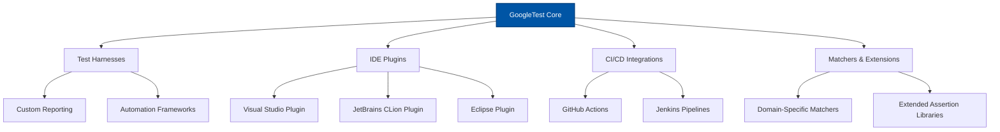

# Ecosystem & Notable Users

Explore the rich ecosystem of open-source projects and community tools that either use or extend GoogleTest. This collection highlights how GoogleTest has become a trusted foundation in the software development and testing landscape, demonstrated by its wide adoption across industries and integration with popular development environments.

---

## Why This Matters

Understanding the ecosystem around GoogleTest not only proves its reliability but also shows you practical ways to expand your testing workflow. Leveraging community tools like test harnesses and IDE plugins can accelerate your productivity and improve test management.

Whether you’re just starting or looking to enhance your existing setup, seeing real-world adoption gives confidence that GoogleTest fits into diverse and demanding development environments.

---

## Community Tools & Extensions

Numerous open-source projects extend GoogleTest’s capabilities or provide additional convenience layers to elevate your testing experience:

- **Test Harnesses:** These frameworks build on top of GoogleTest to provide environment-specific automation, reporting enhancements, or integration with other ecosystem components.

- **IDE Plugins:** Plugins for popular IDEs like Visual Studio, CLion, and Eclipse integrate GoogleTest tightly into the development workflow, offering features like test discovery, inline results, and debugging support.

- **CI/CD Integrations:** Community-developed scripts and modules help incorporate GoogleTest into continuous integration pipelines, streamlining automated validation and reporting.

- **Matchers and Assertions Extensions:** Beyond GoogleTest’s core, additional matcher libraries expand assertion expressiveness to suit specific domain needs.

> _Tip:_ Explore repositories on GitHub with the ‘googletest’ topic to discover up-to-date community tools tailored to your language and environment.

---

## Industry Adoption Examples

GoogleTest serves as the backbone for testing in numerous industry-leading companies and projects, ensuring quality and reliability at scale. Its versatile design accommodates everything from embedded device firmware to large-scale distributed systems.

Some notable examples include:

- **Chromium Project:** Utilizes GoogleTest extensively for browser component testing, benefiting from its robustness and integration ease.
- **Android Open Source Project:** Leverages GoogleTest in native C++ components, enabling rigorous platform validation.
- **LLVM/Clang:** Uses GoogleTest for compiler and toolchain testing to maintain stability and correctness.

These examples demonstrate that GoogleTest is battle-tested under diverse, high-stakes conditions, reinforcing its suitability for production environments.

---

## Getting Involved with the Ecosystem

Joining this vibrant community and tapping into ecosystem projects lets you share experiences, contribute tools, and stay current with best practices.

- Browse [Community-Created Documentation](https://github.com/google/googletest/blob/main/docs/community_created_documentation.md) for tutorials and insights from other developers.
- Engage in forums and discussion platforms such as GitHub Issues and the GoogleTest mailing list.
- Contribute your own integrations, bug fixes, or improvements back to the ecosystem.

This active community ensures GoogleTest remains adaptive and continuously improving.

---

## Summary

GoogleTest's ecosystem includes a broad spectrum of open-source tools, IDE plugins, and integration examples that amplify its core testing capabilities. Seeing its widespread use across major industry projects affirms its reliability and scalability. By actively engaging with these resources, you can accelerate your testing workflows and contribute to a thriving community.

---

## Related Documentation

- [Platform & Toolchain Support](/overview/integration-and-ecosystem/platform-support) — Learn about system compatibility requirements.
- [Integration with Other Systems](/overview/integration-and-ecosystem/integration-points) — See how GoogleTest fits in CI/CD pipelines and IDEs.
- [Community-Created Documentation](https://github.com/google/googletest/blob/main/docs/community_created_documentation.md) — Find tutorials and third-party guides.


---

## Example Community Tool: Installation of a Visual Studio Plugin

For developers using Visual Studio, there are plugins that automatically detect GoogleTest test cases, display inline test results, and allow interactive debugging.

Here’s a quick setup overview:

```powershell
# Open Visual Studio Marketplace inside VS
# Search for 'Google Test Adapter' or similar plugins
# Install and reload Visual Studio

# The plugin detects GoogleTest tests in your solution automatically and
# integrates with the Test Explorer window.
```

This seamless integration saves valuable development time by providing immediate feedback on test outcomes.

---

## Troubleshooting Common Ecosystem Issues

<AccordionGroup title="Common Issues with Ecosystem Tools">
<Accordion title="Test Not Discovered by IDE Plugin">
Verify that your test targets are built successfully before running the plugin. Some plugins require output files or certain project conventions to detect tests properly.
</Accordion>
<Accordion title="CI Pipeline Fails to Recognize Tests">
Ensure GoogleTest libraries and headers are correctly linked in your CI environment. Use `find_package(GTest CONFIG REQUIRED)` in your CMake scripts and confirm all dependencies are installed.
</Accordion>
<Accordion title="Matcher or Assertion Extensions Conflict">
Check for macro collisions or incompatible versions. Use compiler flags like `-DGTEST_DONT_DEFINE_TEST=1` to avoid name clashes if integrating multiple testing frameworks.
</Accordion>
</AccordionGroup>

---

## Visual Diagram: GoogleTest Ecosystem Overview



This overview illustrates how GoogleTest acts as the foundation supporting various ecosystem extensions that enhance test workflow, integration, and extendibility.


---

## Next Steps

Kickstart your exploration by browsing community repositories and integrating an IDE plugin into your development environment. To understand how GoogleTest fits technically into your projects, visit the [Platform & Toolchain Support](../overview/integration-and-ecosystem/platform-support) page. For practical integration advice, see the [Integration with Other Systems](../overview/integration-and-ecosystem/integration-points) guide.

By leveraging ecosystem tools and learning from notable users, you can supercharge your testing strategy with GoogleTest.