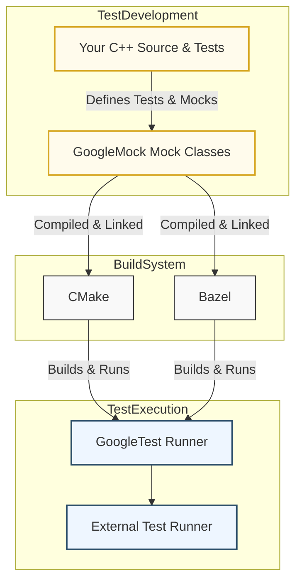

# Integrations and Extensions

## Unlocking Seamless Test Automation with GoogleTest

GoogleTest is more than a powerful C++ testing framework—it is designed to integrate effortlessly with complementary tools and popular build systems, enabling you to build scalable, automated testing pipelines adapted to your project ecosystem.

This page guides you through GoogleTest’s essential integrations with GoogleMock for mocking, external test runners that enhance parallelism and test management, and build tools like CMake and Bazel that streamline compilation and execution workflows.

### Why Integrations Matter

In modern software development, no tool exists in isolation. Efficient testing requires smooth collaboration across mocking frameworks, test runners, and build systems, ensuring your tests are not only reliable but also fit naturally into your development environment.

GoogleTest’s integrations empower you to:

- Combine powerful mocking via GoogleMock to effectively isolate and verify interactions.
- Leverage external test runners for parallel execution and faster feedback cycles.
- Harmonize with build tools like CMake and Bazel for easy incorporation into your build and CI/CD pipelines.

This synergy reduces manual overhead, accelerates test feedback, and supports robust, maintainable test automation.

---

## GoogleMock: Mocking Made Complementary

GoogleMock works hand-in-hand with GoogleTest, providing a robust framework to create mock classes and configure flexible expectations.

### What Does GoogleMock Enable?

- **Interface Mocking**: Seamlessly mock interfaces and classes to isolate units under test.
- **Precise Control**: Define invocation expectations with argument matching, call order, and cardinality.
- **Rich Actions & Matchers**: Specify custom behaviors and validate argument properties.

### How It Fits Into Your Workflow

```cpp
#include <gmock/gmock.h>

class MockFoo : public Foo {
 public:
  MOCK_METHOD(int, GetSize, (), (const, override));
  MOCK_METHOD(std::string, Describe, (int type), (override));
};

using ::testing::Return;

TEST(FooTest, SizeTest) {
  MockFoo mock;
  EXPECT_CALL(mock, GetSize()).WillOnce(Return(42));

  EXPECT_EQ(mock.GetSize(), 42);
}
```

Use GoogleMock to specify expected interactions and behaviors, ensuring units are tested independently and reliably.

<Tip>
GoogleMock is bundled with GoogleTest and requires only adding `#include <gmock/gmock.h>`. It leverages GoogleTest’s assertions and test runner seamlessly.
</Tip>

For complete usage, see [gMock Cheat Sheet](https://google.github.io/googletest/gmock_cheat_sheet.html) and [gMock Cookbook](https://google.github.io/googletest/gmock_cook_book.html).

---

## External Test Runners: Enhancing Test Execution

While GoogleTest provides a built-in test runner, complex projects and large test suites benefit substantially from external orchestration tools that manage test execution in parallel, in sequence, or with enhanced filtering.

### Supported External Runners Include:

- **gtest-parallel**: Enables parallel test execution across CPU cores, drastically reducing total test time.
- **GTest Runner Plugins / Extensions**: IDE or CI tool integrations that improve test management and reporting.

### Benefits

- Run thousands of tests efficiently across multiple processes.
- Leverage sophisticated sharding to split tests evenly.
- Decouple test execution from build steps.

### Typical Workflow

1. External runner discovers GoogleTest tests via reflection or test listing.
2. Tests are distributed for parallel execution.
3. Results are aggregated and reported back.

<Tip>
Using an external test runner is highly recommended for large codebases to maximize throughput and minimize CI/CD feedback loops.
</Tip>

---

## Build System Integration: CMake and Bazel

GoogleTest integrates tightly with popular build systems to make compiling, linking, and executing tests as pain-free as possible.

### CMake Integration

CMake offers robust support for GoogleTest with targets and helper macros:

```cmake
find_package(GTest REQUIRED)

add_executable(MyTest test_mycode.cpp)
target_link_libraries(MyTest GTest::gtest_main)

enable_testing()
add_test(NAME MyTest COMMAND MyTest)
```

- CMake automatically manages the dependencies.
- `enable_testing()` and `add_test()` integrates GoogleTest into CTest.
- Supports easy custom configuration for test discovery and execution.

### Bazel Integration

Bazel also natively supports GoogleTest with testing rules:

```bazel
cc_test(
    name = "my_test",
    srcs = ["test_mycode.cc"],
    deps = ["@com_google_googletest//:gtest_main"],
)
```

- Handles dependency fetching and compilation cache.
- Provides platform-independent build scripts.
- Optimized for large-scale monorepos and parallel builds.

<Tip>
Use the official GoogleTest Bazel targets and CMake modules for smoothest integration.
</Tip>

---

## How These Integrations Work Together



This diagram shows the synergy: Your source and test code use GoogleMock to create mocks; CMake or Bazel compiles and links the code; GoogleTest provides the runtime framework to execute tests; optional external runners manage test orchestration.

---

## Best Practices for Integration Success

- **Mock selectively:** Only mock interfaces critical for your unit tests; avoid over-mocking.
- **Leverage default actions:** Use `ON_CALL` to set sensible defaults to reduce noisy warnings.
- **Sequence expectations:** Use `InSequence` if order matters to avoid flaky tests.
- **Use NiceMock:** Wrap mocks in `NiceMock` to suppress warnings for uninteresting calls during early test development.
- **Automate builds:** Integrate GoogleTest targets fully within your CMake or Bazel builds including test discovery.
- **Adopt parallel testing early:** Incorporate `gtest-parallel` in your CI pipelines for scalability.

---

## Troubleshooting Common Issues

<AccordionGroup title="Common Integration Pitfalls">
<Accordion title="Warnings About Uninteresting Calls">
Uninteresting calls happen when mock methods are invoked with no expectations. Use `NiceMock` to suppress these warnings or explicitly specify expected calls with `EXPECT_CALL` or allow any call with `.Times(AnyNumber())`.
</Accordion>
<Accordion title="Build Failures due to Missing Virtual Destructors">
Ensure any classes you mock have virtual destructors to prevent undefined behavior and memory leaks.
</Accordion>
<Accordion title="Test Runner Doesn't Discover Tests">
Verify that your build system links against GoogleTest's libraries properly and that executable symbols are exported to allow discovery.
</Accordion>
</AccordionGroup>

---

## Getting Started with Integrations

### Quick Start

- Include `<gmock/gmock.h>` for mocks.
- In CMake, use `find_package(GTest REQUIRED)` and link `GTest::gtest_main`.
- Run your tests with `ctest` or optionally use `gtest-parallel`.

### Prerequisites

- Familiarity with GoogleTest basics ([Primer](../primer.md)).
- Basic understanding of your build tool (CMake or Bazel).
- For mocking, ensure your interfaces define virtual methods with virtual destructors.

### Next Steps

- Explore [gMock Cheat Sheet](https://google.github.io/googletest/gmock_cheat_sheet.html) for quick reference.
- Review [gMock Cookbook](https://google.github.io/googletest/gmock_cook_book.html) for in-depth mocking recipes.
- Review your build system's GoogleTest integration documentation (e.g. [Installing with CMake](../../getting_started/installation_integration/install_cmake)).
- Try using external runners like [gtest-parallel](https://github.com/google/gtest-parallel).

<Tip>
Integrating GoogleTest with your environment unlocks faster, more reliable testing across your entire lifecycle.
</Tip>

---

## References and Resources

- [GoogleMock Cheat Sheet](https://google.github.io/googletest/gmock_cheat_sheet.html)
- [GoogleMock Cookbook](https://google.github.io/googletest/gmock_cook_book.html)
- [GoogleTest Primer](../../overview/product-introduction/feature-overview)
- [Installing GoogleTest with CMake](../../getting_started/installation_integration/install_cmake)
- [GoogleTest API Reference for Mocking](../../api-reference/mocking-apis/defining-mocks)

---

_This page is part of the GoogleTest User's Guide and focuses on effective integration and extension points to maximize test automation and maintainability._
