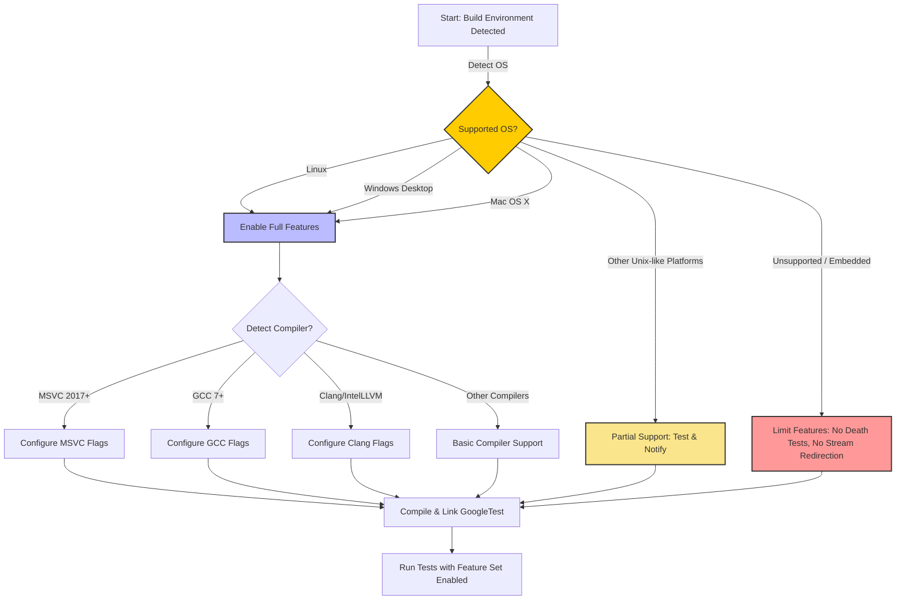

# Supported Platforms & Environments

GoogleTest is designed to provide a robust and portable testing framework for C++ developers across a wide range of platforms, compilers, and build environments. This page details the various operating systems, compiler toolchains, and build tools GoogleTest supports, as well as its policy commitments to ensure broad compatibility and ease of integration.

---

## Why Platform Support Matters

When adopting a testing framework like GoogleTest, compatibility with your development environment is crucial. The supported platforms and environments influence everything from build success to runtime performance and debugging effectiveness. GoogleTest aims to balance comprehensive platform support with maintaining quality and ease of use.

---

## Overview of Supported Operating Systems

GoogleTest follows Google's [Foundational C++ Support Policy](https://opensource.google/documentation/policies/cplusplus-support) which sets the baseline for the platforms officially supported.

Currently, GoogleTest works best on the following major platforms:

- **Linux:** Widely supported with full feature availability, including death tests, threading, and stream redirection.
- **Windows:** Desktop Windows environments, including MSVC, MinGW, and Cygwin toolchains.
- **Mac OS X:** Complete support including testing features that require advanced OS capabilities.

GoogleTest also detects and supports various Unix-like systems including FreeBSD, Solaris, AIX, and others, though support can be less stable on platforms with less broad community involvement.

### Platform Macros

GoogleTest defines internal macros (`GTEST_OS_*`) to indicate the OS during compilation, for example, `GTEST_OS_LINUX`, `GTEST_OS_WINDOWS_DESKTOP`, and `GTEST_OS_MAC`. These macros guide conditional compilation ensuring the framework adapts to the underlying platform capabilities.

---

## Compiler and Build Tool Support

GoogleTest requires environments supporting at least C++17. It integrates seamlessly with many modern compilers and build tools, including:

- **Compilers:**
  - GCC (version 7.0.0 and higher) with appropriate flags
  - Clang and IntelLLVM compilers with settings tuned for warnings and runtime behavior
  - Microsoft Visual C++ (MSVC) 2017 Update 3 or later
  - Other compilers such as SunPro, IBM Visual Age, HP aCC, with varying degrees of support

- **Build Tools:**
  - CMake (recommended and primary build system for GoogleTest itself)
  - Ninja, Makefiles, Visual Studio project files, and Xcode project files generated by CMake

### Compiler Configuration

GoogleTest adjusts compiler flags to ensure proper handling of runtime libraries, exceptions, thread safety, and warning levels. For example, on MSVC and Clang, warning level adjustments and runtime linkage flags (e.g., `/MT`, `/MD`) are carefully managed to prevent runtime conflicts and linker errors.

---

## Threading and Exception Handling

- GoogleTest detects pthread support and enables thread-safe operations accordingly. On platforms with pthreads, GoogleTest operates safely in multi-threaded test environments.
- Exception support detection allows GoogleTest to adapt its assertions and error handling for environments with or without C++ exceptions enabled.

---

## Supported Feature Flags and Customization

Users can influence the platform-specific behavior and compatibility via compile-time macros:

- `GTEST_HAS_PTHREAD`: Manually override pthread availability
- `GTEST_CREATE_SHARED_LIBRARY` and `GTEST_LINKED_AS_SHARED_LIBRARY`: Manage symbol visibility and linkage when building or consuming shared libraries
- Various macros documented in [gtest-port.h](https://github.com/google/googletest/blob/main/googletest/include/gtest/internal/gtest-port.h) allow finer-grained control over platform-specific features

---

## Compatibility Matrix and Policy Commitment

GoogleTest aligns with the [Foundational C++ Support Policy](https://opensource.google/documentation/policies/cplusplus-support) and maintains a [compatibility matrix of supported OS, compilers, and build tools](https://github.com/google/oss-policies-info/blob/main/foundational-cxx-support-matrix.md).

This commitment ensures:

- Timely updates and fixes for supported platforms
- Clear guidance on best supported environments
- Transparency about platform limitations

---

## Real-World Usage and Tips

- **Linux developers** can expect full GoogleTest feature access out of the box.
- **Windows users** should ensure their MSVC version is at least VS 2017 Update 3 and consider the `gtest_force_shared_crt` CMake option if linking mismatch errors occur.
- **Mac users** can leverage CMake to generate project files tailored to their IDE, capturing all required flags.

<Tip>
If you are integrating GoogleTest into an existing build system, using CMake's `FetchContent` or `add_subdirectory()` to build GoogleTest alongside your project ensures consistent compiler and linker flags, preventing subtle compatibility bugs.
</Tip>

<Warning>
On specialized or embedded platforms with limited filesystem or threading support, GoogleTest capabilities such as death tests or stream redirection may not be available.
</Warning>

---

## Summary

Supported platforms, compilers, and build environments form the foundation of a reliable testing ecosystem. GoogleTest provides a consistent, portable, and configurable framework to ensure your tests run efficiently and reliably across your target development and deployment platforms.

To verify your platform compatibility or understand detailed compiler support, review the official compatibility matrix and configure your build settings following the guidance here.

---

## See Also

- [GoogleTest Overview & Introduction](../introduction-and-value/what-is-googletest) – Learn the fundamentals of GoogleTest
- [Build and Install Instructions](../../googletest/README.md) – Details on building GoogleTest with CMake
- [GoogleTest Macros and Flags](../internal-configuration) – Customize build and platform-specific options
- [Supported Platforms Compatibility Matrix](https://github.com/google/oss-policies-info/blob/main/foundational-cxx-support-matrix.md) – Official policy listing

---

## Example: Detecting Platform in Your Code

You can inspect the active `GTEST_OS_*` macro inside your test code if you need platform-specific behavior.

```cpp
#include <gtest/gtest.h>

TEST(PlatformTest, DetectOS) {
#ifdef GTEST_OS_LINUX
  std::cout << "Running on Linux platform." << std::endl;
#elif defined(GTEST_OS_WINDOWS_DESKTOP)
  std::cout << "Running on Windows Desktop." << std::endl;
#elif defined(GTEST_OS_MAC)
  std::cout << "Running on Mac OS X." << std::endl;
#else
  std::cout << "Unknown or unsupported platform." << std::endl;
#endif
  SUCCEED();
}
```

This example demonstrates platform conditional compilation based on the macros set by GoogleTest.

---

## Troubleshooting Platform Issues

<AccordionGroup title="Common Platform Support Issues and Solutions">
<Accordion title="Build Fails Due to Missing pthread Library on Windows">
If you get linker errors about pthread functions on Windows, it's because GoogleTest detects it but the pthread library is not linked. To resolve this, disable pthread support in the build using:

```cmake
-DBUILD_GTEST_DISABLE_PTHREAD=ON
```

or manually link `pthreadwin32` if installed.
</Accordion>

<Accordion title="Linker Errors for Runtime Library Mismatches on MSVC">
Ensure that the `gtest_force_shared_crt` option matches your project settings. This aligns the linkage of C runtime libraries between your tests and GoogleTest, preventing `LNK2038` errors.
</Accordion>

<Accordion title="GoogleTest Features Not Available on Embedded Platforms">
GoogleTest disables or limits features like death tests and stream redirection on embedded or specialized platforms lacking file systems or threading support. Check platform macros and adjust tests accordingly.
</Accordion>
</AccordionGroup>

---

## Summary Diagram of Platform Support Flow



This diagram illustrates how GoogleTest dynamically adapts its feature set depending on OS and compiler support detected during the build.
