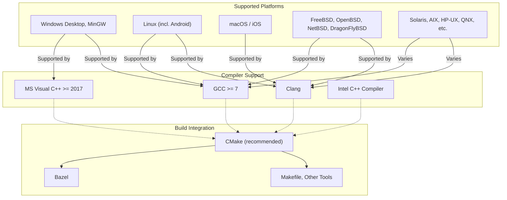

# Supported Platforms & Build Integration

## Overview

This page provides a detailed review of the compilers and operating systems officially supported by GoogleTest. It also explains how GoogleTest fits smoothly into typical C++ build systems and linking workflows. Users will find references to further setup guides tailored for different environments, helping them integrate GoogleTest effectively into their projects.

---

## Supported Platforms

GoogleTest is a portable C++ testing framework designed to work across a broad range of platforms, making it suitable for cross-platform projects. The framework automatically detects the target environment, but users can fine-tune configurations when necessary.

### Officially Supported Operating Systems

GoogleTest supports the following platforms with stable and reliable integration:

- **Windows** (including Desktop, MinGW)
- **Linux** (including variants such as Android)
- **macOS** (with support for iOS)  
- **FreeBSD, OpenBSD, NetBSD, DragonFlyBSD**
- **Solaris, AIX, HP-UX, QNX**

Other platforms like Cygwin, GNU/Hurd, and less common systems may have experimental or varying levels of support.

### Supported Compilers and Toolchains

GoogleTest is tested and compatible with major C++ compilers:

- GCC (version 7 and later recommended, full C++17 support required)
- Clang (with C++17 support)
- Microsoft Visual C++ (VS 2017 Update 3 or newer)
- Intel C++ Compiler

All supported compilers must fully support **C++17**, as it is the minimum standard version for building GoogleTest.

> **Tip:** You can specify the C++ standard version in your build system to ensure compatibility:
>
> ```cmake
> set(CMAKE_CXX_STANDARD 17)
> set(CMAKE_CXX_STANDARD_REQUIRED ON)
> ```

### Threading and Platform Features

GoogleTest leverages platform features such as pthreads on Unix-like systems and Windows critical sections to enable thread-safe testing. The presence of threading libraries is automatically detected, but can be manually configured with macros (e.g., `-DGTEST_HAS_PTHREAD=1`).

Death tests, stream redirection, RTTI, and exception support may depend on platform capabilities and compiler settings.

---

## Integration with Build Systems

GoogleTest fits naturally into common C++ build workflows. While the framework provides core functionality, it does not enforce a particular build system, allowing you to integrate it with your existing setup.

### CMake Integration

CMake is the recommended and most straightforward build tool for GoogleTest.

- **Standalone Build:** Clone the GoogleTest repository and use CMake to generate native build files.

```bash
git clone https://github.com/google/googletest.git -b v1.17.0
mkdir build && cd build
cmake .. -DBUILD_GMOCK=OFF  # To build only GoogleTest
make
sudo make install  # Optional installation
```

- **Embedded in Larger Projects:** Add GoogleTest as a subdirectory within your project’s CMake build.

```cmake
include(FetchContent)
FetchContent_Declare(
  googletest
  URL https://github.com/google/googletest/archive/5376968f6948923e2411081fd9372e71a59d8e77.zip
)
FetchContent_MakeAvailable(googletest)

add_executable(my_tests test.cpp)
target_link_libraries(my_tests GTest::gtest_main)
add_test(NAME my_test COMMAND my_tests)
```

You can also use `find_package(GTest REQUIRED)` if GoogleTest is installed on your system.

> **Note:** CMake 3.14 or later is required to use `FetchContent_MakeAvailable()`.

### Other Build Systems

GoogleTest can be integrated with other C++ build systems such as Bazel, Makefiles, or proprietary build tools. The main consideration is ensuring that GoogleTest headers and source files are appropriately included and linked.

- **Bazel:** GoogleTest is supported as an external repository; use rules provided in Bazel community documentation.
- **Manual Integration:** Manually compile GoogleTest source files and link against your test binaries.

### Linking GoogleTest

Typically, you link against one of these libraries:

- `gtest`: core GoogleTest library
- `gtest_main`: includes a ready-to-use `main()` function for tests

This simplifies running tests without writing boilerplate code.

If you prefer to build GoogleTest as a shared library (DLL on Windows), you must define:

- `-DGTEST_CREATE_SHARED_LIBRARY=1` when building GoogleTest
- `-DGTEST_LINKED_AS_SHARED_LIBRARY=1` when compiling your tests using the shared library

This ensures proper symbol export/import and runtime behavior.

### Runtime Environment Considerations

- **Visual Studio:** There is a known issue with mismatched static/dynamic C runtime linkage. Use the `gtest_force_shared_crt` CMake option to align GoogleTest with your project's CRT linkage.
- **Pthreads:** On POSIX platforms, ensure compiler and linker flags include pthread support (e.g., `-pthread`).

---

## Practical Setup Tips

- Always verify your platform and compiler compatibility before beginning integration.
- When using CMake, include GoogleTest with `FetchContent` or `add_subdirectory` for consistent build and link flags.
- For running simple tests with minimal setup, link against `gtest_main` to avoid writing a custom main function.
- To customize build behavior, define relevant `GTEST_` macros to enable or disable features according to your environment.
- Keep GoogleTest up to date, as newer releases expand supported platforms and improve build integrations.

---

## Related Setup Guides

To dive deeper into setup and integration, refer to these key documentation pages:

- [Prerequisites and System Requirements](/getting-started/setup-introduction/prerequisites-requirements): Detailing OS, compiler, and toolchain needs.
- [Installation (CMake, Bazel, Manual)](/getting-started/setup-introduction/installation-options): Step-by-step installation options.
- [Configuration and Project Setup](/getting-started/setup-introduction/configuration-basics): How to configure GoogleTest in your project.
- [Integrating with CI/CD Pipelines](/gtest-guides/integration-scaling/ci_integration): Best practices for automated testing environments.


---

## Summary

GoogleTest offers broad platform compatibility and clean integration with common C++ build systems, enabling developers to adopt robust testing practices with minimal friction. By aligning your compiler and build environment settings with GoogleTest’s requirements and using the provided build scripts and options, you ensure a seamless testing experience across different operating systems and toolchains.

---

## Example: Minimal CMake Setup for GoogleTest

```cmake
cmake_minimum_required(VERSION 3.14)
project(MyProject CXX)

set(CMAKE_CXX_STANDARD 17)
set(CMAKE_CXX_STANDARD_REQUIRED ON)

include(FetchContent)
FetchContent_Declare(
  googletest
  URL https://github.com/google/googletest/archive/refs/tags/release-1.17.0.zip
)
FetchContent_MakeAvailable(googletest)

add_executable(my_tests test.cpp)
target_link_libraries(my_tests GTest::gtest_main)
add_test(NAME MyTest COMMAND my_tests)
```

This configuration automatically downloads GoogleTest, builds it, and links it to your test executable, ensuring platform-appropriate build settings.

---

## Troubleshooting Common Build Issues

<AccordionGroup title="Common Build and Integration Issues">
<Accordion title="Compiler Does Not Support C++17">
GoogleTest requires C++17 or later. Make sure your compiler is updated and that you specify `-std=c++17` or equivalent.
</Accordion>
<Accordion title="Linker Errors Related to pthread">
If you get undefined references to pthread functions on Unix-like systems, make sure to add `-pthread` to both compile and link flags.
</Accordion>
<Accordion title="Mismatch of Runtime Libraries on Windows">
Enable `gtest_force_shared_crt` in CMake to align GoogleTest with your project's CRT linkage to avoid conflicts in Visual Studio.
</Accordion>
<Accordion title="Shared Library Export/Import Errors">
When building GoogleTest as a shared library, define `-DGTEST_CREATE_SHARED_LIBRARY=1` and use `-DGTEST_LINKED_AS_SHARED_LIBRARY=1` when compiling your tests to prevent symbol resolution errors.
</Accordion>
</AccordionGroup>

---

## Summary Diagram: Supported Platforms and Build System Relationships



---

## Additional References

- [GoogleTest Primer](overview/getting-started/introduction) — Introduction to GoogleTest framework fundamentals.
- [Building and Running Tests](gtest-guides/getting-started/build_and_run) — Details on test build workflows.
- [Integrating with CI/CD Pipelines](gtest-guides/integration-scaling/ci_integration) — Guide to automated test integration.


---

For detailed installation instructions and platform-specific help, visit the [GoogleTest GitHub repository](https://github.com/google/googletest) and review the included CMakeLists and README files.

---

# End of Supported Platforms & Build Integration Documentation
