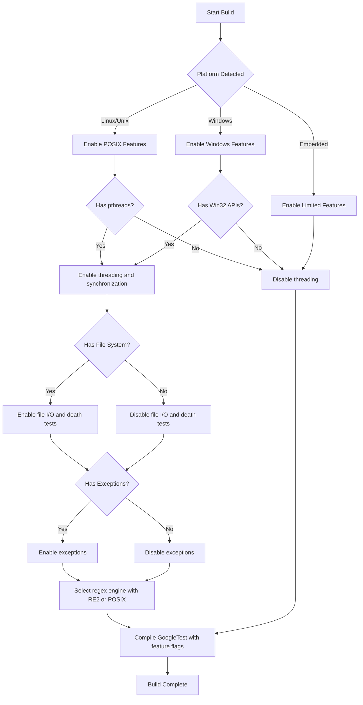

# Supported Platforms & Compatibility

GoogleTest adheres strictly to Google's [Foundational C++ Support Policy](https://opensource.google/documentation/policies/cplusplus-support), ensuring robust and consistent behavior across officially supported platforms and toolchains. This page outlines the operating systems, compilers, and build systems GoogleTest supports to help you integrate the framework seamlessly in professional and diverse environments.

---

## Overview of Supported Platforms

GoogleTest provides stable support for a broad range of platforms, focusing primarily on those widely used in both open-source and enterprise development. The platform support is a result of comprehensive testing and community contributions, ensuring that GoogleTest stays reliable across environments.

### Operating Systems

- **Linux:** Full support on various distributions, including support for native pthreads.
- **Windows:** Desktop Windows, MinGW, and more, with native synchronization primitives and exception handling.
- **Mac OS X & iOS:** Supported with full platform integration and environment-specific optimizations.
- **BSD Variants:** Includes FreeBSD, NetBSD, OpenBSD, and DragonFlyBSD.
- **Others:** Support extends to Solaris, AIX, Haiku, HP-UX, QNX, GNU/Hurd, Fuchsia, Native Client (NaCl), and embedded platforms like Xtensa and ESP variants where feasible.

### Compilers

GoogleTest requires an environment that supports **C++17** or later and works with major modern compilers including:

- **GCC:** Versions meeting foundational requirements.
- **Clang:** Fully supported with appropriate flags.
- **MSVC (Microsoft Visual C++):** Minimum version VS2017 Update 3 (MSVC 19.11) or later.
- **Intel C++ Compiler:** Supported as per C++17 compliance.

Compilers must support C++17 features as GoogleTest leverages them extensively for safe, efficient testing utilities.

### Build Systems

GoogleTest supports building and integration with common build systems:

- **CMake:** Fully supported with provided CMake scripts enabling standalone or integrated builds, including submodule integration.
- **Bazel:** Officially supported for users preferring Bazel build system.

Other build systems can easily incorporate GoogleTest by configuring include paths and linking against generated static or shared libraries.

---

## Version Compatibility and Platform Specifics

GoogleTest automatically detects and adapts to platform capabilities for features like threading, exception handling, file system access, and regular expression support. It exposes user-tweakable macros to override these detections, enabling customization per platform or build scenario.

### Important Macros for Platform Behavior

These macros indicate presence or absence of platform features and influence GoogleTest's internal behavior.

| Macro                      | Purpose                                                            |
|----------------------------|-------------------------------------------------------------------|
| `GTEST_HAS_PTHREAD`         | Indicates availability of pthreads library.                       |
| `GTEST_HAS_EXCEPTIONS`      | Indicates if C++ exceptions are enabled.                          |
| `GTEST_HAS_RTTI`            | Reflects availability of Run-Time Type Information (RTTI).       |
| `GTEST_HAS_FILE_SYSTEM`     | Shows if a file system is accessible on the platform.             |
| `GTEST_HAS_POSIX_RE`        | Indicates availability of POSIX regular expressions.             |
| `GTEST_HAS_CLONE`           | Reflects if clone(2) syscall is present (mainly Linux).           |
| `GTEST_HAS_STREAM_REDIRECTION` | Indicates support for I/O stream redirection for capture.      |
| `GTEST_IS_THREADSAFE`       | Reflects if GoogleTest is thread-safe on this platform.           |

These are defined for you at compile time and can be overridden in build configurations to fix detection issues.

### Platform-Porting Details

- On **Windows**, GoogleTest uses native synchronization APIs, supporting structured exception handling and Windows-specific filesystem calls.
- On **Unix-like systems**, it leverages pthreads and POSIX-compliant I/O mechanisms.
- On embedded platforms, GoogleTest disables or adapts features such as file system access and threading accordingly.

### Regex Engines

GoogleTest selects the most suitable regular expression backend depending on platform features:

- **RE2 Library:** Used when built with Abseil support.
- **POSIX regex:** Default on UNIX-like systems where available.
- **Simple internal regex:** Used on platforms lacking POSIX regex or Abseil.

### Thread Safety

GoogleTest is thread-safe on supported platforms primarily where pthreads or equivalent systems are available. It uses mutexes, locks, and thread-local storage primitives, abstracted internally to support Windows and POSIX threading models.

---

## Integration Guidelines

Users must ensure that their build environments reflect these compatibility expectations:

- A compiler supporting **C++17** or higher is mandatory.
- When targeting platforms with limited threading, file systems, or exceptions, users can customize GoogleTest behavior with preprocessor macros.
- For shared library builds, corresponding definitions such as `-DGTEST_CREATE_SHARED_LIBRARY=1` and `-DGTEST_LINKED_AS_SHARED_LIBRARY=1` must be used.

### Troubleshooting Common Support Issues

- If multi-threading support is incorrectly detected or absent, set `-DGTEST_HAS_PTHREAD=1` or `-DGTEST_HAS_PTHREAD=0` as appropriate.
- To disable exceptions if unsupported, toggle `-DGTEST_HAS_EXCEPTIONS=0`.
- If building on unusual or less common platforms, be prepared to customize or patch platform detection macros.

---

## Future Directions

GoogleTest plans to integrate more closely with the Abseil library for foundational utilities, including flags handling and string views, enhancing compatibility and performance.

---

## References & Additional Resources

- [GoogleTest Repository](https://github.com/google/googletest): Source code and issue tracking.
- [Foundational C++ Support Policy](https://opensource.google/documentation/policies/cplusplus-support): Details on supported compilers and platforms.
- [GoogleTest CMake Build Instructions](../getting-started/installation-config/installing-cmake.md): How to build and configure GoogleTest.
- [GoogleTest Primer](../docs/primer.md): Overview of GoogleTest capabilities and usage.

---

## Summary Diagram of Platform Support and Feature Selection

This flow illustrates how GoogleTest adapts feature availability based on platform and environment capabilities during the build and configuration process.

---