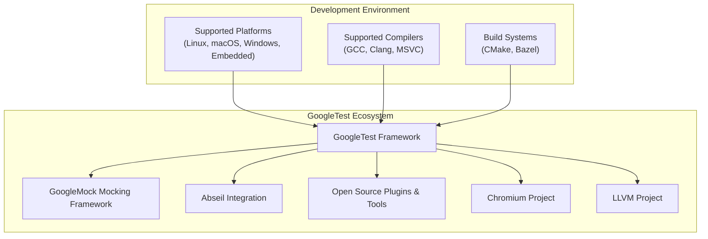

# Integration and Platform Support

## Seamless Platform and Compiler Compatibility

GoogleTest ensures broad usability by supporting a wide range of platforms and compilers commonly used in C++ development. Whether you're working on Linux, Windows, macOS, or embedded systems, GoogleTest is engineered to integrate smoothly. It is thoroughly tested with mainstream compilers such as GCC, Clang, and MSVC, making it a dependable choice for diverse development environments.

### Why Platform and Compiler Support Matters

Efficient and predictable behavior on your development stack means less time spent debugging build issues and more focus on quality testing. GoogleTest's compatibility ensures that you can rely on its core and mocking functionalities without worrying about platform-specific quirks or compiler idiosyncrasies.

## Integration with Modern Build Systems

Integrating GoogleTest into your build and development pipeline is straightforward thanks to its native support for popular build systems:

- **CMake:** GoogleTest provides `FetchContent` and `add_subdirectory` support to seamlessly incorporate into your CMake projects. This fosters easy setup, automatic dependency resolution, and simple configuration to include both GoogleTest and GoogleMock.

- **Bazel:** For projects using Bazel, GoogleTest is consumable as a standard dependency, with tailored build rules enabling centralized management and reproducible builds.

### Practical Integration Scenarios

Consider a project that uses CMake. Adding GoogleTest might look like:

```cmake
include(FetchContent)
FetchContent_Declare(
  googletest
  URL https://github.com/google/googletest/archive/main.zip
)
FetchContent_MakeAvailable(googletest)

add_executable(MyTests test_main.cpp test_foo.cpp)
target_link_libraries(MyTests gtest_main gmock_main)
```

This minimal snippet sets up GoogleTest and GoogleMock without manual cloning or manual linking hassles.

On Bazel, you would declare GoogleTest in your `WORKSPACE` and list it as a dependency in your `BUILD` files, ensuring smooth test runs as part of your continuous integration workflows.

## Extending GoogleTest with Open Source Plugins and Tools

GoogleTest’s ecosystem thrives not only as a standalone framework but also through its extensibility. Users can enhance its capabilities and integrate with other tools by creating or utilizing open source plugins:

- **Custom Assertions and Matchers:** You can write new matchers and assertions that suit your domain-specific testing needs, extending the expressive power of GoogleTest.

- **Platform Portability Helpers:** Plugins can adapt GoogleTest to unusual or constrained environments, optimizing its behavior for embedded or niche platforms.

- **Integration Helpers:** Many tools exist or can be developed to bridge GoogleTest with other testing frameworks or CI/CD environments, helping maintain unified test reporting and workflows.

<Tip>
Consider exploring GoogleMock’s rich macros like `MOCK_METHOD` for creating flexible mocks tailored to complex scenarios, enhancing your test fidelity and precision.
</Tip>

## Interoperability with Abseil and Major Projects

GoogleTest is designed not just as a testing framework but as a foundational component embraced by major projects in the C++ ecosystem.

- It integrates naturally with the **Abseil** library, Google's common C++ utility library, ensuring consistent and robust utility-based development patterns.

- It is widely adopted by critical projects such as **Chromium** and **LLVM**. These projects leverage GoogleTest for their extensive testing needs, confirming its reliability and scalability.

This interoperability means adopting GoogleTest aligns you with proven industry standards and large-scale, high-profile codebases.

## Summary

GoogleTest fits flexibly into a wide array of C++ development environments with robust platform and compiler support. Its seamless integration with CMake and Bazel expedites project setup and continuous testing. Extensible through open source plugins and harmonized with established libraries and major projects, GoogleTest empowers teams to maintain rigorous test coverage across complex, varied software stacks.

---

## Practical Tips for Success

- Always confirm your compiler version compatibility with your GoogleTest release.
- When integrating via CMake, prefer `FetchContent` for better version control.
- Use `NiceMock`, `StrictMock`, or `NaggyMock` to tailor mock object behavior based on your project's sensitivity to uninteresting mock calls.
- Consider writing custom matchers and actions to simplify complex validation logic in your tests.

## Troubleshooting Common Integration Issues

<AccordionGroup title="Integration Troubleshooting">
<Accordion title="GoogleTest Not Found in CMake">
Ensure the `FetchContent` or `find_package` commands correctly point to GoogleTest sources or installed packages. Mismatched versions between GoogleTest and your compiler can cause elusive errors.
</Accordion>
<Accordion title="Compiler Errors Due to Calling Conventions">
When mocking Windows APIs, specify the calling convention in the `MOCK_METHOD` macro using `Calltype(STDMETHODCALLTYPE)`.
</Accordion>
<Accordion title="Linker Errors for GoogleMock Symbols">
Confirm that both GoogleTest and GoogleMock libraries are linked and their versions match. Mixing different versions can cause symbol conflicts.
</Accordion>
</AccordionGroup>

## Related Documentation

- [Feature Overview](/overview/concepts-features-usecases/feature-overview) — For core capabilities
- [Using Mocks Reference](https://google.github.io/googletest/reference/mocking.html) — In-depth mocking techniques and macros
- [Product Introduction](/overview/intro-and-architecture/product-introduction) — To understand GoogleTest’s architecture
- [Integration and Getting Started Guide](/overview/integration-and-getting-started/integration-points) — For detailed integration patterns

---

## Visual Integration Flow



This diagram outlines the relationship and support zones for GoogleTest in common development environments.

---

For comprehensive integration instructions, best practices, and troubleshooting, consult the [Integration and Getting Started](../../integration-and-getting-started/integration-points) guide.


---

