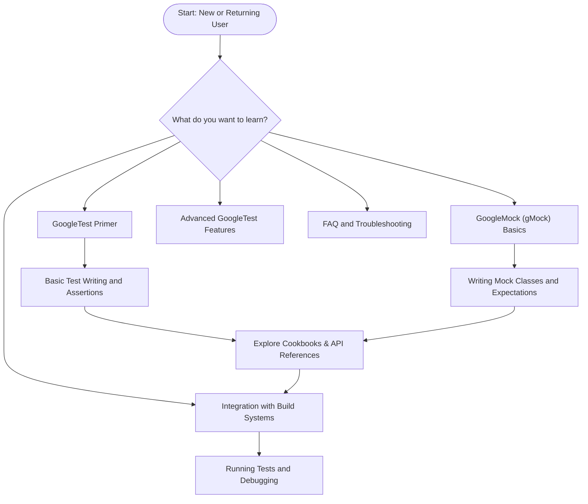

# Quickstart & Resources

Welcome to your streamlined gateway into the world of GoogleTest. This page provides you with the essential resources and starting points to ramp up quickly and effectively. Whether you are new to GoogleTest or looking for practical guidance while integrating it into your projects, we've gathered the most valuable materials here to ensure your onboarding experience is smooth and productive.

## Why Start Here?

Embarking on automated testing with GoogleTest can appear overwhelming given its rich functionality. This page serves as your curated entryway, guiding you towards foundational tutorials, useful references, and additional guides, so you can spend less time searching and more time testing.

## Essential Resources to Begin Your GoogleTest Journey

### 1. GoogleTest Primer

The Primer is *your first stop* if you’re new to GoogleTest. It introduces you to writing simple, effective tests with clear explanations and hands-on examples.

- **Learn the basics:** How to write tests, assertions, and use test fixtures.
- **Understand the testing philosophy:** What makes a good test and how GoogleTest supports it.
- **Build confidence:** By following approachable, practical examples.

Access it here: [GoogleTest Primer](primer.md)

### 2. GoogleTest Advanced Guides

Once you’ve grasped the basics, dive into advanced capabilities to unlock the full potential of GoogleTest:

- Parameterized and type-parameterized testing
- Death tests for crash-testing scenarios
- Customizing test behaviors

Explore it here: [GoogleTest Advanced](advanced.md)

### 3. GoogleMock (gMock) for Mocking Dependencies

For testing interactions and dependencies, the GoogleMock framework is tightly integrated:

- Learn to create mock classes effortlessly
- Set expectations on method calls
- Control mock behaviors with rich actions

Recommended starting point: [gMock for Dummies](gmock_for_dummies.md)

### 4. Cheat Sheets and Cookbooks

Keep quick references and recipes close at hand:

- [gMock Cheat Sheet](gmock_cheat_sheet.md) — Handy syntax reminders
- [gMock Cookbook](gmock_cook_book.md) — Recipes for common mocking patterns

### 5. Frequently Asked Questions

If you hit obstacles or need guided clarifications:

- [GoogleTest FAQ](faq.md)
- [gMock FAQ](gmock_faq.md)

## How This Page Fits Into the Documentation Landscape

This Quickstart page complements the broader GoogleTest documentation, offering a navigational hub aligned with topics from core concepts to integration and architecture. It points you directly to detailed conceptual and API references found in the documentation tree:

- **Overview & Core Concepts:** For understanding GoogleTest architecture, features, and paradigms.
- **Integration Guides:** For smoothly adding GoogleTest to your build systems and CI pipelines.
- **API References:** For deep dives into assertions, mocking APIs, and customization.

Explore the full documentation map to plan your learning route: 

[GoogleTest Documentation Navigation](index.md)

## Practical Tips for Getting Started

- Begin with the primer; it provides a solid foundation.
- Use mock objects with `EXPECT_CALL` and `ON_CALL` to simplify tests involving dependencies.
- Leverage the cookbooks and cheat sheets to apply best practices rapidly.
- When ready, connect your tests with build systems like CMake or Bazel following integration guides.

## Common Pitfalls When Starting

- Setting expectations *after* invoking mock methods leads to undefined behavior; always establish expectations before exercising mocks.
- Overly strict expectations can make tests brittle; keep mocks focused on meaningful interactions.
- Beware of uninteresting calls that generate warnings by default; use `NiceMock` to silence them or provide broader expectations.

## Example: Basic Mock Usage to Get You Started

```cpp
#include <gmock/gmock.h>
#include <gtest/gtest.h>

class Turtle {
 public:
  virtual ~Turtle() {}
  virtual void PenUp() = 0;
  virtual void PenDown() = 0;
  virtual void Forward(int distance) = 0;
  virtual void Turn(int degrees) = 0;
};

class MockTurtle : public Turtle {
 public:
  MOCK_METHOD(void, PenUp, (), (override));
  MOCK_METHOD(void, PenDown, (), (override));
  MOCK_METHOD(void, Forward, (int distance), (override));
  MOCK_METHOD(void, Turn, (int degrees), (override));
};

using ::testing::AtLeast;

TEST(PaintTest, DrawsLine) {
  MockTurtle mock_turtle;

  EXPECT_CALL(mock_turtle, PenDown()).Times(AtLeast(1));
  EXPECT_CALL(mock_turtle, Forward(100));

  // Code that uses mock_turtle to draw lines
}
```

This example from the Primer introduces the core mocking concept: defining a mock, setting method call expectations, and using them to verify interactions.

## Next Steps: Navigate Further

- Read the [GoogleTest Primer](primer.md) for test basics.
- Explore [Integration with Build Systems](integration-with-build-systems-and-tools.md) to set up your environment.
- Dive into [GoogleMock for Dummies](gmock_for_dummies.md) to master mocks.
- Visit the [FAQ](faq.md) if you encounter issues.

<Tip>
Start here to avoid disorientation: the primer offers the quickest path to writing your first successful tests.
</Tip>

<Note>
If you plan to mock dependencies in your tests, familiarize yourself with GoogleMock using the dedicated guide.
</Note>

<Warning>
Do not skip setting expectations before your test calls mock methods, or you will experience confusing errors.
</Warning>

---

### Diagram: Guided User Journey to Key Resources



This flowchart guides users in deciding their learning path starting from this Quickstart page.

---

## Additional Helpful Links

- [GoogleTest GitHub Repository](https://github.com/google/googletest)
- [GoogleTest API Reference](reference/index.md)
- [GoogleMock Documentation](gmock_for_dummies.md)


---

We encourage you to use this page as your launch pad. It consolidates entry points tailored for newcomers and experienced users alike, saving you time and accelerating your proficiency with GoogleTest.

Happy testing!
