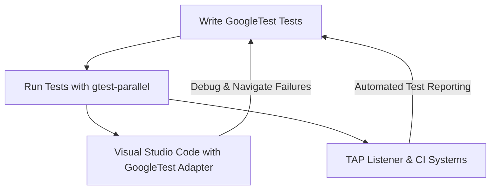

# Ecosystem & Integrations

GoogleTest's power is amplified by an ecosystem of open source projects, IDE plugins, test runners, and extensions designed to make your C++ testing faster, easier, and more productive. This page introduces key integrations—such as `gtest-parallel`, Visual Studio Code adapters, and TAP listeners—that extend GoogleTest's capabilities and help you embed it seamlessly within modern C++ development workflows.

---

## Why Explore Ecosystem & Integrations?

While GoogleTest provides a robust and feature-rich C++ testing framework, real-world software development demands tools that integrate smoothly into your environment and scale with your needs:

- **Speed up test execution on multi-core systems**
- **Integrate with popular development environments for better debugging**
- **Leverage continuous integration and test aggregation tools via standardized test output formats**

Exploring the ecosystem helps you unlock these benefits without reinventing the wheel.

## Key Ecosystem Components

### 1. gtest-parallel: Accelerate Testing by Running Tests in Parallel

- **What it is:** An open-source test runner that executes GoogleTest tests simultaneously across multiple CPU cores.
- **Why it matters:** For large test suites, sequential execution can be time-consuming. `gtest-parallel` leverages concurrency to dramatically reduce test run durations by distributing tests intelligently.
- **How it helps you:**
  - Achieve faster feedback cycles.
  - Efficiently utilize available hardware resources.
  - Compatible out-of-the-box with GoogleTest test binaries.

**Example usage:**

```bash
gtest-parallel path/to/test_binary --repeat 5 --workers 8
```

This runs tests with 8 workers, each running tests in parallel, repeating the suite 5 times to catch flaky tests.

### 2. IDE Integrations: Debug and Develop with Comfort

#### Visual Studio Code Adapters

- **What they provide:** Extensions for Visual Studio Code that enable running and debugging GoogleTest-based tests directly within the editor.
- **User Value:**
  - Seamless test discovery and execution inside your IDE
  - Easy test result visualization and navigation to failures
  - Integrated debugging support for quicker test failure diagnosis

**Real scenario:**
You edit your C++ code and test files, run all tests with a click, and when a test fails, click on the failure message to jump directly to the problematic code—even setting breakpoints or stepping through the test.

### 3. TAP Listeners and Extensions: Facilitate Integration with CI/CD Pipelines

- **Description:** TAP (Test Anything Protocol) listeners parse results from GoogleTest and emit them in TAP format.
- **Why you should care:** Many continuous integration systems and test aggregation tools understand TAP, enabling smooth incorporation of GoogleTest results into broader development workflows.
- **Practical benefits:**
  - Standardized output easily consumable by third-party systems
  - Monitoring and reporting test results with familiar, pipeline-friendly formats
  - Reducing custom parsing code and integration effort

### 4. Other Notable Open Source Projects

- Mocking framework integration enhancements (e.g., gMock extensions) that complement GoogleTest.
- Plugins and scripts that automatically collect coverage data, generate reports, or improve test isolation.

## Bringing It All Together: How These Integrations Fit in Your Workflow



**Story:** Imagine you joined a C++ project with an extensive GoogleTest suite. Initial test runs take minutes, slowing feedback. Introducing `gtest-parallel` trims test time to seconds. Then, you configure a Visual Studio Code extension enabling you to run and debug tests right where you write code, saving precious context-switching time. Finally, a TAP listener integrates test results into your CI dashboard, giving your team instant feedback on every code push.

## Best Practices for Leveraging Ecosystem & Integrations

- **Start by identifying pain points**: Long test times? Frequent context switching? CI integration gaps?
- **Choose tools that fit your environment**: For example, use IDE adapters matching your preferred development environment.
- **Gradually enhance your workflow**: Adopt `gtest-parallel` first, then add TAP integration, then IDE support.
- **Use NiceMock and StrictMock carefully** to tune the clutter of warnings when using extensive mock-based tests, improving developer focus.
- **Keep dependencies up-to-date** to leverage improvements and fixes in ecosystem tools.

## Troubleshooting Common Issues

<AccordionGroup title="Common Pitfalls & Solutions">
<Accordion title="Tests Fail to Run in Parallel with gtest-parallel">
- Ensure tests are independent and do not share mutable global state.
- Confirm your test binary supports repeated invocations without side effects.
- Check environment variables and file locks that may serialize test execution.
</Accordion>
<Accordion title="Visual Studio Code Does Not Discover Tests">
- Verify the GoogleTest adapter is correctly configured to point at your test binaries.
- Make sure tests are compiled with debugging symbols.
- Confirm your project’s build system creates recognizable test executables.
</Accordion>
<Accordion title="TAP Output Integration Issues">
- Validate TAP output using a TAP validator tool.
- Ensure your TAP listener matches the GoogleTest version and output format.
- Confirm CI system parsing configuration aligns with TAP output.
</Accordion>
</AccordionGroup>

## Getting Started with Integrations

<Steps>
<Step title="Select Your Integration Needs">
Assess your workflow to decide which integrations will bring the most value: parallel test execution, IDE support, or CI integration.
</Step>
<Step title="Install gtest-parallel or Your Chosen Tools">
Clone or install the gtest-parallel tool; install Visual Studio Code extensions or TAP listeners per your environment.
</Step>
<Step title="Configure Your Tests and Environment">
Update test runs to use `gtest-parallel`; configure test adapters and TAP output according to official guides.
</Step>
<Step title="Run, Debug, and Iterate">
Leverage faster executions and enhanced feedback loops to improve code quality and developer productivity.
</Step>
</Steps>

**Next logical step:**
Visit the [Supported Platforms & Compatibility](https://github.com/google/googletest/tree/main/docs/overview/integration-ecosystem/supported-platforms.mdx) page to ensure your environment is ready to integrate with these tools.

---

## Additional Resources

- [gtest-parallel repository](https://github.com/google/gtest-parallel)
- [Visual Studio Code GoogleTest Adapter extensions](https://marketplace.visualstudio.com/items?itemName=matepek.vscode-catch2-test-adapter)
- [Test Anything Protocol (TAP)](https://testanything.org/)
- [GoogleTest Ecosystem Overview](https://github.com/google/googletest/blob/main/docs/overview/integration-ecosystem/ecosystem-integrations.md)
- [Mocking Reference](https://google.github.io/googletest/reference/mocking.html)


----

**Note:** This page complements the core [GoogleTest value proposition](https://github.com/google/googletest/tree/main/docs/overview/introduction-foundations/value-proposition.mdx) and the [high-level architecture overview](https://github.com/google/googletest/tree/main/docs/overview/architecture-concepts/high-level-architecture.mdx).

Explore this page as your gateway to supercharging GoogleTest with powerful community and tooling support that fits your team's style and scale.