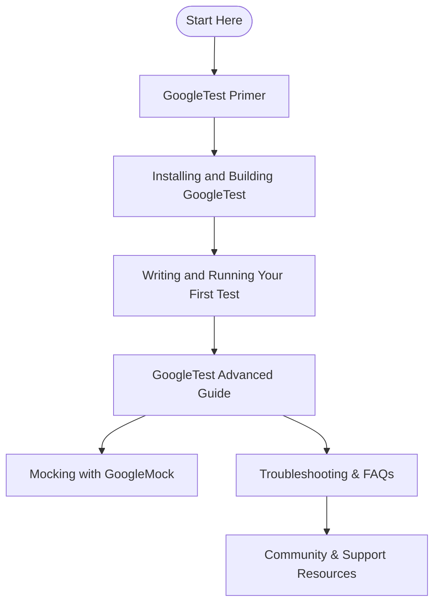

# Further Reading & Where to Start

Welcome to your gateway for deeper knowledge and practical guidance on GoogleTest. This page provides a curated selection of essential documentation resources, user guides, and setup instructions that will ensure you have a smooth and effective onboarding experience.

---

## Why This Page Matters

When you're adopting GoogleTest for your C++ testing needs, it helps to have quick access to authoritative materials that can ease learning and accelerate your journey from setup to advanced usage. Whether you’re a beginner seeking straightforward installation steps or a seasoned developer looking for sample code and best practices, this page connects you directly to the resources that matter most.

---

## Key Resources for Getting Started and Mastery

### 1. Essential User Guides

- **GoogleTest Primer:** 
  Begin here if you are new. This guide walks you through writing your first tests, understanding assertions, test fixtures, and basic test execution. It builds your foundation step-by-step.

- **GoogleTest Advanced:** 
  After mastering the basics, dive into advanced features, test parameterization, death tests, and customizations that empower you to write robust, complex tests.

- **GoogleTest Samples:** 
  See real-world examples that demonstrate typical uses of GoogleTest features, helping you adapt them to your own projects quickly.

- **Mocking with GoogleMock:** 
  If your testing requires mock objects, the 'Mocking for Dummies' guide and 'Mocking Cookbook' provide an intuitive path to start using GoogleMock effectively.

### 2. Setting Up Your Environment

- **Building with CMake:**
  GoogleTest provides a flexible CMake build system supporting multiple platforms. Whether you want to build GoogleTest standalone or integrate it into your existing project, detailed steps and examples are available to get you compiling and linking fast.

- **Using gtest_main and gmock_main Libraries:**
  For ease of use, you can link your test executables against prebuilt main functions provided by `gtest_main` or `gmock_main`. This saves you from writing boilerplate code and simplifies test program entry points.

- **C++ Version Requirements:**
  Ensure your environment supports C++17 or later to build and run GoogleTest smoothly.

### 3. Practical Tips and Best Practices

- Be mindful of runtime library conflicts when using Visual Studio. Using the `gtest_force_shared_crt` option helps align runtime linking.

- Tweak GoogleTest behavior by defining macros on the compiler command line for your specific environment needs.

- Use `ASSERT_*` and `EXPECT_*` assertions thoughtfully to balance test continuation and correctness.

### 4. Troubleshooting and Support

- If you encounter build or linkage issues, consult the Troubleshooting and FAQ pages linked in this documentation set.

- Reach out via community channels or support forums for additional help.

---

## How This Page Fits Into Your GoogleTest Journey

This page acts as a hub bridging your initial interest, through installation and early tests, to advanced workflows and integration.

Below is a simplified user flow to guide your next steps:

Use this as a roadmap to progress through learning and adopting GoogleTest.

---

## Quick Links to Core Resources

- [GoogleTest Primer](primer.md)
- [GoogleTest Advanced](advanced.md)
- [GoogleTest Samples](samples.md)
- [Mocking for Dummies](gmock_for_dummies.md)
- [Mocking Cookbook](gmock_cook_book.md)
- [Installing with CMake](../getting-started/prerequisites-installation/installation-cmake.md)
- [Configuring Includes and Linking](../getting-started/configuration-validation/include-and-link.md)
- [Writing and Running Your First Test](../getting-started/configuration-validation/first-test.md)
- [Troubleshooting Common Setup Issues](../getting-started/troubleshooting-help/common-issues.md)
- [Where To Get Help](../getting-started/troubleshooting-help/support-resources.md)

---

## Pro Tips For Success

- **Link Against gtest_main or gmock_main** whenever possible to simplify test executable setup.

- **Use CMake `FetchContent`** to embed GoogleTest sources cleanly and keep your build system consistent.

- **Pay attention to C++ standard version (>= C++17)** to avoid build failures.

- **Leverage sample tests** as templates to jumpstart your own test suites.

- **Explore mock tutorials early if your project includes dependencies or interactions you want to isolate.**

- **Save time debugging by using the powerful assertion macros that automatically report detailed failure info.**

---

## Next Steps

Move forward by selecting the resource that matches your current needs:

- For absolute beginners, start with the [GoogleTest Primer](primer.md).
- For integration help, see the [Installing with CMake](../getting-started/prerequisites-installation/installation-cmake.md) guide.
- For mocking scenarios, begin with [Mocking for Dummies](gmock_for_dummies.md).

Harness these resources to maximize GoogleTest’s value and rapidly improve your testing workflows.

---

## Additional Reading

To deepen your understanding, consider these complementary documentation:

- [Core Concepts & Terminology](/overview/core-concepts-architecture/core-concepts-terminology)
- [System Architecture Overview](/overview/core-concepts-architecture/architecture-diagram)
- [Ecosystem & Integrations](/overview/integration-ecosystem/ecosystem-integrations)

Your journey with GoogleTest is best advanced by a mix of foundational knowledge, practical examples, and community support - all accessible from this landing page.

---

# You Are Fully Equipped to Start Testing with Confidence

This page is your launchpad to mastering GoogleTest. With the right guides in hand, building a robust C++ testing suite that scales with your projects is within reach. Dive in, explore, and put GoogleTest to work for your code quality assurance today.