# Integration with Other Systems

## Unlocking Seamless Integration for Reliable Testing Workflows

Integrating GoogleTest into your development pipeline is straightforward and designed to complement the tools you already use. This page details how GoogleTest works smoothly with popular build systems, compatible compilers, platforms, continuous integration (CI) tools, and showcases prominent open-source projects that rely on it. Understanding these integrations is crucial to harnessing the full power of GoogleTest in your production environment.

---

## Building with Your Preferred Build System

GoogleTest offers robust support for widely used C++ build systems, enabling you to embed testing effortlessly into your build process.

### CMake

- **Rapid Setup:** GoogleTest provides native support for CMake, allowing you to include it as a subdirectory or as an external dependency easily.
- **Automated Discovery:** Tests written with GoogleTest integrate with CTest, enabling automated test discovery without additional configuration.
- **Flexible Configuration:** You can customize test compilation options, include GoogleTest only in test builds, and link it with your code seamlessly.

### Bazel

- **Optimized Builds:** Bazel users benefit from GoogleTest’s optimized Bazel build rules, enabling efficient incremental builds and caching.
- **Explicit Dependencies:** Easily specify GoogleTest as a dependency with clearly defined rules, which leads to reproducible builds.
- **Compatibility:** Supports multi-platform builds, ensuring your tests run consistently across different environments.

<Info>
For both build systems, comprehensive installation and configuration instructions can be found in the respective [Installation & Quickstart](https://github.com/google/googletest/tree/main/docs/installation.md) and [Configure Your Project](/getting-started/installation-quickstart/configure-project) guides.
</Info>

---

## Supported Platforms and Compilers

GoogleTest is compatible with a wide range of platforms and compilers, making it highly portable.

- **Operating Systems:** Windows, Linux, macOS, and several Unix flavors.
- **Compilers:** GCC, Clang, MSVC, ICC, and others that support modern C++ standards.
- **Continuous Updates:** Ongoing improvements ensure compatibility with the latest language features and platform updates.

<Tip>
When targeting a specific platform or compiler, consult the [Supported Platforms & Requirements](/overview/integration-ecosystem/supported-platforms) page for detailed compatibility notes and known issues.
</Tip>

---

## Continuous Integration (CI) Tool Compatibility

Integrating GoogleTest with your CI pipeline accelerates feedback loops and maintains software quality.

- **Built-in Test Reporting:** GoogleTest outputs standardized test results (e.g., XML format) consumable by popular CI systems such as Jenkins, GitHub Actions, GitLab CI, and CircleCI.
- **Flexible Output Control:** Customize verbosity and reporting to fit your CI environment’s needs, ensuring clear and actionable reports.

<Note>
You can use GoogleTest’s command-line flags like `--gtest_output=xml` to generate reports automatically processed by your CI platform.
</Note>

---

## Prominent Open-Source Projects and Tools Using GoogleTest

GoogleTest is battle-tested in production environments across numerous high-profile open-source projects, which demonstrates its reliability and industry acceptance.

- **Chromium:** The open-source base for Google Chrome extensively uses GoogleTest to ensure code robustness.
- **TensorFlow:** Google’s machine learning framework leverages it for unit and integration tests.
- **Protocol Buffers:** Google’s data interchange format validates its codebase using GoogleTest.
- **Abseil:** The Abseil library collection, widely used in C++ projects, integrates GoogleTest for its testing needs.

These examples highlight GoogleTest’s scalability from small libraries to large, complex codebases.

---

## Customization and Advanced Integration Points

GoogleTest also supports advanced integration scenarios, including:

- **Custom User Configurations:** Override default behaviors such as logging and temporary directory paths by defining macros in the `gtest` and `gmock` custom headers.
- **Threading and Platform-Specific Features:** Macros and hooks exist for customizing threading mechanisms, stack trace collection, and symbol exporting for platform-specific adaptations.

For more detailed guidance, see the [Customization Points](https://github.com/google/googletest/tree/main/googletest/include/gtest/internal/custom) documentation.

---

## Practical Tips for Integration Success

- **Set Expectations Early:** Define clear build and runtime configurations to avoid surprises during test execution.
- **Leverage Default Build Targets:** Use GoogleTest’s provided CMake targets or Bazel rules to reduce maintenance overhead.
- **Use Official Releases:** Prefer official GoogleTest releases to ensure compatibility and receive community support.

<Warning>
Be cautious when mocking or integrating with proprietary build or CI systems; verify compatibility and update your GoogleTest version regularly.
</Warning>

---

## Next Steps

Ready to add tests to your project?

<Steps>
<Step title="Choose Your Build System">
Review the [Install with CMake](/getting-started/installation-quickstart/install-cmake) or [Install with Bazel](/getting-started/installation-quickstart/install-bazel) guide depending on your environment.
</Step>
<Step title="Configure Your Project">
Follow the [Configure Your Project](/getting-started/installation-quickstart/configure-project) documentation to set up GoogleTest for your codebase.
</Step>
<Step title="Explore Supported Platforms">
Check the [Supported Platforms & Requirements](/overview/integration-ecosystem/supported-platforms) for details to ensure smooth operation.
</Step>
<Step title="Integrate with CI">
Implement GoogleTest’s reporting features into your CI pipeline for automated validation.
</Step>
</Steps>

---

## References

- [GoogleTest GitHub Repository](https://github.com/google/googletest)
- [GoogleTest Installation Guide](https://github.com/google/googletest/tree/main/docs/installation.md)
- [GoogleTest Supported Platforms & Requirements](/overview/integration-ecosystem/supported-platforms)
- [Using GoogleTest with CMake](https://cmake.org/cmake/help/latest/module/GoogleTest.html)
- [GoogleTest Continuous Integration Example](https://google.github.io/googletest/continuous-integration.html)

---

## Diagram: Integration Landscape Overview

```mermaid
flowchart TD
  BuildSystem_CMake["Build System: CMake"]
  BuildSystem_Bazel["Build System: Bazel"]
  Platform_Windows["Platform: Windows"]
  Platform_Linux["Platform: Linux"]
  Platform_MacOS["Platform: macOS"]
  Compiler_GCC["Compiler: GCC"]
  Compiler_Clang["Compiler: Clang"]
  Compiler_MSVC["Compiler: MSVC"]
  CI_Jenkins["CI: Jenkins"]
  CI_GitHub["CI: GitHub Actions"]
  CI_GitLab["CI: GitLab CI"]
  GoogleTest["GoogleTest Framework"]
  Projects_Chromium["Project: Chromium"]
  Projects_TensorFlow["Project: TensorFlow"]
  Projects_Protobuf["Project: Protocol Buffers"]

  BuildSystem_CMake -->|builds with| GoogleTest
  BuildSystem_Bazel -->|builds with| GoogleTest

  Platform_Windows -->|supports| GoogleTest
  Platform_Linux -->|supports| GoogleTest
  Platform_MacOS -->|supports| GoogleTest

  Compiler_GCC -->|compatible with| GoogleTest
  Compiler_Clang -->|compatible with| GoogleTest
  Compiler_MSVC -->|compatible with| GoogleTest

  CI_Jenkins -->|consumes test reports| GoogleTest
  CI_GitHub -->|consumes test reports| GoogleTest
  CI_GitLab -->|consumes test reports| GoogleTest

  Projects_Chromium -->|uses| GoogleTest
  Projects_TensorFlow -->|uses| GoogleTest
  Projects_Protobuf -->|uses| GoogleTest

  subgraph "Platform & Compiler"
    Platform_Windows
    Platform_Linux
    Platform_MacOS
    Compiler_GCC
    Compiler_Clang
    Compiler_MSVC
  end

  subgraph "Build Tools"
    BuildSystem_CMake
    BuildSystem_Bazel
  end

  subgraph "Continuous Integration"
    CI_Jenkins
    CI_GitHub
    CI_GitLab
  end

  subgraph "Open Source Projects"
    Projects_Chromium
    Projects_TensorFlow
    Projects_Protobuf
  end

  classDef component fill:#f9f,stroke:#333,stroke-width:1px;
  class BuildSystem_CMake,BuildSystem_Bazel,Platform_Windows,Platform_Linux,Platform_MacOS,Compiler_GCC,Compiler_Clang,Compiler_MSVC,CI_Jenkins,CI_GitHub,CI_GitLab,Projects_Chromium,Projects_TensorFlow,Projects_Protobuf,GoogleTest component;
```

