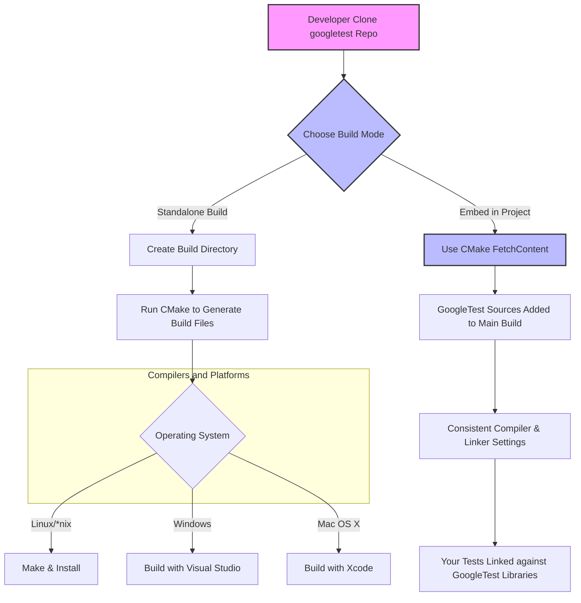

# Supported Platforms & Build Systems

GoogleTest is designed to empower C++ developers with a robust and portable testing framework. Understanding the supported platforms, compilers, and build systems is essential to smoothly integrate GoogleTest into your projects and ensure compatibility.

This page outlines the environments where GoogleTest operates reliably, details the foundational C++ support policy it follows, and explains how to assess whether it fits your project's technical requirements.

---

## Operating Systems Supported

GoogleTest supports a broad spectrum of operating systems, reflecting Google's commitment to platform neutrality and wide usability:

- **Linux**: Including various distributions and Linux-based environments such as Android (partial support).
- **Windows**: Desktop versions, including Visual Studio environments and MinGW.
- **Mac OS X**: Native support including Xcode integration.
- **BSD Variants**: FreeBSD, NetBSD, OpenBSD, DragonFly.
- **Other UNIX-like platforms**: Solaris, AIX, HP-UX.
- **Embedded and specialized platforms**: Limited support or conditional functionality on platforms such as Native Client (NaCl), RTOS like QNX, and microcontrollers like ESP8266/ESP32.

This wide operating system coverage ensures that whether your C++ code runs on server, desktop, mobile, or embedded systems, GoogleTest can serve as a dependable testing foundation.

## Compiler Compatibility

GoogleTest adheres strictly to modern C++ standards, specifically requiring **C++17** or later. The rationale for this is to leverage language features that enable cleaner APIs, better portability, and future-proof robustness.

### Key Compiler Facts:

- **C++ Standard**: Minimum of C++17 support required.
- **Supported Compilers**:
  - GCC (GNU Compiler Collection) with versions supporting C++17.
  - Clang and Intel LLVM, configured for C++17.
  - Microsoft Visual Studio 2017 (version 15.7) or newer.
  - Other compilers compliant with the C++17 standard as per Google's Foundational C++ Support Policy.

### Compiler Configuration Tips:

To ensure successful building of GoogleTest:

- Explicitly set the C++ standard in your build system to C++17, for example with CMake:

  ```cmake
  set(CMAKE_CXX_STANDARD 17)
  set(CMAKE_CXX_STANDARD_REQUIRED ON)
  ```

- If you are integrating into a C project, or cannot set the flag at the top-level, pass the proper compiler options explicitly (e.g., using `-DCMAKE_CXX_FLAGS` with your desired flags).


## Build Systems Supported and Integration

GoogleTest is structured to integrate seamlessly with various widely-used C++ build systems, focusing on flexibility and ease of adoption.

### Primary Build System: CMake

GoogleTest includes a comprehensive native CMake build script allowing easy setup on almost all supported platforms:

- **Standalone Build of GoogleTest:**

  ```bash
  git clone https://github.com/google/googletest.git -b v1.17.0
  cd googletest
  mkdir build
  cd build
  cmake ..             # Builds both GoogleTest and GoogleMock
  make                 # On *nix: compiles the libraries
  sudo make install    # Installs the libraries and headers system-wide
  ```

- To skip building GoogleMock and build only GoogleTest:

  ```bash
  cmake .. -DBUILD_GMOCK=OFF
  ```

- **Development Environments:**
  - Visual Studio project files (`gtest.sln`) generated automatically on Windows.
  - Xcode project files (`.xcodeproj`) created on Mac OS.

- **Incorporation into Existing CMake Projects:**
  The best practice is to add GoogleTest as part of your project build using `add_subdirectory()` or use CMake's `FetchContent` module:

  ```cmake
  include(FetchContent)
  FetchContent_Declare(
    googletest
    URL https://github.com/google/googletest/archive/5376968f6948923e2411081fd9372e71a59d8e77.zip
  )
  set(gtest_force_shared_crt ON CACHE BOOL "" FORCE) # For Windows runtime compatibility
  FetchContent_MakeAvailable(googletest)

  add_executable(example example.cpp)
  target_link_libraries(example gtest_main)
  add_test(NAME example_test COMMAND example)
  ```

  This method offers the advantage that the same compiler and linker settings apply consistently to both GoogleTest and the project code, preventing compatibility issues, especially on Windows platforms.

#### Additional Notes on Integration

- You can utilize Google's Foundational C++ Support Policy matrix to confirm compiler and build system versions comply with GoogleTest's supported range.
- GoogleTest supports both static and shared library builds. For shared libraries (DLLs on Windows), define these macros during compilation:

  ```
  -DGTEST_CREATE_SHARED_LIBRARY=1
  -DGTEST_LINKED_AS_SHARED_LIBRARY=1
  ```

  This ensures correct linkage and runtime compatibility.

- On Windows with Visual Studio, linking C runtime libraries dynamically is typical. GoogleTest defaults to static CRT linkage but provides the option `gtest_force_shared_crt` to harmonize this.

- Multi-threaded tests are supported where pthreads are available; otherwise, threading support and related flags are handled automatically in the build.

## Foundational C++ Support Policy

GoogleTest follows the [Google Foundational C++ Support Policy](https://opensource.google/documentation/policies/cplusplus-support) to ensure stability and compatibility:

- The policy outlines which OS versions, compiler versions, and build environments are supported and actively maintained.
- New changes adhere to this policy to avoid regressions or compatibility breaks.
- Refer to the [support matrix](https://github.com/google/oss-policies-info/blob/main/foundational-cxx-support-matrix.md) for details on exactly which compiler versions (e.g., GCC 11, MSVC 2019) and build tools are supported at any point in time.

This guarantees your usage of GoogleTest aligns with the environments Google actively tests and supports.

---

## Troubleshooting Compatibility

### Common Setup Pitfalls

- ### Unsupported Compiler Version
  Ensure your compiler fully supports C++17. Older compilers will cause build failures or runtime issues.

- ### Mismatched Runtime Libraries on Windows
  Mismatches between dynamically and statically linked C runtime (CRT) can cause link errors. Use the `gtest_force_shared_crt` option to align CRT linkage.

- ### Pthreads Detection Fails
  On platforms where pthreads support is partial or absent, you might need to manually define `-DGTEST_HAS_PTHREAD=0` or `1` to override detection.

- ### Build System Configuration
  Avoid mixing installed GoogleTest libraries and source builds in the same project. Prefer one approach—to reduce ABI incompatibilities.

- ### Cross-compilation Considerations
  If cross-compiling, configure pkg-config paths and CMake sysroots carefully to ensure all include and lib paths resolve correctly.

## Related Resources

- [Generic Build Instructions (googletest/README.md)](https://github.com/google/googletest/blob/main/googletest/README.md) — Comprehensive build and setup guidance.
- [Using GoogleTest with pkg-config (docs/pkgconfig.md)](/docs/pkgconfig.md) — For build systems supporting pkg-config, including cross-compilation tips.
- [Foundational C++ Support Policy Matrix](https://github.com/google/oss-policies-info/blob/main/foundational-cxx-support-matrix.md) — Detailed supported compiler and platform versions.
- [Getting Started Overview](/getting-started/core-setup/prerequisites-requirements) — Basic requirements including OS and compiler recommendations.

---

## Summary

GoogleTest runs on major desktop and server OSes, requires modern C++17-capable compilers, and is built primarily with CMake supporting integration into diverse development pipelines. Following the Foundational C++ Support Policy ensures long-term compatibility and reliability.

Planning your GoogleTest integration with these platform and build system considerations will reduce setup friction and increase your test suite's stability.


---

## Visual Summary Diagram of Build Integration Flow



This diagram highlights the choices users have when building or integrating GoogleTest, showing platform-specific options and recommended integration strategies.

---