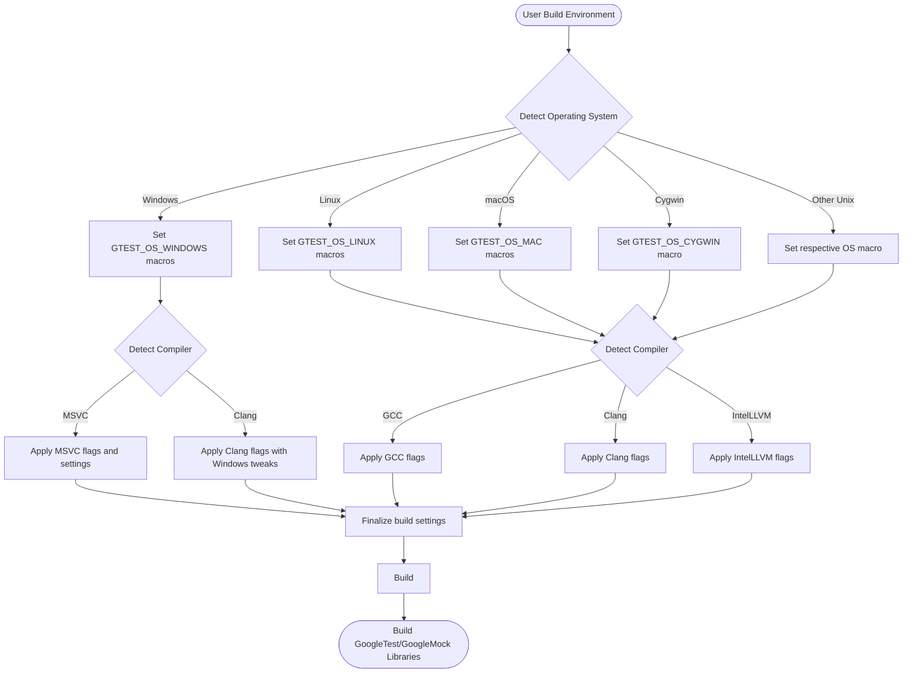

# Supported Platforms and Toolchains

GoogleTest and GoogleMock are designed to operate reliably across a broad variety of environments, from popular desktop platforms to embedded systems. This page details the officially supported operating systems, compilers, and build environments, alongside foundational compatibility policies guiding support decisions. By understanding these support parameters, you can confidently select and configure your development environment for seamless integration with GoogleTest and GoogleMock.

---

## Why Platform and Toolchain Support Matters

Choosing the right platform and compiler ensures your tests run consistently and that the extensive features of GoogleTest and GoogleMock work as expected. Google applies a rigorous support policy that balances wide compatibility with maintainability, focusing on stable, widely-used configurations that maximize user success.

This page helps you:

- Identify which operating systems and compilers are officially supported
- Understand the thread-safety and exception handling capabilities on your platform
- Gain clarity on underlying library and feature dependencies
- Access detailed support matrices and policies via external links


## Official Compatibility Policy

GoogleTest follows Google's [Foundational C++ Support Policy](https://opensource.google/documentation/policies/cplusplus-support), which defines supported C++ platform and compiler versions to ensure security, reliability, and maintainability.

- **Supported Platforms:** Cygwin, Linux, Mac OS X, Windows (Desktop and MinGW) have the most stable and widely tested support.
- **Lesser-Supported Platforms:** Some Unix variants and embedded platforms may work but are less tested due to limited access.
- **C++ Standard:** C++17 or later is required for successful builds, reflecting modern language features and safety.

Refer to [Google's Foundational C++ Support Matrix](https://github.com/google/oss-policies-info/blob/main/foundational-cxx-support-matrix.md) for the latest detailed list of supported compiler versions and platform toolchains.


## Supported Operating Systems

GoogleTest automatically detects the host operating system and sets corresponding macros to optimize compatibility and enable platform-specific functionality. Below are the main officially supported platforms:

| Operating System     | Macro Identifier        | Notes                                  |
|---------------------|------------------------|----------------------------------------|
| Windows Desktop     | `GTEST_OS_WINDOWS_DESKTOP` | Full support including exception handling and threading. |
| MinGW               | `GTEST_OS_WINDOWS_MINGW` | GCC-based Windows support, with pthread-like threading abstractions replaced by native Windows threading primitives. |
| Linux               | `GTEST_OS_LINUX`         | Robust POSIX compliance, pthread support, supports stream redirection and death tests. |
| macOS (OS X)        | `GTEST_OS_MAC`           | Full support including iOS subsets flagged separately. |
| Cygwin              | `GTEST_OS_CYGWIN`        | POSIX compatibility layer on Windows. |

**Additional Supported Systems:**

- BSD Variants: FreeBSD, OpenBSD, NetBSD, DragonFlyBSD (limited testing)
- Solaris / Sun Solaris
- IBM AIX
- Fuchsia

**Embedded & Specialized Platforms:**

Limited support for platforms such as Xtensa, ESP32, and QNX exists, but may lack some advanced features due to limited threading or file system support.


## Supported Compiler Toolchains

GoogleTest supports a range of modern C++ compilers capable of C++17 or later. The build scripts (CMake and others) automatically detect compiler characteristics to adjust flags and compatibility macros.

| Compiler            | Notes                                |
|---------------------|-------------------------------------|
| Microsoft Visual C++ | Minimum VS 2017 Update 3, with flags to control exception support and runtime linkage.
| Clang               | Full support with default warnings and exception flags.
| GCC                 | Supports GCC 7.0.0 and later; includes workarounds for older versions.
| IntelLLVM           | Supported with additional tuning flags.
| SunPro              | Supported with explicit exception macro settings.
| IBM XL / VisualAge   | Supported with adjusted exception and RTTI macros.


### C++ Standard Requirement

GoogleTest requires a C++17-compliant compiler environment to build and run successfully. If your project or environment uses older standards, upgrade your toolchain or apply appropriate flags:

```cmake
set(CMAKE_CXX_STANDARD 17)
set(CMAKE_CXX_STANDARD_REQUIRED ON)
```


## Key Platform Feature Macros

GoogleTest uses macros to fine-tune its behavior based on platform capabilities:

| Macro                        | Meaning                                |
|------------------------------|---------------------------------------|
| `GTEST_HAS_PTHREAD`          | Indicates pthreads threading support is available.
| `GTEST_HAS_EXCEPTIONS`       | Signals whether exception handling is enabled.
| `GTEST_HAS_RTTI`             | Indicates if Run-Time Type Information is enabled.
| `GTEST_HAS_POSIX_RE`         | POSIX regex support availability.
| `GTEST_HAS_FILE_SYSTEM`      | Whether the platform provides file system access.
| `GTEST_HAS_STREAM_REDIRECTION` | Support for redirecting stdout/stderr streams.
| `GTEST_HAS_DEATH_TEST`       | Indicates if death tests are supported.

These macros guide GoogleTest in optimizing synchronization, error handling, and test execution strategies for your environment.


## Build Environment Configuration

GoogleTest's CMake-based build system adjusts to the detected platform and compiler. Some highlights include:

- **Threading:** Automatically detects pthread availability; disables on unsupported environments.
- **Runtime Libraries:** On Windows, the build system handles static vs dynamic CRT linkage, with an option to force shared CRT.
- **Compiler Flags:** Tailored flags are applied per compiler to enforce strict warnings, exception handling, and C++ standard compliance.
- **Shared vs Static Libraries:** Options to build GoogleTest and GoogleMock as either shared or static libraries.

Sample typical CMake commands:

```bash
mkdir build
cd build
cmake ..             # Builds both GoogleTest and GoogleMock
cmake .. -DBUILD_GMOCK=OFF  # Builds only GoogleTest
make                 # Or build with your IDE/build tool
sudo make install    # Installs headers and libraries
```


## Troubleshooting Platform Compatibility

Common issues stem from mismatches between your build environment and GoogleTest's expectations:

- **Threading Errors:** Ensure pthreads are available on Unix systems or that your toolchain properly supports multithreading.
- **Exception Handling:** Confirm your compiler flags do not disable exceptions if your tests require them.
- **Runtime Library Conflicts:** On Windows, mismatch between static and dynamic CRT linkage can cause linker errors.
- **Unsupported Platforms:** Using platforms outside official support may require manual tweaks or may lack full feature sets.

<Tip>
If your environment is not natively supported but you want to try building GoogleTest, consider manually defining key macros such as `GTEST_HAS_PTHREAD=0` or `GTEST_HAS_EXCEPTIONS=1` and adjust your compiler flags accordingly.
</Tip>


## Further Resources and Detailed Matrices

- [Google's Foundational C++ Support Policy and Matrix](https://github.com/google/oss-policies-info/blob/main/foundational-cxx-support-matrix.md): comprehensive up-to-date compatibility list.
- [GoogleTest README - Build and Configuration](https://github.com/google/googletest/blob/main/README.md): practical build instructions and environment considerations.
- [Platform-Specific Macros and Details](https://github.com/google/googletest/blob/main/googletest/include/gtest/internal/gtest-port.h): definitive source of platform capabilities and flags.


## Summary

This page consolidates foundational platform and toolchain support details crucial for setting up GoogleTest and GoogleMock environments. Understanding the compatibility landscape helps you avoid configuration pitfalls, optimize builds, and leverage the full power of Google’s C++ testing frameworks.

For a smooth start, pair this knowledge with the practical "Prerequisites & Supported Platforms" and "Installation Methods" pages in our docs.


---

### Platform and Compiler Detection Flow Diagram




## Practical Tips

- Always use CMake to handle the complexity of platform differences.
- Explicitly set the C++ standard to 17 or greater in your project.
- On Windows with Visual Studio, consider the `gtest_force_shared_crt` option to avoid runtime library conflicts.
- For cross-compilation or embedded environments, verify key macros for threading and exception support.
- Refer to the `gtest-port.h` macros to understand how GoogleTest adapts to your platform.


---

For a more in-depth understanding of GoogleTest architecture and features, explore our [Core Architecture Overview](/overview/core-architecture-concepts/architecture-diagram) and the [Platform & Build System Integration](/concepts/integration-scalability/platform-integration) documentation pages.

---

# Links

- Foundational C++ Support Policy: https://opensource.google/documentation/policies/cplusplus-support
- Foundational C++ Support Matrix: https://github.com/google/oss-policies-info/blob/main/foundational-cxx-support-matrix.md
- GoogleTest README - Build and Installation: https://github.com/google/googletest/blob/main/README.md
- Platform Macros and Build Configuration: https://github.com/google/googletest/blob/main/googletest/include/gtest/internal/gtest-port.h
- Supported Platforms Overview: /overview/integration-platforms/platform-support
- Prerequisites & Supported Platforms Guide: /getting-started/prereqs-installation/prerequisites

