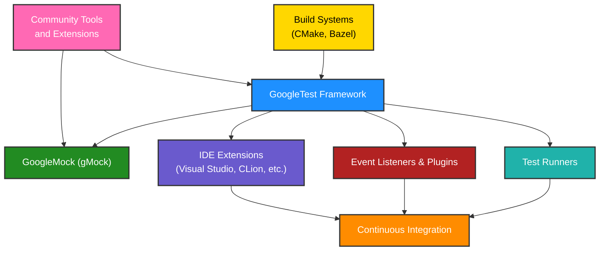

# Related Tools & GoogleTest Ecosystem

Explore the rich ecosystem surrounding GoogleTest, featuring community-driven and Google-supported tools that extend its testing capabilities. This page highlights auxiliary test runners, IDE extensions, event listeners, and various plugins designed to enhance developer workflows across diverse environments. Whether integrating with build systems or leveraging enhanced reporting, these tools empower you to harness GoogleTest with greater flexibility and efficiency.

---

## Overview of the GoogleTest Ecosystem

GoogleTest is more than just a testing framework — it serves as the foundation for a vibrant ecosystem of tools that improve development and testing experiences. These companion tools address pain points such as running tests in different environments, integrating with IDEs, capturing richer test metadata, and customizing test reporting.

By leveraging these tools, you can:

- Run and manage tests conveniently across complex build systems and CI pipelines.
- Benefit from IDE support that offers real-time feedback and seamless integration.
- Extend test reporting with custom listeners and plugins to suit your project's needs.
- Incorporate additional workflows that fit your particular development environment.

Together, these tools maximize your productivity and test reliability.

## Key Categories in the Ecosystem

### Test Runners and Build Tools

GoogleTest integrates well with existing build systems, and complementary test runners make it easy to automate test execution:

- **Bazel** and **CMake** integrations support building and running tests efficiently in large projects.
- Standalone test runners provide flexibility for smaller setups or specialized requirements.

### IDE Extensions

To boost productivity during development, numerous IDE plugins and extensions are available:

- **Visual Studio**, **CLion**, and other popular C++ IDEs have GoogleTest plugins that recognize test cases, enable one-click test runs, and parse results visually.
- These extensions support debugging, test filtering, and sometimes even auto-generation of test scaffolding.

### Event Listeners and Plugins

GoogleTest's extensible architecture allows customizing test execution behavior and reporting through event listeners:

- Event listeners can hook into test lifecycle events to capture custom metrics or integrate with third-party systems.
- Plugins help generate test artifacts such as XML reports compatible with CI tools, or enhanced console output for better readability.

### Community Contributions and Third-Party Tools

The ecosystem is enriched by active community contributions, including:

- Specialized mocking tools that extend GoogleMock's capabilities.
- Test coverage analyzers and mutation testing tools that provide insights into test quality.
- Code analyzers and linters tailored for GoogleTest-based projects.

## Why Use These Related Tools?

By integrating these tools into your testing workflow, you can achieve:

- **Faster feedback cycles** through IDE integration and automated test runners.
- **Better test visibility** with rich test reports and coverage information.
- **More reliable test management** across large codebases using advanced build integrations.
- **Custom workflows** that adapt GoogleTest behavior to your team's conventions and infrastructure.

## Practical Example: Integrating GoogleTest with CMake and an IDE

Imagine a developer writing C++ code using GoogleTest with CMake as a build system:

1. They add GoogleTest as an external dependency or submodule.
2. Their CMakeLists.txt is configured to build tests and produce executable test binaries.
3. Inside their IDE (e.g., CLion), the GoogleTest plugin detects all test cases automatically.
4. The developer can run, debug, or re-run specific tests directly from the IDE with meaningful output and inline error reporting.
5. Upon CI integration, XML test reports generated by GoogleTest can be consumed for detailed dashboards.

This combination dramatically simplifies test-driven development and continuous validation.

---

## Tips & Best Practices

- Always keep your build integration scripts (CMake, Bazel) up to date with GoogleTest to leverage new features.
- Use event listeners for custom logging or metrics but keep performance impacts minimal.
- Choose the right mock strategy (NiceMock, NaggyMock, StrictMock) to balance test strictness and maintainability.
- Explore community-developed plugins and extensions to avoid reinventing the wheel.
- Integrate test output with your CI/CD dashboards to quickly spot regressions.

## Troubleshooting Common Challenges

- If tests are not detected by your IDE plugin, verify the plugin version and project configuration.
- Build issues with GoogleTest integration often arise from mismatched compiler settings; ensure consistent flags.
- Unclear test reports can be improved by customizing event listeners or enabling verbose output.
- Manage mock strictness carefully as overly strict mocks can cause fragile tests; use NiceMock during development for flexibility.

---

## Learn More & Next Steps

To deepen your understanding and get started with these related tools:

- Visit the [GoogleTest GitHub repository](https://github.com/google/googletest) to explore integration guidelines and community contributions.
- Refer to the **Supported Platforms & Compatibility** ([link](/overview/integrations/supported-platforms)) page for environment details.
- Check out the **Integration with Build Systems** ([link](/overview/integrations/integration-with-build-systems)) documentation for CMake and Bazel instructions.
- Explore the **Core Concepts & Terminology** ([link](/overview/architecture-concepts/core-concepts)) to understand test lifecycle and mocking.
- Try the **Creating and Using Mocks with GoogleMock** ([link](/guides/core-testing-workflows/using-mocks)) guide for advanced testing scenarios.

These resources guide you through the full spectrum from setup to advanced usage within the GoogleTest ecosystem.

---

<Info>
For detailed API reference, examples, and recipes on GoogleMock and mocking patterns, see the [GoogleMock README and References](https://google.github.io/googletest/gmock_for_dummies.html).
</Info>

<Note>
Make sure to evaluate your project's needs before integrating additional tools to maintain simplicity and avoid overcomplicated workflows.
</Note>

---

### Summary Diagram: GoogleTest Ecosystem Overview

