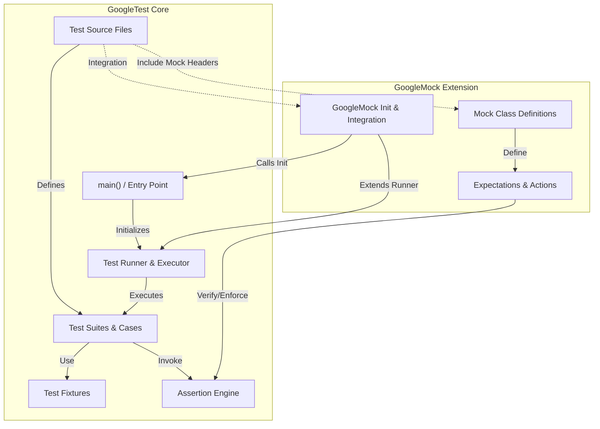

# How GoogleTest Is Structured

Understand the high-level architecture of GoogleTest and GoogleMock, the foundational components of this widely adopted C++ testing framework. This page provides a clear visualization of how the core testing and mocking libraries interact, process test code, and manage execution flow — empowering you to grasp how test source files transform into executed tests.

---

## Overview: Why This Matters

Efficient, reliable testing depends on a clear architecture. When you know how GoogleTest and GoogleMock fit together, you achieve better integration, debugging, and extension capabilities. This page unpacks their relationship, clarifying:

- How GoogleTest discovers, organizes, and executes tests.
- How GoogleMock extends the framework to provide mock class support.
- How the two libraries coexist with distinct but complementary responsibilities.

By visualizing their structure, you are equipped to diagnose issues, customize entry points, and leverage advanced features.

---

## High-Level Architecture of GoogleTest

At a glance, GoogleTest's architecture comprises the following key components:

- **Test Cases and Test Suites:** Logical organization units grouping related tests.
- **Test Fixtures:** Setup and teardown support for shared test context.
- **Test Runner and Main Function:** Initialization, command-line parsing, and orchestration of test execution.
- **Assertion Engine:** Records and reports pass/fail status.

GoogleMock builds on top of this foundation, adding:

- **Mock Class Definitions:** User-defined mock objects with methods mimicking production code.
- **Expectation and Behavior Engine:** Declarative expectations for method calls with flexible matching and response options.
- **Integration with GoogleTest's Runner:** To execute and verify mock expectations alongside regular tests.

For many users, GoogleMock seamlessly integrates with GoogleTest without changing the core test flow, but provides powerful mocking within that flow.

---

## Visual Diagram: Component Interaction

---

## How Tests Flow From Source to Execution

1. **Source Code Definition:** You write test source files using `TEST()`, `TEST_F()`, or mock classes with `MOCK_METHOD()` macros. These build the test suite and mocking infrastructure.

2. **Initialization in `main()`:** Normally, GoogleTest provides a predefined `main()` in `gtest_main`. If you use GoogleMock, `gmock_main` initializes both GoogleMock and GoogleTest together, preparing to run tests and mocks.

3. **Test and Mock Discovery:** The test runner registers tests and mock expectations automatically from static initialization.

4. **Execution:** Calling `RUN_ALL_TESTS()` invokes each test in isolation, using test fixtures where defined. GoogleMock verifies that mock expectations are met during test execution.

5. **Results Reporting:** Assertions accumulate pass/fail status with detailed output. Mock failures highlight unmet or unexpected method calls.

---

## Core Integration Points

- **Initialization Functions:**
  - `testing::InitGoogleTest()` — Prepares the GoogleTest framework.
  - `testing::InitGoogleMock()` — Calls `InitGoogleTest()` internally, then sets up mocking.
 
- **Main Entrypoints:**
  - When using GoogleTest alone, link with `gtest_main` to get a default `main`.
  - When using GoogleMock, link with `gmock_main` for a `main` that initializes both.

- **Mock and Test Headers:**
  - Include `<gtest/gtest.h>` for core testing.
  - Include `<gmock/gmock.h>` to add mocking capabilities in tests.

---

## Practical Tips for Working with This Structure

- **If you only need simple tests, link with `gtest_main` and include `<gtest/gtest.h>`**.

- **For mocking, link with `gmock_main` and include `<gmock/gmock.h>`**; this automatically initializes both frameworks in correct order.

- **Keep your test suites organized to match the product structure**; this ensures smooth registration and intuitive reporting.

- **Understand that GoogleMock depends on GoogleTest:** You cannot separate them if you want mocking.

- **Customize `main()` only if you need special initialization**; otherwise use provided defaults.

- **When debugging test startup or registration issues, check the entry point initialization functions**.

---

## Common Pitfalls

<Warning>
Avoid including both `gtest_main` and `gmock_main` libraries in the same executable; this will cause linker conflicts because both define `main()`.
</Warning>

<Warning>
Do not call `InitGoogleTest()` separately when `InitGoogleMock()` is used; `InitGoogleMock()` already initializes GoogleTest.
</Warning>

<Tip>
If you need special platform support or custom `main()`, refer to the source files `gtest_main.cc` and `gmock_main.cc` which demonstrate default patterns and platform-specific considerations.
</Tip>

---

## Summary

This page demystified the structure of GoogleTest and GoogleMock, visually mapping how components connect from tests in your source files through execution and verification. Understanding these relationships streamlines test development, integration, and troubleshooting.

For practical use, most users won't need to touch the underlying architecture but knowing its flow helps with customizing initialization or diagnosing complex test behavior.

---

## Next Steps

- Explore the [GoogleTest Primer](primer.md) to start writing your first tests.
- Learn to create mocks using [Mocking for Dummies](gmock_for_dummies.md).
- Dive into integration patterns in [Integration and Platform Support](overview/integration-and-getting-started/integration-points) for environment-specific guidance.

---

## References

- [GoogleTest Primer](primer.md)
- [GoogleMock README](googlemock/README.md)
- [GoogleTest Main.cc Source](googletest/src/gtest_main.cc)
- [GoogleMock Main.cc Source](googlemock/src/gmock_main.cc)

---

## Source Code Links

<Source url="https://github.com/google/googletest" paths={[{"path": "googletest/src/gtest_main.cc", "range": "1-70"},{"path": "googlemock/src/gmock_main.cc", "range": "1-69"}]} />
