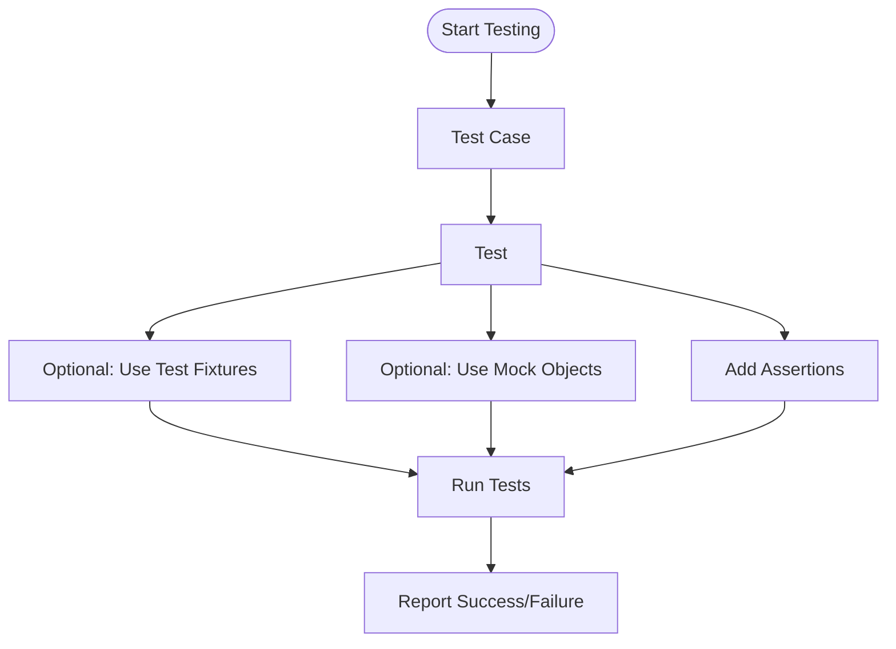

# Core Concepts and Terminology

Explore the essential concepts, such as test cases, assertions, mock objects, and test fixtures, that form the backbone of effective testing with GoogleTest. This page demystifies terminology for new users while providing clarity for advanced use.

---

## Understanding the Building Blocks of GoogleTest

GoogleTest provides a robust framework for writing and running C++ tests. To leverage its power effectively, it’s crucial to grasp its core concepts and terminology. This understanding enables you to write clearer tests, use mocking effectively, and debug issues faster.

### Test Case

A **test case** is a logical grouping of related tests. It organizes tests by feature, component, or behavior, allowing you to manage and run related tests together.

### Test

A **test** is an individual unit that checks a specific behavior or state. Each test is identified by a unique name within a test case and consists of one or more assertions.

### Assertion

An **assertion** is a statement that verifies whether a condition is true or false. GoogleTest provides a rich set of assertions (e.g., `EXPECT_EQ`, `ASSERT_TRUE`) to express expectations about your code.

### Test Fixture

A **test fixture** is a C++ class that sets up a common environment for multiple tests. It provides shared setup and teardown methods, allowing tests to reuse code and maintain isolation.

### Mock Object

A **mock object** is a test double that mimics the behavior of a real object. It records interactions and can be programmed to respond in specific ways. GoogleMock extends GoogleTest to support creating and using mock objects.

---

## Key Principles and Terminology

| Term           | Definition                                                                                   |
|----------------|----------------------------------------------------------------------------------------------|
| Test Suite     | Another term for Test Case, a collection of related tests.                                  |
| Test Runner    | The executable or component responsible for running tests and reporting results.            |
| Test Fixture   | A class that provides setup and teardown code for tests sharing the same environment.       |
| Assertion      | A condition that verifies expected vs. actual outcomes; failures here flag test failures.   |
| Mock Object    | An object that simulates behavior of real modules, facilitating interaction testing.        |

---

## How These Concepts Fit Together

A typical GoogleTest workflow uses these components as follows:

1. **Organize tests** into test cases or suites.
2. **Write individual tests**, each performing a discrete behavior check.
3. **Use assertions** within tests to validate conditions.
4. **Create test fixtures** if multiple tests share setup/teardown logic.
5. **Employ mock objects** to replace dependencies, allowing isolated testing of components.

This layered approach promotes modular, maintainable, and readable tests.

---

## Practical Tips

- Always provide **unique, descriptive names** for your tests and test cases to make reports easy to understand.
- Use **test fixtures** when multiple tests need common setup to reduce code duplication.
- Prefer **mock objects** over real external dependencies to keep tests fast and deterministic.
- Understand the difference between **assertions that continue tests (EXPECT_*) and those that abort tests (ASSERT_*)** to structure tests appropriately.

---

## Common Terminology Clarifications

- **Test Case vs Test Suite:** Used interchangeably in GoogleTest, though GoogleTest uses Test Case primarily.
- **Mock vs Fake:** Mocks verify interactions; fakes provide simplified working implementations.
- **Match vs Expectation:** A *matcher* checks if an argument meets criteria; an *expectation* asserts that a call matching those criteria happens.

---

## Troubleshooting Common Confusions

- A test failing might mean an assertion failed, or an unexpected call to a mock occurred.
- Tests can pass even if not all mock expectations are set correctly; ensure you verify mock expectations.
- Mock objects require **virtual destructors** in their interfaces to avoid memory leaks.

---

## Ready to Advance?

Once comfortable with these fundamental terms, explore practical guidance on writing tests and using mocks:

- [Writing and Running Your First Test](/guides/getting-started/your-first-test)
- [Basic Mocking with GoogleMock](/getting-started/configuration-and-first-use/using-googlemock-basics)
- [Mocking in Practice: Isolating Dependencies](/guides/core-test-workflows/mocking-intro)

You might also want to review the [Product Value Proposition](/overview/intro-concepts/product-value-proposition) page to understand the goals GoogleTest aims to achieve.

---

## References and Further Reading

- [GoogleTest Overview and Architecture](/overview/intro-concepts/product-value-proposition)
- [GoogleMock for Dummies](https://google.github.io/googletest/gmock_for_dummies.html)
- [GoogleMock Cookbook](https://google.github.io/googletest/gmock_cook_book.html)
- [GoogleMock Cheat Sheet](https://google.github.io/googletest/gmock_cheat_sheet.html)

---

## Diagram: Core Test Workflow Overview

---