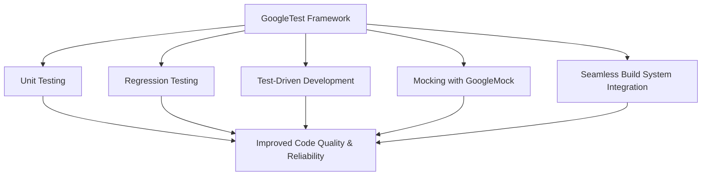

# Value Proposition and Use Cases

## Accelerate Your C++ Development Cycle with GoogleTest

GoogleTest is designed to streamline and accelerate your workflow in developing C++ applications by providing a robust, automated testing framework. By integrating GoogleTest, you ensure that your code is consistently verified for correctness, enabling rapid iteration without sacrificing quality.

### Why GoogleTest Matters

- **Enhance Code Quality:** Automated tests catch regressions early and enforce design contracts.
- **Comprehensive Test Discovery:** Easily finds and runs all your tests, saving time.
- **Seamless Integration:** Fits smoothly into common build systems and continuous integration pipelines.
- **Support for Modern Development Practices:** Facilitates unit testing, regression testing, and test-driven development (TDD).
- **Mocking Capabilities:** Leveraging GoogleMock enables isolating components and verifying behavior in complex systems.

### Who Benefits Most?
- C++ developers seeking reliable and maintainable tests.
- Teams adopting TDD or continuous integration workflows.
- Projects requiring control over dependencies through mocking.

## What Is This Page About?

This documentation page outlines the core business and technical values you gain by adopting GoogleTest. It details the major use cases where GoogleTest is especially powerful, and how it enables best practices in software development.

## GoogleTest: Empowering Your Testing

GoogleTest is an open-source C++ testing framework by Google that removes manual overhead from writing and maintaining tests. It automates discovery and execution of tests and is designed to boost both developer productivity and software quality.

At its core, GoogleTest enables:

- **Automated verification:** Ensure your code behaves as expected by running tests automatically.
- **Rapid Feedback Loop:** Immediate feedback on changes reduces debugging time.
- **Scalability:** Supports projects of any size with extensive test discovery.

Its value is amplified when paired with GoogleMock, allowing mocking and verification of interactions between components.

## Key Value Propositions

- **Accelerated Development:** Tests run quickly and reliably, letting you catch errors in the earliest stages.
- **Improved Reliability:** Robust unit testing reduces bugs in production.
- **Maintainable Codebase:** Writing and running tests becomes an integral part of the lifecycle.
- **Flexible Testing Patterns:** Supports various testing strategies including regression testing and TDD.
- **Dependency Isolation with Mocks:** Enables testing in isolation by replacing complex dependencies.

## Primary Use Cases

### 1. Unit Testing

GoogleTest facilitates the creation of small, focused tests that verify the correctness of individual components. Use this to ensure your pieces behave correctly independently.

### 2. Regression Testing

Ensure that changes do not unintentionally break existing functionalities. GoogleTest automatically discovers all tests and enables continuous execution.

### 3. Test-Driven Development (TDD)

Write your tests before your code to design clean, testable, and reliable components. GoogleTest’s intuitive syntax and integration encourage this practice.

### 4. Mocking Dependencies

Using GoogleMock, mock objects simulate complex or external dependencies, allowing you to isolate units of code and verify interactions and behaviors precisely.

## Benefits and Real-World Scenarios

Imagine developing a feature that relies on a database call. Before GoogleTest, testing such code might require a running database, making tests slow and fragile. With GoogleMock, you can simulate the database, focusing tests on logic, accelerating testing, and making it more dependable.

### Before GoogleTest
- Manual testing or limited automation.
- Tests depend on environment setup.
- Fragile and slow tests.

### After GoogleTest
- Fully automated, environment-independent tests.
- Quick feedback on code changes.
- Confident refactoring and maintenance.

## Getting Started Preview

Getting started with GoogleTest involves these steps:

- Include GoogleTest headers in your project.
- Write your test cases using the TEST or TEST_F macros.
- Run your tests either standalone or integrated within your build system.
- Incorporate GoogleMock for mocking complex dependencies.

For detailed instructions, refer to the [Getting Started](https://github.com/google/googletest/blob/main/docs/gmock_for_dummies.md) and the samples provided.

## Practical Tips & Best Practices

- Use GoogleTest’s rich assertion macros to write expressive and meaningful checks.
- Combine GoogleTest with GoogleMock for comprehensive test coverage.
- Avoid over-specifying expectations; prefer `ON_CALL` for default behaviors and `EXPECT_CALL` for actual verification.
- Organize complex expectations with sequences and cardinalities to model interaction patterns accurately.
- Leverage `NiceMock`, `NaggyMock`, or `StrictMock` classes to control uninteresting call behavior as per your test strategy.

## Troubleshooting Common Issues

- Ensure all virtual methods you mock have virtual destructors to prevent memory issues.
- Remember to set expectations before exercising the code under test to avoid undefined behavior.
- Use `--gmock_verbose=info` for detailed tracing when expectations fail.
- Use `Mock::AllowLeak()` cautiously when mocks are deliberately leaked.

## Further Reading & Resources

- [What is GoogleTest?](https://github.com/google/googletest/blob/main/docs/overview/intro-core-concepts/what-is-googletest.mdx)
- [gMock Reference](https://github.com/google/googletest/blob/main/docs/reference/mocking.md)
- [gMock Cookbook](https://github.com/google/googletest/blob/main/docs/gmock_cook_book.md)
- [gMock Cheat Sheet](https://github.com/google/googletest/blob/main/docs/gmock_cheat_sheet.md)

---

_For a comprehensive walkthrough of core concepts, start with the introduction to GoogleTest, and then proceed to mock creation and usage guides._



---

## Example: Setting Expectations and Using GoogleMock

```cpp
#include <gmock/gmock.h>
#include <gtest/gtest.h>

using ::testing::Return;

class Foo {
 public:
  virtual ~Foo() {}
  virtual int GetSize() const = 0;
};

class MockFoo : public Foo {
 public:
  MOCK_METHOD(int, GetSize, (), (const, override));
};

TEST(FooTest, ReturnsProperSize) {
  MockFoo mock_foo;
  ON_CALL(mock_foo, GetSize()).WillByDefault(Return(42));
  EXPECT_CALL(mock_foo, GetSize()).Times(1);

  int size = mock_foo.GetSize();
  EXPECT_EQ(size, 42);
}
```

This simple test:

- Creates a mock class for `Foo`.
- Sets a default action that `GetSize()` returns `42`.
- Expects `GetSize()` to be called exactly once.
- Verifies the return value.

---

## Summary

This page is your first step in understanding how GoogleTest helps accelerate your C++ development, improves code reliability, and supports modern testing workflows including mocks for complex dependency testing. By mastering these use cases and value propositions, you empower your projects with robust automated testing tailored to C++.

# Additional Resources
- [Getting Started with GoogleTest](https://github.com/google/googletest/blob/main/docs/gmock_for_dummies.md)
- [GoogleMock Reference](https://github.com/google/googletest/blob/main/docs/reference/mocking.md)
- [Core Concepts Overview](https://github.com/google/googletest/blob/main/docs/overview/intro-core-concepts/what-is-googletest.mdx)


---

> For a full path through the documentation, consider the [Navigation Map](../overview/intro-core-concepts/Value-Proposition-and-Use-Cases) and explore related guides on writing tests, mocking dependencies, and integrating tests into build systems.