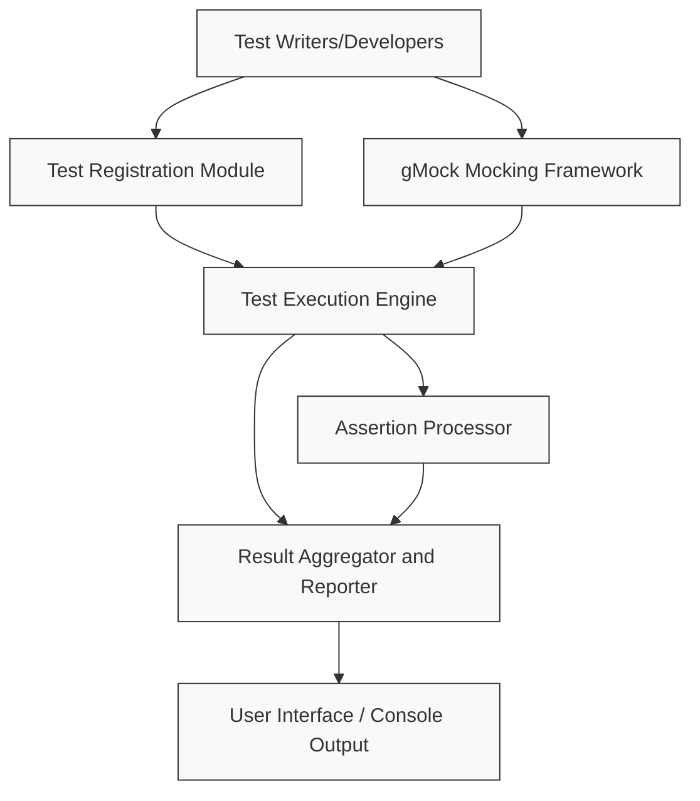

# System Diagram

## Visualizing the Core Interaction Flow of GoogleTest

Welcome to the System Diagram page where we offer a clear graphical illustration of how the fundamental components of the GoogleTest framework interact. Whether you are a new user, a developer seeking to understand the workflow, or a stakeholder wanting organizational clarity, this diagram breaks down the system flow — from writing tests and mocks to executing them and reporting results.

---

## Why This Matters

Understanding the system architecture at a glance empowers you to:  
- Grasp how tests and mocks fit within the broader GoogleTest ecosystem
- Visualize the execution flow to simplify debugging and development
- Appreciate the design choices that enable fast, reliable testing

With this knowledge, you can confidently navigate GoogleTest’s capabilities and optimize your testing strategy.

---

## Core Components and Their Roles

Here are the key components featured in the diagram:  

- **Test Writers**: Developers writing test cases and mock classes using GoogleTest and GoogleMock APIs.
- **Test Registration Module**: Automatically registers test cases and fixtures to simplify test discovery.
- **Mocking Framework (gMock)**: Allows creation and management of mock objects, enabling behavior control and expectation verification.
- **Test Execution Engine**: Runs registered tests, including handling fixtures setup and teardown.
- **Assertion Processor**: Evaluates assertions within tests to determine success or failure.
- **Result Aggregator and Reporter**: Collects test outcomes and generates readable reports.
- **User Interface / Console Output**: Presents test results, summaries, and detailed failure messages.

---

## System Flow Explained

1. **Writing Tests and Mocks**: You write tests using macros like `TEST()` and create mock classes with gMock’s macros.
2. **Automatic Registration**: Tests and mocks are automatically registered via internal mechanisms for discovery.
3. **Test Execution**: The execution engine runs each test, ensuring proper setup and teardown.
4. **Assertions and Expectations**: The assertion processor checks truth conditions; the mocking framework verifies mock interactions.
5. **Result Reporting**: Outcomes are aggregated and reported to the user via console or UI.

This flow ensures your tests are organized, run efficiently, and provide insightful feedback.

---

## Diagram: GoogleTest Core Interaction

---

## Practical Example Scenario

Imagine you have just written a test suite for a module with several dependencies. Using gMock, you create mock implementations of those dependencies. Once you start your test run:

- Your test code is registered automatically.
- The execution engine sets up the test fixtures.
- Mock expectations are checked during execution.
- Assertions verify returned and internal states.
- Results report any discrepancies immediately with precise error locations.

This coherent flow minimizes manual setup and maximizes feedback clarity, improving developer productivity.

---

## Tips for Navigating the System

- **Leverage Automatic Registration:** Avoid manual enumeration of tests by relying on GoogleTest’s registration mechanism.
- **Understand Mock Interactions:** Use the mocking framework to tightly control dependencies and test interactions.
- **Follow Execution Order:** Knowing the sequence helps when debugging setup or teardown issues.
- **Use Detailed Reporting:** Act on failure reports immediately as they link directly to failing expectations or assertions.

---

## Troubleshooting Common Issues

<AccordionGroup title="Common Troubleshooting Tips">  
<Accordion title="Test Not Running or Registered">  
Ensure you use supported test macros like `TEST()` or `TEST_F()`. Check that all test files are linked in the build and that registration is not disabled.  
</Accordion>  
<Accordion title="Mock Expectations Fail Unexpectedly">  
Verify that expectations are set _before_ the code under test interacts with mocks. Ensure call cardinalities and order constraints match your test scenario.  
</Accordion>  
<Accordion title="Unclear Failure Messages">  
Run tests with verbose output flags to get detailed stack traces and contextual information. Use IDE integrations if available to jump directly to failure points.  
</Accordion>  
</AccordionGroup>

---

## Next Steps

Now that you have a clear visualization of how GoogleTest components interact,
explore the following pages to deepen your understanding and master the framework:

- [What is GoogleTest?](../introduction-and-architecture/what-is-googletest) — Learn the fundamental purpose and benefits.
- [Core Architecture Overview](../introduction-and-architecture/core-architecture-overview) — Dive further into detailed architectural concepts.
- [Writing and Running Your First Test](../../guides/gtest-core-workflows/writing-and-running-tests) — Get started with practical test writing.

---

We invite you to use this diagram as a mental map while working with GoogleTest to streamline your development and testing workflows.

---

*For detailed code examples and advanced mocking scenarios, see the** [GoogleTest Primer](../../getting-started/primer) and **[gMock for Dummies](../../guides/gmock-mocking-patterns/creating-mocks)**.*

---

*This page is part of the [GoogleTest User Guide](../../index).*