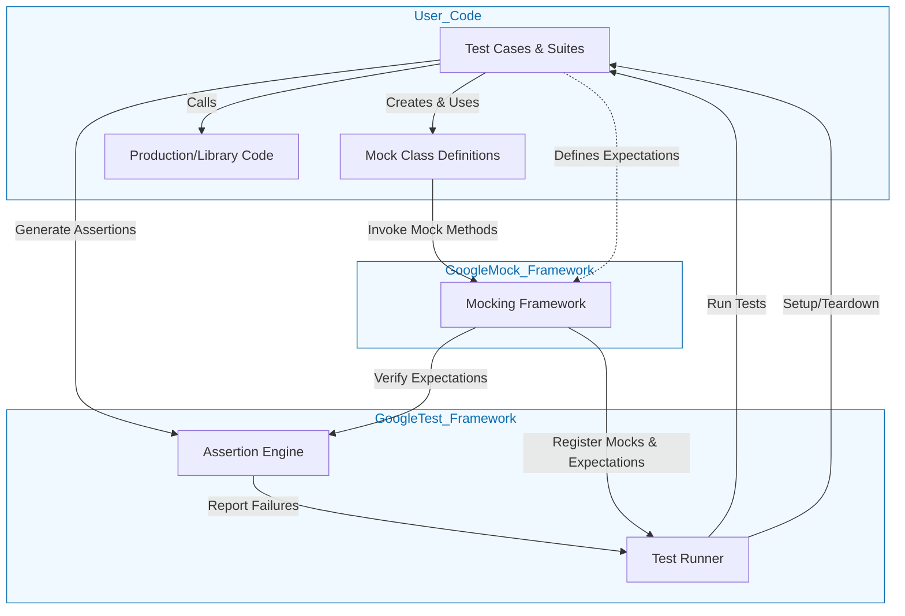

# GoogleTest System Architecture

Understand the architecture behind GoogleTest and GoogleMock to see how key components interact seamlessly to provide a powerful, unified testing and mocking framework for C++ developers. This page presents a high-level overview of the system architecture, visualizing how the test runner, assertion engine, mocking infrastructure, and user code interoperate.

---

## Why Architecture Matters

Behind the simplicity of writing `TEST()` and `EXPECT_CALL()` lies a robust architecture that enables:

- Flexible test discovery and execution
- Detailed assertion checking with expressive diagnostics
- Advanced mocking capabilities with expectation management
- Efficient integration with user test code and build environments

Visualizing the architecture helps you grasp how GoogleTest and GoogleMock build trust and extensibility into your testing workflow.

---

## Overview of Components

At the core of GoogleTest and GoogleMock, several principal components collaborate:

- **Test Runner:** Controls test scheduling, discovery, and execution lifecycle.
- **Assertion Engine:** Evaluates test expectations and reports failures.
- **Mocking Framework:** Enables creation of mock objects, expectation specifications, and invocation verification.
- **User Test Code:** Contains test functions, mock class definitions, and exercises code under test.

These components communicate in a coordinated flow to deliver a smooth, reliable test environment.

---

## High-Level Architecture Diagram

> This diagram illustrates the logical boundaries and interactions of the main pieces involved when running tests and mocks.

---

## Component Roles Described

### Test Runner

- Discovers all tests defined in user code.
- Manages test execution lifecycle (setup, run, teardown).
- Aggregates results from the assertion engine and mocking framework.
- Provides hooks for integration with CI systems and reporting.

### Assertion Engine

- Evaluates the success or failure of individual `EXPECT_*` and `ASSERT_*` statements.
- Produces detailed diagnostic messages on failures.
- Handles exception and signal translation into test outcomes.

### Mocking Framework (GoogleMock)

- Provides macros and classes (`MOCK_METHOD`, `EXPECT_CALL`) for defining mocks and their expected behavior.
- Controls the lifetime and verification of mocks and their expectations.
- Integrates with the assertion engine to report violations of mock contract.
- Supports advanced features like call sequences, matchers, actions, and call ordering.

### User Test Code

- Uses GoogleTest macros and structures to define test cases.
- Defines mock classes leveraging GoogleMock.
- Applies expectations and exercises mocks alongside real production code.

---

## How It Works: User Flow Example

1. **Writing Tests and Mocks:** Users define test cases (`TEST` macros) and mock classes (`MOCK_METHOD` macros).

2. **Running Tests:** The test runner discovers test cases and prepares the environment.

3. **Executing Tests:** Each test case runs, which may call mock methods.

4. **Handling Mock Invocations:** Mock calls are intercepted by GoogleMock's mocking framework to check expectations.

5. **Evaluating Assertions:** The assertion engine evaluates test predicates and mock verification results.

6. **Reporting Results:** The test runner collects and outputs success/failure results.

---

## Practical Tips

- **Mock Integration:** Define mocks using `MOCK_METHOD` in the public section, even for protected/private methods, for accessibility.
- **Expectation Ordering:** Use sequences (`InSequence`) to enforce order when necessary.
- **Default Actions:** Use `ON_CALL` to define default mock behaviors without enforcing strict call order.
- **Strictness Modes:** Wrap mocks with `NiceMock`, `NaggyMock`, or `StrictMock` to control uninteresting call warnings.

---

## Troubleshooting Common Scenarios

<AccordionGroup title="Troubleshooting GoogleMock Expectations">  
<Accordion title="Why are my EXPECT_CALLs not being triggered?">  
If you set expectations after exercising mocks or after passing them to production code, behavior is undefined. Always define expectations before using mocks.
</Accordion>  
<Accordion title="Why am I seeing uninteresting mock function call warnings?">  
This means a mock method was called without a matching EXPECT_CALL. You can suppress spurious warnings by using `NiceMock` or adding `EXPECT_CALL` with `.Times(AnyNumber())` for ignored methods.
</Accordion>  
<Accordion title="How to verify that all mock expectations are met?">  
Expectations are verified automatically on mock destruction, or you can call `Mock::VerifyAndClearExpectations(&mock)` manually.
</Accordion>  
</AccordionGroup>

---

## Next Steps

To deepen your understanding and apply these concepts:

- Visit the [Creating and Using Mocks](../guides/mocking-scenarios/creating-and-using-mocks) guide to see examples of defining mocks.
- Explore the [gMock Cheat Sheet](docs/gmock_cheat_sheet.md) for quick reference.
- Learn about advanced mock behaviors in [Advanced Mock Behaviors and Actions](../guides/mocking-scenarios/advanced-mock-behaviors).
- Study the architecture overview in [Main Components and Their Roles](../concepts/architecture-overview/component-roles).

---

## References

- [GoogleTest Product Overview](/overview/introduction-and-core-concepts/product-overview) — foundational introduction.
- [Mocking for Dummies](docs/gmock_for_dummies.md) — beginner-friendly usage guide.
- [GoogleMock Spec Builders Test](googlemock/test/gmock-spec-builders_test.cc) — for implementation details on expectation syntax.

---

This page bridges your knowledge from writing tests and mocks into how GoogleTest and GoogleMock power your workflows with clear, maintainable, and verifiable test architecture.

---