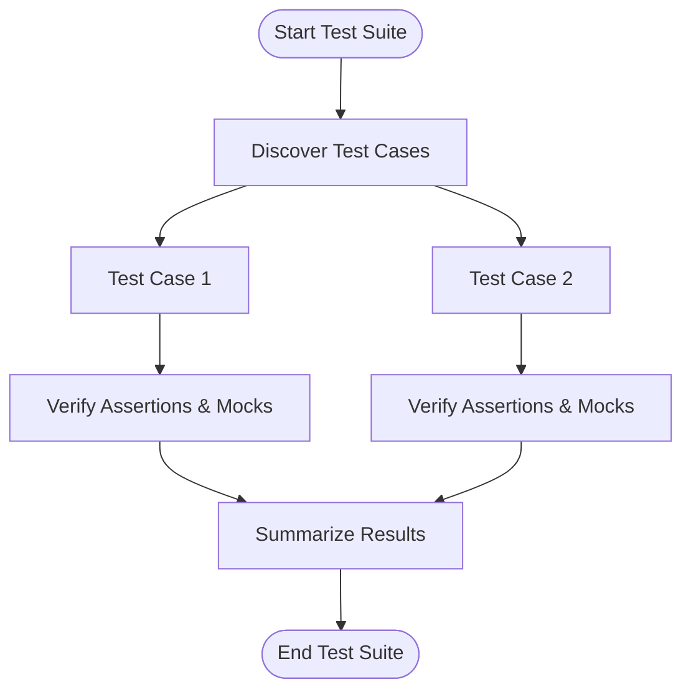

# Quick Feature Overview of GoogleTest

GoogleTest offers a comprehensive, feature-rich C++ testing framework designed to simplify the creation, organization, execution, and verification of tests. Its core strengths lie in robust unit testing capabilities combined with powerful mocking support via GoogleMock (gMock), enabling developers to write clear, maintainable, and reliable tests.

---

## Key Features at a Glance

### xUnit-Style Testing
GoogleTest implements a modern xUnit architecture optimized for C++:
- **Test Discovery & Execution:** Automatically finds and runs tests organized by test cases and test suites with no manual registration.
- **Rich Assertions:** Provides diverse assertion macros (`EXPECT_`, `ASSERT_`, `EXPECT_THAT`) for precise validation, including advanced predicates and container matchers.
- **Death Tests:** Enables verification of program termination under specific conditions, simulating failure cases safely.
- **Parameterized & Typed Tests:** Supports writing scalable tests running against multiple input sets or types, enabling broad coverage with minimal code duplication.
- **Failure Handling:** Failures immediately report detailed messages with stack traces and source file locations, speeding up debugging.

### Flexible Test Running Options
- **Command Line Flags:** Extensive control over test execution, including filtering tests, randomizing order, and setting verbosity.
- **Integration Support:** Easily integrates with build systems like CMake and Bazel, CI/CD pipelines, and IDEs.

### GoogleMock (gMock) Support
- **Declarative Mocking:** Define mock classes quickly using straightforward macros.
- **Advanced Matchers and Actions:** Validate complex argument conditions and specify customized behaviors for mocks.
- **Expectation Verification:** Ensure interactions occur in correct order, number of times, and with appropriate arguments.
- **Mock Strictness Control:** Support for "nice", "naggy", and "strict" mocks to manage uninteresting and unexpected calls.
- **Support for Overloaded, Const, and Move-Only Methods:** Robust mocking for diverse C++ idioms.

---

## Why This Matters

GoogleTest is built to provide developers with the tools they need to create thorough, expressive tests that:
- Detect bugs early by validating both state and interaction
- Improve code design and maintainability
- Support large-scale codebases with complex dependencies
- Offer informative diagnostics to quickly localize failures

---

## Example: Basic Unit Test
```cpp
#include <gtest/gtest.h>

TEST(MathTest, SimpleAddition) {
  EXPECT_EQ(2 + 2, 4);
}
```

## Example: Mocking with gMock
```cpp
#include <gmock/gmock.h>

class MockFoo {
 public:
  MOCK_METHOD(int, Bar, (int x), ());
};

using ::testing::Return;
using ::testing::_;

TEST(MockTest, ReturnsValue) {
  MockFoo mock;
  EXPECT_CALL(mock, Bar(_)).WillOnce(Return(42));
  EXPECT_EQ(mock.Bar(10), 42);
}
```

---

## Tips for Effective Use
- Use **`EXPECT_CALL`** to set expectations on mock methods and verify interactions.
- Use **`ON_CALL`** to define default actions for mock methods without enforcing call expectations.
- Use **matchers** (`_`, `Eq()`, `Ge()`, `ElementsAre()`, etc.) to specify argument constraints clearly.
- Manage method call order and cardinality via **`InSequence`**, **`After`**, and **`Times`** clauses.
- Leverage **parameterized tests** to reduce duplication and maximize coverage.
- Use **`NiceMock`** or **`StrictMock`** wrappers depending on desired strictness.

For more detailed techniques and best practices, consult the full [gMock Cookbook](docs/gmock_cook_book.md) and [gMock for Dummies](docs/gmock_for_dummies.md).

---

## Summary
GoogleTest combines a state-of-the-art unit testing framework with a powerful mocking framework, enabling effective testing of complex C++ codebases. It offers developers:
- Automatic test discovery and execution
- Rich assertions and matchers
- Flexible mocking with expectation verification
- Support for complex test scenarios including order-sensitive and partial order tests


---

### Next Steps
- Begin your exploration with the [GoogleTest Primer](primer.md) to learn how to write your first tests.
- Advance into [Mocking Dependencies with GoogleMock](guides/core-workflows/mocking-workflow.md) for in-depth understanding of mocks.
- Explore [Effective Parameterized and Typed Tests](guides/best-practices-and-patterns/parameterized-testing.md) to build scalable tests.
- Utilize the [gMock Cheat Sheet](docs/gmock_cheat_sheet.md) and [Mocking Reference](docs/reference/mocking.md) for quick lookups.

---

### _Diagram: Typical GoogleTest Flow_


---

*This page provides a concise, focused snapshot of GoogleTest's core capabilities to help users quickly understand its value proposition and start integrating it into their workflow.*