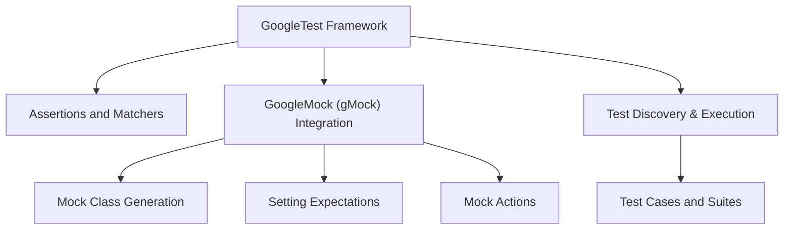

# What is GoogleTest?

## Overview

GoogleTest is a powerful and versatile C++ testing framework designed to help developers write scalable, reliable, and expressive unit and integration tests. It provides a solid foundation for automating the validation of your code, catching bugs early, and supporting maintainable test suites.

At its core, GoogleTest merges unit testing capabilities with a fully integrated mocking library called GoogleMock (gMock), enabling you to test not just individual units but also the interactions between them.

## Why GoogleTest?

Developers face many challenges when writing tests in C++. GoogleTest addresses these by:

- Offering easy-to-use test discovery and execution with clear, actionable reporting.
- Supporting expressive assertions to verify conditions precisely and informatively.
- Integrating mocking to simulate complex dependencies and interactions.
- Providing a rich set of utilities that fit C++ idioms and patterns, avoiding exception reliance.
- Allowing both beginners and advanced users to create robust tests efficiently.

## What Can You Achieve With GoogleTest?

- Write tests that document the expected behavior of your code.
- Detect failures immediately, with detailed context and stack traces.
- Use parameterized tests, enabling efficient coverage of various inputs.
- Mock dependencies easily with GoogleMock to isolate specific components under test.
- Control test execution order and handle test fixtures flexibly.

## How GoogleTest Empowers You

By simplifying test automation, GoogleTest reduces the effort needed to maintain a comprehensive test suite. It encourages best practices like:

- Early and continuous testing.
- Integration of mocks to focus on interaction behaviors.
- Clear, maintainable test organization.

This leads to faster feedback cycles, higher code quality, and confidence in refactoring and scaling your codebase.

## Getting Started

To start using GoogleTest, include it within your C++ project, write your test cases using the framework’s macros and assertions, and execute your tests with the framework-provided runners. For mocking, GoogleMock comes bundled, enabling detailed control over dependencies.

Check out the following topics next to deepen your understanding:

- [Who Should Use GoogleTest?](/overview/introduction-and-value/target-audience-use-cases)
- [Key Features at a Glance](/overview/introduction-and-value/feature-overview)
- [Your First Test: Writing and Running](/guides/getting_started/first-test)

---

## Additional Resources

- Official [GoogleTest GitHub repository](https://github.com/google/googletest) for the latest code and examples.
- The [gMock for Dummies](https://google.github.io/googletest/gmock_for_dummies.html) guide for a gentle introduction to mocking.
- The [GoogleTest FAQ](https://google.github.io/googletest/faq.html) for troubleshooting and best practices.

---

## Summary Diagram of GoogleTest Ecosystem

This diagram illustrates how GoogleTest provides the framework, integrates mocking, and supports test execution and validation.

## Practical Considerations

- **Unit Testing:** Focus quickly on individual code units using GoogleTest's simple syntax.
- **Mocking with GoogleMock:** Isolate dependencies and check interactions for robust behavior validation.
- **Test Scalability:** Organize your tests logically for maintainability as your codebase grows.
- **Integration:** Easily link with your build systems, CI pipelines, and IDEs.

## Common Next Steps

- Explore how to write your first simple test case.
- Learn to structure and organize test suites effectively.
- Understand mock creation and usage for complex dependencies.
- Discover advanced features like parameterized tests and custom assertions.

## Tips & Best Practices

- Always initialize GoogleTest and GoogleMock in your test main function.
- Keep tests focused and assert one behavior per test.
- Use mocks judiciously to simulate only necessary dependencies.
- Leverage test fixtures to setup and teardown shared test context.

---

By adopting GoogleTest, you'll empower your development workflow with reliable, clear, and maintainable C++ testing capabilities that gracefully scale from small units to complex integration scenarios.
