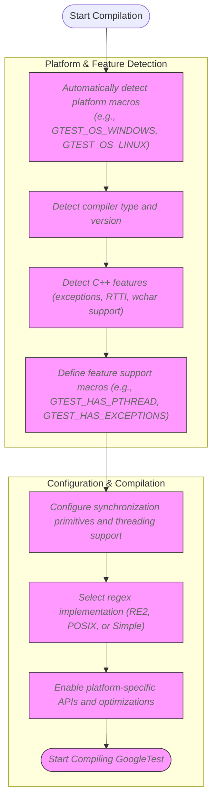

# Supported Platforms & Ecosystem

## Ensuring Cross-Platform Compatibility with GoogleTest

GoogleTest is engineered to seamlessly integrate into diverse C++ development environments across a broad spectrum of platforms and toolchains. Adhering firmly to Google's [Foundational C++ Support Policy](https://opensource.google/documentation/policies/cplusplus-support), it guarantees consistent behavior and a reliable testing experience regardless of your system setup.

### Wide-Ranging Platform Support

GoogleTest statically defines platform-indicating macros that cover numerous operating systems. This automatic detection enables the framework to adapt and offer environment-specific capabilities:

- **Unix-like Systems:** Linux, macOS, FreeBSD, Solaris, AIX, NetBSD, OpenBSD, DragonFlyBSD, GNU/Hurd, Haiku
- **Windows Variants:** Desktop Windows, MinGW, Windows Mobile, Windows Phone, Windows RT, Windows Games
- **Embedded and Specialized Platforms:** Android, Native Client (NaCl), Fuchsia, QNX, ESP32, ESP8266, Xtensa, NXP QN9090, NRF52, z/OS, OS/2
- **Apple Platforms:** iOS (tightly integrated within macOS support)

The broad platform matrix ensures that whether you are developing on a desktop, a mobile device, or embedded hardware, GoogleTest integrates smoothly.

### Toolchain Compatibility

GoogleTest supports standard modern C++ toolchains that are compatible with C++17 or higher — a requirement since GoogleTest leverages language features and compiler capabilities not available in older standards. It also provides macros and configuration points for environments that may lack certain features like exceptions, RTTI, or POSIX regular expressions, allowing users to fine-tune the framework for their toolchain limitations.

Practical aspects include:

- Native integration with threading libraries where available (like pthreads on Unix-like OSes, Windows threading primitives on Windows).
- Support for multiple compiler families including GCC, Clang, MSVC, Intel LLVM, and others.
- Macros to enable or disable exceptions, RTTI, wide string support (`std::wstring`), and other C++ features.

### Key Design Features Bringing Stability Across Platforms

GoogleTest achieves its cross-platform reliability via:

- **Automatic Environment Detection:** Compile-time macros identify platform, compiler, threading, and feature support.
- **Conditional Implementation:** Varies functionality such as threading primitives, regular expression support, and file system access based on platform capabilities.
- **Minimal External Dependencies:** Where possible, uses built-in language and standard library features.

### Ecosystem Integrations and Developer Productivity

GoogleTest lies at the heart of a vibrant, active ecosystem that enhances the C++ testing workflow:

- **GoogleMock:** Seamlessly integrates mocking capabilities with GoogleTest, extending testing beyond assertions to behavior verification.
- **Build Systems:** Provides CMake support, pkg-config files, and detailed integration instructions for incorporating GoogleTest into diverse build pipelines.
- **Platform-Specific Main Functions:** Supports platform-tailored entry points, including for embedded systems like ESP8266 and ESP32.

This ecosystem support ensures developers can quickly adopt and extend GoogleTest functionality in their native environment without friction.

### Real-World Scenario: Testing on Multiple Platforms

Imagine a team developing a cross-platform C++ library that targets Windows desktop, Linux servers, and embedded devices running Zephyr OS. By adopting GoogleTest:

1. They write a single suite of tests without platform-specific adjustments.
2. GoogleTest automatically detects the platform at build time and configures features accordingly.
3. Developers running tests on Windows benefit from Windows threading support and MSVC compiler compatibility.
4. Embedded developers leverage a compatible stripped-down environment without exceptions or full file system support.
5. Continuous Integration pipelines use the same tests across all targets, ensuring consistency.

This phenomenal flexibility reduces test maintenance overhead and increases confidence in cross-platform correctness.

---

## Practical Tips for Using GoogleTest Across Platforms

- Always check platform macro definitions (e.g., `GTEST_OS_WINDOWS`, `GTEST_OS_LINUX`) if you need to write platform-specific tests or customization.
- Use GoogleTest flag macros to enable or disable features based on platform capabilities (e.g., exceptions, RTTI).
- For multithreaded tests, verify `GTEST_HAS_PTHREAD` is set correctly for your environment; otherwise, define it explicitly to avoid subtle threading issues.
- When using GoogleTest in embedded or constrained platforms, confirm minimal required standard library features are supported or disabled appropriately.

## Common Pitfalls and How to Avoid Them

- **Undefined Platform Macros:** If the build environment does not define expected macros, GoogleTest's automatic detection might be incorrect. Explicitly define platform macros in such cases.
- **Missing Threading Support:** On platforms lacking pthreads or Windows threading, GoogleTest falls back to no-op synchronization primitives, so multithreaded tests may not be safe.
- **Compile Standard Mismatch:** Using a C++ standard less than C++17 will cause build errors. Ensure your build environment targets at least C++17.

## Next Steps & Related Documentation

To build on this foundation, explore the following guides and references:

- [System Requirements & Supported Platforms](/getting-started/prerequisites-installation/system-requirements): Deep dive into the detailed system prerequisites.
- [Integration Story](/overview/getting-started-and-integration/integration-story): How GoogleTest fits into your build and test flow.
- [Building and Installation Instructions (CMake)](/getting-started/prerequisites-installation/install-cmake): Step-by-step build and install process across platforms.
- [Cross-Platform Testing Strategies](/guides/integration-scenarios/platforms-support): Best practices for testing in heterogeneous environments.

---

## Summary Diagram: Platform Detection and Feature Configuration Flow

This flow encapsulates how GoogleTest shapes its internal setup to deliver consistent cross-platform behavior.

---

<Note>
For a comprehensive list of platform versions, compilers, and build tool support, please consult the official Google foundational C++ support matrix [here](https://github.com/google/oss-policies-info/blob/main/foundational-cxx-support-matrix.md).
</Note>
