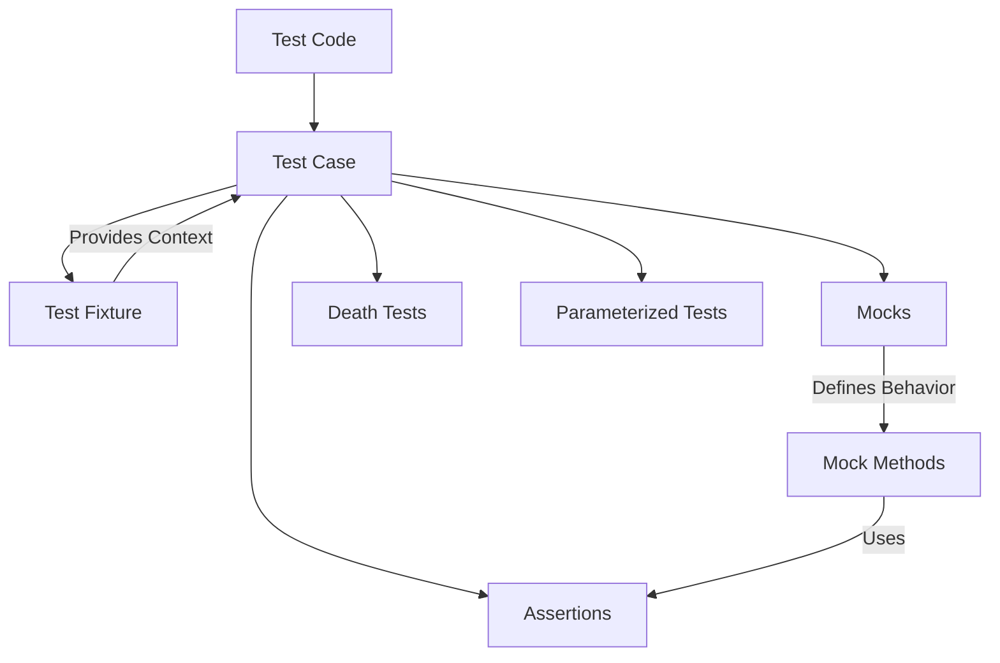

# Core Concepts and Terminology

GoogleTest and GoogleMock rely on a consistent set of fundamental testing concepts and terminology. This page defines these essential terms, equipping you with a clear understanding of the building blocks used across all GoogleTest documentation and practical usage.

Understanding these concepts upfront will help you navigate the framework more effectively and accelerate your test suite development.

---

## What You Will Learn Here

- Definitions of key testing concepts: assertions, test cases, fixtures, mocks, death tests, and parameterized tests.
- How these concepts interrelate within GoogleTest and GoogleMock.
- Links to corresponding API and guide sections for deeper exploration.

---

## Key Terminology Explained

### Assertions

Assertions are the fundamental validation statements in tests. They check whether certain conditions are true, such as comparing expected vs actual values. If an assertion fails, the test reports failure immediately or non-fatally based on the assertion type.

**Example:**
```cpp
EXPECT_EQ(42, result);  // Asserts that result equals 42
ASSERT_TRUE(is_valid);  // Checks that condition is true and aborts test if not
```

Assertions allow you to verify specific outcomes or state within your code, serving as the core mechanism for test verification.

### Test Cases (Tests) and Test Suites

- A **test case** (or **test**) is a single unit of testing — a function that exercises part of your code and contains assertions verifying its behavior.
- A **test suite** groups related test cases together, typically organized by the component or feature under test.

GoogleTest reports results at the test case and test suite level, helping you identify which scope passed or failed.

### Test Fixtures

Fixtures provide a way to reuse setup and teardown code across multiple related tests. By inheriting from `::testing::Test` and overriding the `SetUp()` and `TearDown()` methods, you can establish a consistent test environment.

This reduces repetition and ensures all tests in the fixture start with the same context.

**Example:**
```cpp
class MyTestFixture : public ::testing::Test {
 protected:
  void SetUp() override {
    // Common setup
  }

  void TearDown() override {
    // Common cleanup
  }
};

TEST_F(MyTestFixture, Test1) {
  // uses fixture setup
}
```

### Mocks and GoogleMock

Mocks are fake objects that simulate the behavior of real dependencies under test control. GoogleMock extends GoogleTest with facilities to create mock classes and precisely specify expectations about how they should be used.

Mocks help isolate the unit under test from its collaborators, allowing verification of interaction patterns such as method calls, call counts, argument values, and call order.

Key GoogleMock terms include:
- **`MOCK_METHOD` macro:** Defines mock methods inside mock classes.
- **`EXPECT_CALL`:** Sets expectations on methods.
- **Matchers:** Specify argument patterns for calls.
- **Actions:** Define behaviors (return values, side effects).

### Death Tests

Death tests verify that code causes the program to exit or terminate under expected conditions, such as invalid arguments or failed assertions.

GoogleTest provides mechanisms to capture and verify death test behavior safely and consistently.

### Parameterized Tests

Parameterized tests enable you to write a test once and execute it repeatedly with different input parameters, reducing duplication and improving coverage.

GoogleTest supports several parameterization styles:
- Simple value parameters
- Typed tests
- Parameterized test fixtures

This allows you to test various input scenarios neatly.

---

## How These Concepts Fit Together



This simplified flowchart shows how tests are structured around assertions, potentially use fixtures to share setup, mocks to isolate dependencies, and extend into death or parameterized tests.

---

## Practical Tips

- **Start simple:** Begin with basic test cases and assertions before incorporating mocks or parameterization.
- **Use fixtures for reuse:** When multiple tests share complex setup, use test fixtures to avoid duplication.
- **Mock responsibly:** Use mocks to isolate units and control dependencies, but avoid over-mocking which can make tests brittle.
- **Leverage parameterized tests:** When testing variations of inputs or states, parameterize to keep your test suite concise.
- **Understand death tests:** Use death tests to ensure your code handles fatal conditions properly.

---

## Next Steps and Related Documentation

- [Writing Your First Test](../getting-started/first-test-workflow/writing-your-first-test) — start creating basic tests.
- [Using GoogleMock](../guides/core-workflows/using-mocks) — dive deeper into mocks and expectations.
- [Parameterized and Typed Tests](../guides/advanced-patterns/parameterized-tests) — explore advanced test structures.
- [Test Cases & Fixtures API](../api-reference/core-testing-apis/test-case-and-fixture-api) — reference for programming test fixtures.
- [Mocking Reference](../docs/reference/mocking.md) — comprehensive guide to mocking facilities.

Understanding and mastering these core concepts and terminology will make you confident in progressing with GoogleTest and GoogleMock.

---

<Tip>
For clarity and maintainability, always describe your expectations clearly and avoid over-specifying test behavior. Remember: your tests are documentation of intended behavior.
</Tip>

<Note>
If you find terminology confusing, revisit this page often; it serves as your glossary to consult as you write and understand tests.
</Note>
