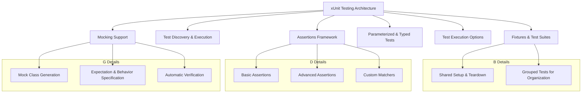

# Key Features at a Glance

GoogleTest is a powerful and versatile C++ testing framework built around the xUnit architecture. This page highlights its core features which empower developers to write effective, maintainable, and comprehensive tests with ease. Understanding these features not only sets the right expectations but also helps you appreciate the capabilities that make GoogleTest the go-to choice for C++ testing.

---

## xUnit-Based Testing Framework

GoogleTest adopts the widely recognized xUnit architecture, providing a familiar and structured approach to writing unit tests.

- **Test Cases and Test Suites:** Organize tests logically into test cases (or test suites) allowing grouped execution and reporting.
- **Fixtures:** Share common setup and teardown code across tests, reducing redundancy and enhancing clarity.

**Real-world Example:** Suppose you're testing a `Calculator` class — you would create a test suite `CalculatorTests` with individual tests such as `Addition`, `Subtraction`, etc., each verifying specific behavior.

## Automatic Test Discovery and Execution

Forget the boilerplate of registering your tests manually. GoogleTest automatically discovers all tests in your project and provides flexible execution options.

- **Auto-Discovery:** Detects all tests compiled in, making it easy to scale a test suite.
- **Selective Execution:** Run all tests, a specific test suite, or a individual test using command-line flags.
- **Test Filters:** Powerful filtering options to run only tests matching certain patterns.

**Benefit:** This enables rapid feedback by quickly running relevant tests without manual overhead.

## Rich and Customizable Assertions

Assert the correctness of your code with a broad range of assertion macros that express expectations clearly.

- **Basic Assertions:** `EXPECT_EQ`, `ASSERT_TRUE`, `EXPECT_LT`, and more for equality and relational checks.
- **Advanced Assertions:** `EXPECT_THROW` to test exception handling.
- **Custom Assertions:** Define your own assertions or use `EXPECT_THAT` with [Matchers](reference/matchers.md) for expressive checks.

Example:

```cpp
EXPECT_EQ(calculator.Add(2, 3), 5);
EXPECT_THROW(calculator.Divide(1, 0), std::invalid_argument);
```

This expressive assertion framework helps you catch incorrect behavior precisely.

## Parameterized and Typed Tests

GoogleTest supports parameterized and typed tests so you can write one test logic and run it across multiple input values or types.

- **Parameterized Tests:** Run the same test with different parameter sets, reducing code duplication.
- **Typed Tests:** Write template tests that run for multiple types, invaluable for template-heavy codebases.

**Example Scenario:** Testing a sorting algorithm against various data types `(int, float, std::string)` or multiple input arrays.

## Flexible Test Execution and Reporting

Controlled execution combined with clear reporting helps keep your testing process efficient.

- **Command-Line Flags:** Customize test runs (e.g., `--gtest_filter`, `--gtest_repeat`, `--gtest_shuffle`).
- **XML Output:** Generate reports for CI systems.
- **Test Environment Setup:** Define global setup/teardown routines.

## Seamless Mocking Support (GoogleMock)

Though technically an extension, GoogleMock comes bundled with GoogleTest and offers robust mocking capabilities:

- **Mock Classes:** Easily create mocks for your interfaces.
- **Setting Expectations:** Specify how mocks should behave under various scenarios.
- **Verification:** Automatically verify interactions.

Explore GoogleMock in detail to control and verify the behavior of dependencies in your tests.

## Summary Diagram



## Practical Tips and Best Practices

- Use **parameterized tests** to cover a wide range of inputs without duplicating code.
- Set **clear expectations** for mocks to keep tests resilient and intention-revealing.
- Leverage **test filters** to focus test runs during development.
- Prefer **`EXPECT` over `ASSERT`** in many cases to allow multiple verifications before failing.
- Regularly **run tests with verbose output** (`--gmock_verbose=info`) when debugging to get deep observable insights.

## What’s Next?

This page lays the foundation of what GoogleTest offers at a glance. To dive deeper:

- Explore the [Writing Effective Assertions](/guides/core-testing-workflows/writing-assertions) guide to master expressive and robust test validations.
- Learn [Parameterized and Typed Tests](/guides/real-world-patterns/parameterized-and-type-tests) to handle complex input scenarios efficiently.
- Understand [Mock Object Definition and Usage](/api-reference/gmock-mocking-apis/mock-object-definition) to simulate and verify interactions.
- Review [System Architecture Overview](/overview/architecture-concepts/system-architecture) for how these features fit together.

---

[Back to What is GoogleTest?](/overview/introduction-core-value/what-is-googletest) | [GoogleTest Primer](/guides/getting-started/primer)

---

<Tip>
This overview sets the stage for your GoogleTest journey. Keep it handy for quick recalls of features and capabilities as you explore the detailed guides and API references.
</Tip>

---

## Related Links

- [GoogleTest What is GoogleTest?](overview/introduction-core-value/what-is-googletest)
- [GoogleTest Primer](guides/getting-started/primer)
- [Writing Effective Assertions](guides/core-testing-workflows/writing-assertions)
- [Parameterized and Typed Tests](guides/real-world-patterns/parameterized-and-type-tests)
- [GoogleMock Mock Object Definition](api-reference/gmock-mocking-apis/mock-object-definition)

---

## External Resources

- [GoogleTest GitHub Repository](https://github.com/google/googletest)
- [GoogleTest Official Documentation](https://google.github.io/googletest/)

---