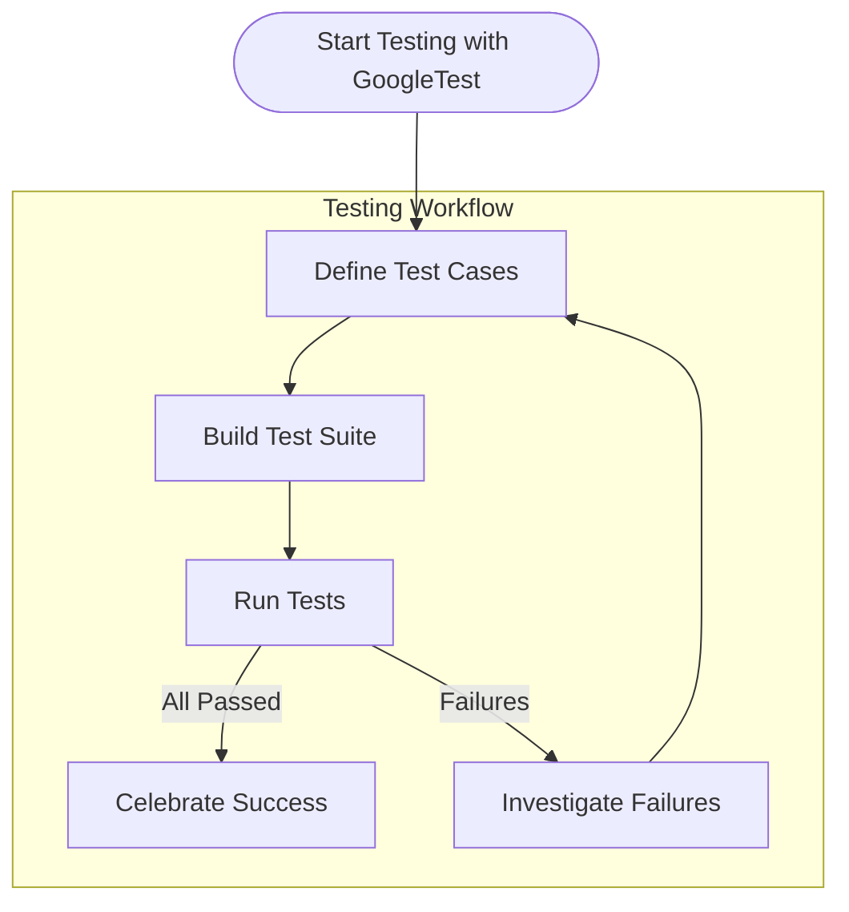

# Why Choose GoogleTest?

## Unlocking the Power of Reliable and Expressive C++ Testing

GoogleTest stands at the forefront of C++ testing frameworks, delivering automated, xUnit-style testing that integrates seamlessly with modern C++ toolchains. It empowers developers to write robust, maintainable tests through a comprehensive set of assertions and rich feature support for complex test workflows.

### Key Reasons To Choose GoogleTest

- **Automated xUnit-Style Testing:** Structure your tests in clear, reusable units that yield better coverage and confidence.
- **Rich Assertion Library:** Use a broad range of assertions that precisely convey test intent and catch subtle bugs.
- **Deep C++ Toolchain Integration:** Benefit from native compatibility with the latest C++ standards and build tools.
- **Proven Industry Standard:** Join the global community leveraging GoogleTest for robust and stable C++ quality assurance.
- **Support for Complex Test Scenarios:** Manage setup, teardown, parameterized tests, and custom matchers to meet demanding testing needs.

## What Is GoogleTest?

GoogleTest is an open-source C++ testing framework developed and maintained by Google. It provides a structured environment to create and run unit tests that validate your code's correctness. By automating test execution and results reporting, it ensures your C++ projects deliver high quality and reliability.

At its core, GoogleTest solves the problem of manual testing by enabling:

- Automated detection of regressions
- Clear documentation of expected behaviors
- Flexible test organization

Its unique value lies in its ability to combine expressiveness with performance, fitting naturally into modern C++ development workflows without the overhead of complicated setup.

## Key Features & Capabilities

- **Test Fixtures and Parameterized Tests:** Easily share common setup/teardown logic and run tests with varying inputs to cover more edge cases.
- **Powerful Assertions:** Validate conditions with a rich and descriptive assertion set (e.g., `EXPECT_EQ`, `ASSERT_TRUE`, `EXPECT_THROW`), improving failure diagnostics.
- **Mocking Support (GoogleMock):** Seamlessly integrates mocking capabilities to isolate units and verify interactions.
- **Test Discovery and Execution:** Automatically find and run all tests with informative progress output.
- **Custom Matchers and Actions:** Create expressive matchers and control mock behavior for complex scenarios.
- **Cross-Platform Compatibility:** Works with major compilers and build systems on Windows, Linux, and macOS.

### Real-World Example

Imagine testing a graphics engine's `Renderer` class. Using GoogleTest, you can write:

```cpp
#include <gtest/gtest.h>

class RendererTest : public ::testing::Test {
 protected:
  void SetUp() override {
    renderer = new Renderer();
  }
  void TearDown() override {
    delete renderer;
  }

  Renderer* renderer;
};

TEST_F(RendererTest, CanClearScreen) {
  ASSERT_NO_THROW(renderer->ClearScreen());
  EXPECT_TRUE(renderer->IsScreenClear());
}
```

This test automatically checks that the screen clearing operation completes without exceptions and verifies the screen state.

## Why Should You Care?

GoogleTest transforms your development by:

- **Boosting Confidence:** Automated assertions catch defects early.
- **Improving Productivity:** Less manual verification and faster feedback loops.
- **Enabling Clean Code:** Encourages modular, testable design.
- **Reducing Maintenance Costs:** Tests act as living documentation and guard against regressions.

## Getting Started Preview

Getting started with GoogleTest involves:

- **Installation:** Use your favorite build system such as CMake or Bazel to add GoogleTest as a dependency.
- **Writing Your First Test:** Define test cases using `TEST()` or `TEST_F()` macros.
- **Running Tests:** Execute tests via command line or IDE integration, and interpret detailed results.

> For detailed setup instructions and beginner guides, see the [GoogleTest Getting Started Documentation](https://github.com/google/googletest).


---

### Further Learning and Resources

- [GoogleTest Overview and Core Value](https://github.com/google/googletest/blob/main/docs/overview/introduction-core-value/product-intro.mdx)
- [GoogleMock Cookbook](https://github.com/google/googletest/blob/main/docs/gmock_cook_book.md)
- [Mocking Reference for Advanced Mocking Use](https://github.com/google/googletest/blob/main/docs/reference/mocking.md)
- [GoogleTest & GoogleMock Cheatsheet](https://github.com/google/googletest/blob/main/docs/gmock_cheat_sheet.md)

Explore these resources to deepen your mastery of testing with GoogleTest and GoogleMock.

---

For the comprehensive architecture and features, visit the [Overview Tab in Documentation Navigation](https://github.com/google/googletest/tree/main/docs#overview).


---

## Practical Tips

- Always put `MOCK_METHOD` declarations in the `public` section of your mock classes, regardless of the original access specifier.
- Wrap complex types with parentheses or use type aliases to avoid macro parsing issues.
- Use `ON_CALL` to set default mock behaviors without asserting they must be called.
- Use `EXPECT_CALL` to declare which calls to your mock are expected, with counts and ordering.
- Consider `NiceMock` and `StrictMock` wrappers to suppress or escalate warnings on uninteresting calls.

<Tip>
Avoid over-specifying expectations; let tests verify one behavior at a time for better maintainability.
</Tip>

<Warning>
Beware of using mock methods that return references to temporary objects; use `ReturnRefOfCopy` if needed.
</Warning>


---

Complete your understanding of GoogleTest benefits here and embrace reliable, expressive testing in your C++ projects today.

---

## Summary Diagram of Typical GoogleTest User Flow



---

For more detailed workflows and integration steps, refer to the "Getting Started" documentation section.