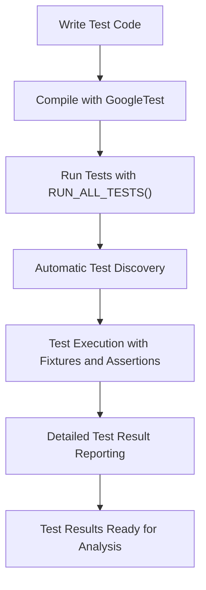

# What is GoogleTest?

## Understanding GoogleTest: Google's C++ Testing Framework

GoogleTest is a powerful, versatile testing framework designed to help C++ developers write more reliable and maintainable tests. Born out of Google's need for a robust cross-platform testing solution, it has grown into a widely adopted open-source project, providing essential tools to the C++ community for ensuring code quality.

### Origins and Purpose

GoogleTest originated from Google's internal testing technology team to meet the demands of large-scale, multi-platform C++ projects. It emerged to solve common pain points in testing C++ code, such as the lack of uniform test discovery, poor assertion reporting, and difficulties in maintaining test code across diverse environments.

### What Problems Does GoogleTest Address?

- **Test isolation and reliability:** GoogleTest ensures tests are independent and repeatable, so failures are easier to diagnose.
- **Structured organization:** It organizes tests into suites and fixtures, promoting clarity and reuse.
- **Cross-platform compatibility:** Supports Linux, Windows, Mac, and other platforms seamlessly.
- **Detailed failure reporting:** Provides informative messages and stack traces to swiftly pinpoint bugs.
- **Flexible assertions:** Enables both fatal and non-fatal failures, giving developers control over test flow.
- **Parameterized and type-parameterized tests:** Makes it simple to test different inputs and types with minimal boilerplate.

### Why Has GoogleTest Become Foundational?

Its comprehensive feature set, combined with ease of integration and extensibility, has made GoogleTest a cornerstone of both open-source and commercial C++ projects. Not only does it offer a familiar xUnit-style framework, but it also continuously evolves, supporting modern C++ standards and integrating with tools such as GoogleMock for mocking capabilities.

## How GoogleTest Fits Into Your Development 

When adopting GoogleTest, you are equipping your project with a well-supported framework that automates test discovery and execution, enhances test clarity, and scales from small unit tests to complex integration workflows.

Consider the example of testing a simple function:

```cpp
// Computes factorial of n.
int Factorial(int n);

// Testing Factorial with GoogleTest
TEST(FactorialTest, HandlesZeroInput) {
  EXPECT_EQ(Factorial(0), 1);
}

TEST(FactorialTest, HandlesPositiveInput) {
  EXPECT_EQ(Factorial(3), 6);
  EXPECT_EQ(Factorial(8), 40320);
}
```

This snippet shows how GoogleTest lets you organize related tests into a suite (`FactorialTest`), and use expressive assertions to validate outcomes.

## Key Concepts Behind GoogleTest

- **Tests and Test Suites:** Related tests are grouped into suites, improving organization and readability.
- **Test Fixtures:** Reuse common setup/teardown code across multiple tests.
- **Assertions:** Macros that verify conditions, with `ASSERT_*` halting on failure and `EXPECT_*` allowing continued execution.
- **Fatal and Non-Fatal Failures:** Control test run flow based on the severity of assertion failures.
- **Parameterized Tests:** Run the same test logic with different input data.

## Summary

GoogleTest is more than just a testing tool—it’s a foundational framework for boosting the quality of C++ software. It offers a clear, consistent, and scalable way to write, organize, and run tests that integrate seamlessly with various platforms and build systems.

For those new to testing or looking to standardize their C++ test practices, GoogleTest provides the perfect balance of simplicity and advanced capabilities.

---

## Next Steps

To get started with GoogleTest, see the [GoogleTest Primer](../primer.md), which guides you through writing your first tests. For integrating into your build environment, the [googletest/README.md](googletest/README.md) offers detailed build and setup instructions. To expand your testing repertoire, explore guides on [Advanced Mocking & Test Patterns](../guides/advanced-mocking/designing-mock-objects.md).

---

## Diagram: GoogleTest Testing Flow (Conceptual)



---

## Related Links

- [GoogleTest User's Guide](https://google.github.io/googletest/)
- [GoogleTest Primer](../primer.md)
- [Test Declarations & Test Cases](../api-reference/core-apis/test-declarations.md)
- [Assertions Reference](../api-reference/core-apis/assertions.md)

---

Enjoy building reliable C++ tests with GoogleTest—your first step towards safer, maintainable code!