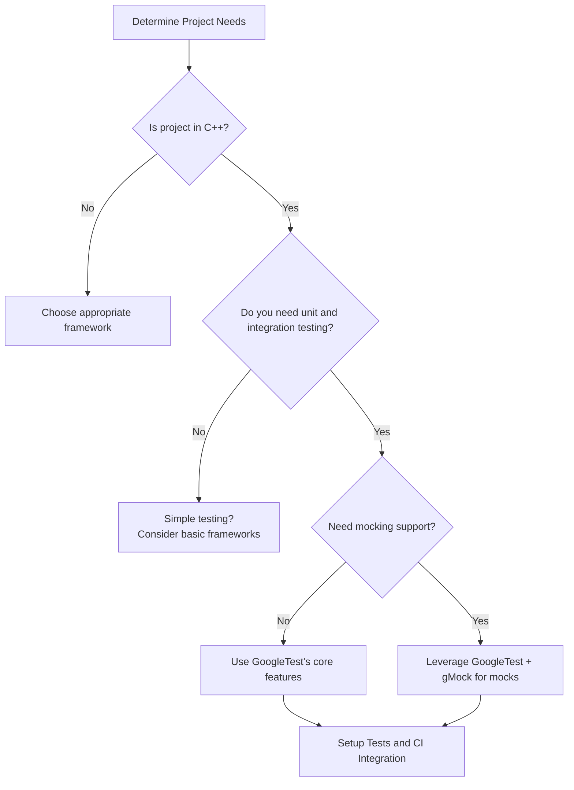

# Audience & Use Cases

## Is GoogleTest Right for Your Project?

Choosing the right testing framework is a critical step in ensuring code quality, maintainability, and developer productivity. This page helps you identify if GoogleTest matches your project's needs by exploring typical development scenarios where GoogleTest excels.

### Who Benefits Most from GoogleTest?

GoogleTest is designed for C++ projects that require robust, flexible, and scalable unit testing. It's especially well-suited for:

- **Continuous Integration Pipelines:** Automate testing for frequent builds and deployments.
- **Open Source Projects:** Encourage contributions with standardized, easy-to-write tests.
- **Enterprise-Scale Codebases:** Manage large test suites with advanced features like parameterized testing, test discovery, and mocking support.
- **Teams practicing Test-Driven Development (TDD):** Benefit from fast feedback cycles and mocks to isolate components.

### Typical Use Cases

GoogleTest effectively serves a variety of testing needs across these scenarios:

- **Unit Testing:** Write small, focused tests that validate the behavior of individual functions or classes.
- **Integration Testing:** Verify interactions among multiple components or modules.
- **Regression Testing:** Detect unintended side effects of code changes quickly.
- **Mocking Collaborators:** Use integrated gMock library to replace dependencies and verify interactions implicitly.

### Why Should You Consider GoogleTest?

- It is a mature and widely adopted C++ testing framework, actively maintained by Google.
- Supports powerful assertions, parameterized tests, and extensive mocking capabilities.
- Integrates seamlessly with popular build systems like Bazel and CMake.
- Offers automatic test discovery and detailed failure reporting.
- Compatible across platforms including Linux, Windows, and Mac.

### Before You Start

- Make sure your project can include third-party libraries and handle C++11 or above.
- Familiarize yourself with basic testing concepts if new to automated testing.
- Consider your build environment to leverage existing GoogleTest integration guides.

### Where This Fits in the Documentation

This page complements foundational content such as:

- [GoogleTest Primer](primer.md) for test basics.
- [Value Proposition](value-proposition.md) highlighting core benefits.

It's also a logical prelude to setup and installation instructions in Getting Started.

---

## Common Scenarios Illustrating GoogleTest Use

### Scenario 1: Speeding Up Development with TDD

Imagine a developer working on a new feature who writes a failing test first, then implements the code to pass it. GoogleTest's quick test execution and detailed feedback make this cycle smooth and efficient. The developer can mock dependencies easily with gMock, avoiding delays caused by slow or complex components.

### Scenario 2: Ensuring Stability in a Large Codebase

A QA team integrates GoogleTest suites into their CI pipeline. Every code push triggers hundreds of tests, rapidly detecting regressions and integration issues. Parameterized tests reduce duplicated code, while test filters help isolate failures quickly.

### Scenario 3: Open Source Contribution Confidence

An open source project adopts GoogleTest to standardize testing. Contributors can add tests with familiar frameworks, and the project maintainers rely on GoogleTest reports to verify the quality of submissions, facilitating collaboration.

<Info>
For more detailed workflows, see the [GoogleTest Primer](primer.md) and [Using Assertions Effectively](using-assertions-effectively.md).
</Info>

---

## Practical Tips for Getting Started

- Start with simple unit tests targeting core logic.
- Use mocks to replace external dependencies or slow resources.
- Leverage parameterized tests to cover multiple input combinations efficiently.
- Integrate test runs within your build and CI system early for continuous feedback.

<Check>
Ensure your classes use virtual destructors for safe mocking.
</Check>

<Note>
Tests should verify only one behavior per test case to keep failures clear and maintainable.
</Note>

---

## Troubleshooting Common Concerns

| Concern                                   | Resolution                                                                       |
|------------------------------------------|----------------------------------------------------------------------------------|
| *GoogleTest feels complex at first.*    | Start with tutorials in the Primer, and gradually explore advanced features.     |
| *My mocks cause warnings or errors.*    | Use `NiceMock` or `StrictMock` to adjust mock strictness as needed.               |
| *Tests run slowly.*                      | Isolate tests, mock external dependencies, and use parallel test execution.      |
| *Integration with build tools.*          | Follow platform-specific guides in Integration & Ecosystem section.              |

---

## Related Documentation and Next Steps

- [Value Proposition](value-proposition.md): Understand the core advantages.
- [GoogleTest Primer](primer.md): Learn how to write your first test.
- [Supported Platforms](supported-platforms.html): Check environment compatibility.
- [Mocking for Dummies](gmock_for_dummies.md): Explore mock objects usage.
- [Setting Expectations and Actions](setting-expectations-and-actions.md): Control mock behavior.

---

### Visual Summary

---

This page focuses on user intent—helping you understand if and how GoogleTest suits your development workflow by highlighting practical benefits and common usage patterns.