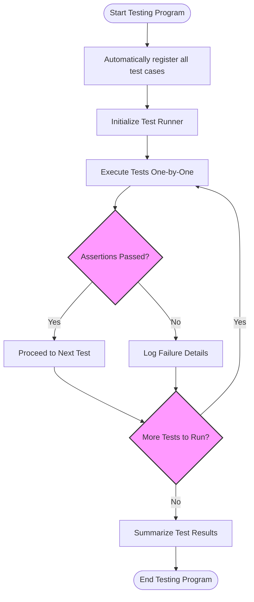

# Core Features & Capabilities

GoogleTest is a robust, versatile testing framework designed to help C++ developers write, organize, and manage automated tests efficiently. It provides a rich set of capabilities that support comprehensive test coverage, easy diagnostics, and flexible integration with user workflows.

---

## Feature Overview

### 1. **xUnit Architecture**
GoogleTest follows the xUnit architecture, allowing you to organize tests into test suites and individual tests with clear isolation. This promotes maintainability and modular test design by enabling independent execution and isolation of test cases.

### 2. **Assertions and Expectations**
Provides a wide range of assertion macros (`EXPECT_*`, `ASSERT_*`) to validate test results. Assertions include checks for equality, relational comparisons, string matching, exception throwing, and custom predicates, allowing precise test verification and meaningful failure messages.

### 3. **Parameterized Tests**
Supports both value-parameterized and type-parameterized tests, enabling the same test logic to run across multiple input values or types. This eliminates redundancy and makes tests more scalable and expressive.

### 4. **Death Tests**
Facilitates testing of code that is expected to terminate the program (e.g., assertions failing or fatal errors), verifying that the program dies as expected under defined conditions. This is critical for ensuring robust system behavior in error scenarios.

### 5. **Rich Customization & Extensibility**
GoogleTest allows users to extend the framework with custom assertion macros, matchers, and test event listeners. This empowers developers to adapt GoogleTest to specialized testing needs and integrate deeply with custom workflows.

### 6. **Integration with GoogleMock (gMock)**
Seamlessly integrates with GoogleMock to enable advanced mocking capabilities for unit tests. This aids in isolating code under test and verifying interactions between objects with mocks and expectations.

### 7. **Cross-Platform Support & Portability**
Designed to work consistently across multiple platforms including Linux, Windows, and Mac OS, making tests highly portable across development and production environments.

### 8. **Test Discovery and Execution Model**
Automatically discovers all tests defined in the test binary and runs them, simplifying test automation. Supports selective test runs by name or tag, parallel execution, and detailed test result reporting.

## How These Features Benefit You

- **Increased Confidence**: Precise assertions and automated verification ensure your code is behaving as intended.
- **Improved Productivity**: Parameterized tests and automatic test discovery reduce duplication and boilerplate.
- **Robust Diagnostics**: Meaningful test failure reports, including stack traces and argument values, help quickly identify issues.
- **Flexible Testing Workflows**: Customizable assertions, death tests, and mocking facilitate testing of both normal and edge-case behaviors.
- **Maintainable and Scalable Tests**: Modular test organization and reuse via parameterization enable sustainable test growth.

---

## Concrete Examples

### Writing Assertions
```cpp
TEST(FactorialTest, BasicAssertions) {
  EXPECT_EQ(Factorial(1), 1);
  EXPECT_EQ(Factorial(2), 2);
  EXPECT_EQ(Factorial(3), 6);
  EXPECT_NE(Factorial(4), 20);  // Intentional failure if wrong
}
```

### Using Parameterized Tests
```cpp
class FactorialTest : public ::testing::TestWithParam<int> {};

TEST_P(FactorialTest, HandlesMultipleValues) {
  int n = GetParam();
  EXPECT_GT(Factorial(n), 0);
}

INSTANTIATE_TEST_SUITE_P(PositiveNumbers, FactorialTest, ::testing::Values(1, 2, 3, 4));
```

### Detecting Program Crashes (Death Tests)
```cpp
TEST(DeathTest, CrashesOnNegativeInput) {
  EXPECT_DEATH(Factorial(-1), "Assertion.*failed");
}
```

### Integrating GoogleMock
```cpp
class MockFoo {
 public:
  MOCK_METHOD(int, Compute, (int x), ());
};

TEST(MockTest, MockObjectExample) {
  MockFoo mock;
  EXPECT_CALL(mock, Compute(5))
      .WillOnce(Return(25));
  ASSERT_EQ(mock.Compute(5), 25);
}
```

---

## Architecture Snapshot

At a high level, GoogleTest manages test registration, test execution, and results reporting, handling the following workflow:

1. Test code defines test cases with assertions.
2. The framework automatically registers these tests.
3. On execution, the runner iterates over tests, invoking each.
4. Assertions validate conditions and report outcomes.
5. Results are aggregated and summarized for the user.

This modular design allows easy integration with build systems and CI/CD pipelines.

---

## Tips and Best Practices

- **Group Related Tests**: Organize tests logically into suites for clarity and better maintenance.
- **Prefer Parameterized Tests**: Use where applicable to reduce code duplication and cover edge cases easily.
- **Use Assertions Wisely**: `EXPECT_*` allows tests to continue after failure to report multiple errors; `ASSERT_*` halts the test when continuation wouldn’t be meaningful.
- **Leverage Death Tests**: Verify error handling paths explicitly when your code calls `exit()` or crashes.
- **Integrate GoogleMock for Behavior Testing**: For complex interactions, mocks allow precise control and observation.
- **Control Test Verbosity**: Use command-line flags or API calls to customize output for efficient debugging.

---

## Troubleshooting Common Issues

- Ensure test names are unique within their suites to avoid conflicts.
- Use `ASSERT_*` carefully; avoid resource leaks if the test halts unexpectedly.
- If tests are not discovered, verify that tests are properly linked and the test runner is initialized.
- For flaky death tests, consider timeouts or alternative test constructs.

---

## Getting Started with Core Features

For hands-on guidance, consult the [GoogleTest Primer](overview/introduction-getting-started/what-is-googletest) and [Writing and Running Your First Test](getting-started/gs-configuration-first-test/gs-first-test).

Learn more about setting expectations and using mocks at [Creating and Using Mock Objects](guides/mocking-scenarios/creating-basic-mocks) and [Mock Strictness: Nice, Naggy, and Strict](guides/mocking-scenarios/mock-strictness-best-practices).


---

## Diagram: GoogleTest High-Level Process



---