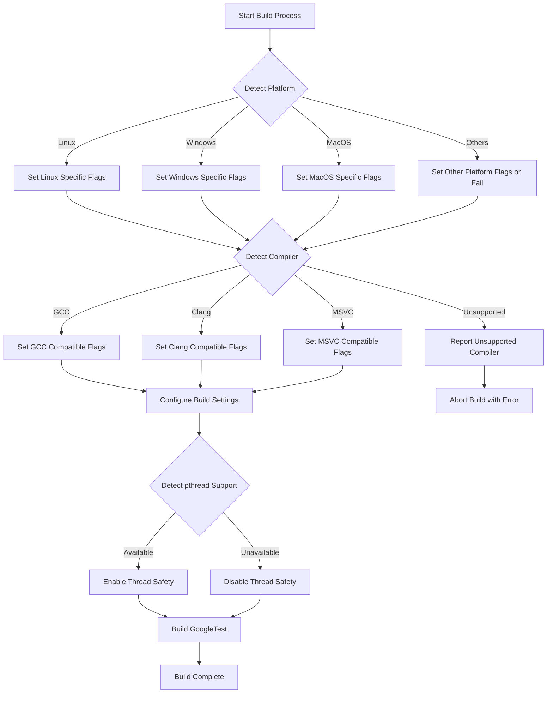

# Supported Platforms & Compatibility

GoogleTest is designed to function reliably across a wide range of operating systems, compilers, and build tools. This support adheres strictly to Google’s [Foundational C++ Support Policy](https://opensource.google/documentation/policies/cplusplus-support), ensuring that your tests are portable, consistent, and maintainable in diverse development environments.

---

## Why Platform & Compiler Support Matters

Building and running C++ tests on multiple platforms or legacy environments often introduces subtle compatibility issues. GoogleTest shields you from many of these problems by providing:

- **Cross-platform consistency:** Ensures the same test code runs on Linux, Windows, MacOS, and other supported systems without modification.
- **Compiler compliance:** Supports a broad set of compiler versions recognized under Google’s foundational policy.
- **Build tool integration:** Compatible with popular build systems such as CMake, facilitating straightforward incorporation into your CI/CD pipelines.

This foundational compatibility means you can focus on writing tests rather than troubleshooting environmental inconsistencies.

---

## Supported Platforms

GoogleTest explicitly supports the following operating systems:

- **Linux** (including various distributions and Android variants)
- **Windows** (Desktop editions, MinGW, and Windows Mobile flavors)
- **Mac OS X** and **iOS**
- **BSD flavors** (FreeBSD, NetBSD, OpenBSD)
- **Solaris**
- **AIX**
- **Fuchsia**
- **GNU/Hurd**
- **Others such as Haiku, DragonFly, QNX, and z/OS**

For embedded platforms, support varies. Certain embedded systems like ESP32, ESP8266, and NRF52 have limited or specialized support due to platform constraints.

### Platform Detection

GoogleTest internally detects your platform during compilation through macros (e.g., `GTEST_OS_LINUX`, `GTEST_OS_WINDOWS`, `GTEST_OS_MAC`, etc.) to adapt functionality and enable platform-specific optimizations and workarounds transparently.

---

## Compiler Support

GoogleTest requires a C++17-capable compiler and verifies this during build time. Supported compilers include:

- **Clang** (and Apple Clang)
- **GCC** version 7.0 and later
- **Microsoft Visual C++** (Visual Studio 2017 Update 3 or newer)
- **Intel Compiler** (version supporting C++17)
- **Various others** that conform to the Foundational C++ Support Policy

The build system configures compiler flags and exceptions accordingly to maintain compatibility and optimize warning levels.

### Key Compiler Configuration Highlights

- Compiler flags are adjusted to enforce strict warnings to maintain code quality without overwhelming the developer.
- Exceptions and RTTI detection enable or disable related features for maximum portability.
- Threading support via `pthreads` is autodetected and incorporated.
- When using MSVC, GoogleTest supports static and dynamic CRT linkage with options to avoid linking conflicts.

---

## Build Tools Compatibility

While GoogleTest primarily uses **CMake** as its official build system, it can integrate with other build systems through generated files or manual setup.

### Using CMake

- GoogleTest ships with a ready-made `CMakeLists.txt` supporting various platforms.
- Offers flexible options (like building GoogleMock, shared versus static libraries).
- Supports modern CMake approaches (`FetchContent`, `find_package`) for easy embedding into existing projects.
- Allows fine control over compiler flags and runtime linking.

### Other Build Systems

- Manual compilation with appropriate compiler flags is feasible.
- Integration into projects using Makefiles, Bazel, or other build frameworks is documented through example projects and community support.

---

## Practical Guidance for Cross-Platform Projects

If you are developing software that needs to run on multiple targets or older systems, here are actionable tips:

- **Check the Foundational C++ Support Matrix:** Review the official [Foundational C++ Support Matrix](https://github.com/google/oss-policies-info/blob/main/foundational-cxx-support-matrix.md) to confirm your toolchain compatibility.
- **Use CMake for your test builds:** It simplifies cross-platform config and takes care of linking pthreads or other platform specifics.
- **Enable multi-threading support selectively:** Verify the `GTEST_HAS_PTHREAD` macro in your environment (defined automatically) to ensure thread safety is enabled or disabled as appropriate.
- **Leverage prebuilt binaries when possible** for stable platforms to reduce build times.

---

## Common Pitfalls & Troubleshooting

<AccordionGroup title="Troubleshooting Platform-Related Issues">
<Accordion title="Build Errors on Windows with MSVC">
MSVC users often face linker errors related to runtime library mismatches. Use the `gtest_force_shared_crt` CMake option to align CRT linkage. If dynamic linking causes issues, try static linking with compatible runtime flags.
</Accordion>
<Accordion title="Missing pthread Support on MinGW">
By default, pthreads is not supported on MinGW. GoogleTest automatically detects this and disables pthread usage. Use alternative threading primitives on Windows or switch to a compatible compiler setup.
</Accordion>
<Accordion title="Unsupported or Unknown Platform">
If your build system or environment is very niche or new, GoogleTest might not auto-detect platform macros correctly. You can manually define them or extend porting utilities, but note this requires deep technical understanding.
</Accordion>
<Accordion title="Compiling with Older Compilers">
GoogleTest mandates C++17 support. If your compiler does not support C++17, upgrading or switching compilers is required.
</Accordion>
</AccordionGroup>

---

## How This Fits Into Your GoogleTest Workflow

Understanding supported platforms and compiler compatibility ensures:

- You can confidently build and run tests in your preferred environment.
- Test failures or build problems won’t stem from unsupported toolchains or OS issues.
- Your CI/CD pipelines can automate building and testing across the defined platforms.

For detailed installation and build configuration guidance, see the related pages in the documentation.

---

## Additional Resources & References

- [Foundational C++ Support Policy](https://opensource.google/documentation/policies/cplusplus-support)
- [Foundational C++ Support Matrix](https://github.com/google/oss-policies-info/blob/main/foundational-cxx-support-matrix.md)
- [GoogleTest Build Instructions (README)](/googletest/README.md)
- [Configuring Your Build](/getting-started/preparation-installation/build-configuration)
- [Troubleshooting Setup Issues](/getting-started/first-steps-usage/troubleshooting-setup)

---

## Summary Diagram: Platform & Compiler Support Workflow

This flow illustrates how GoogleTest dynamically configures itself according to the detected platform and compiler during build, enabling or disabling features such as thread safety accordingly.

---

## Next Steps

- Ensure your build toolchain meets the C++17 standard requirement.
- Follow the [Installing GoogleTest](/getting-started/preparation-installation/installation-methods) guide for platform-specific installation instructions.
- Begin writing and running tests using the [Writing Your First Test](/getting-started/first-steps-usage/writing-your-first-test) guide.

<Check>
Confirm your environment complies with the Foundational C++ Support Policy to maximize compatibility and maintainability.
</Check>

<Info>
For platform-specific workarounds or advanced build customizations, explore the internal port files such as `gtest-port.h` and `gtest-port-arch.h` provided within the source code repository.
</Info>

---

*Documentation last updated based on GoogleTest main branch.*

<Source url="https://github.com/google/googletest" branch="main" paths={[{"path": "docs/platforms.md", "range": "1-20"},{"path": "googletest/include/gtest/internal/gtest-port.h", "range": "1-280"},{"path": "googletest/include/gtest/internal/gtest-port-arch.h", "range": "1-100"}]} />