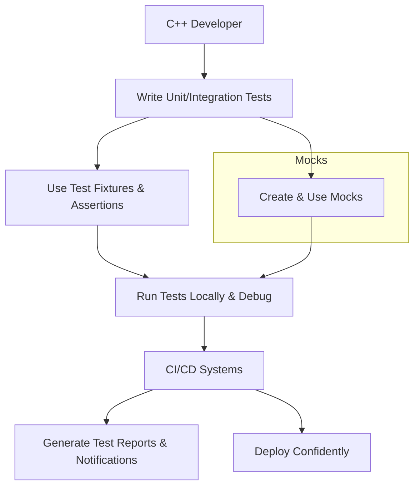

# Target Audience & Common Use Cases

## Understanding Who Benefits Most from GoogleTest

GoogleTest is purpose-built for C++ developers and teams who demand reliable, maintainable, and automated testing solutions. Whether you’re part of an open-source community, a startup, or managing large-scale software, GoogleTest fits seamlessly into your development workflow, improving code quality and accelerating delivery.

### Primary Users

- **C++ Developers:** Individuals writing unit and integration tests to validate their code.
- **Development Teams:** Collaborating teams aiming to ensure consistent code quality across shared codebases.
- **Open-Source Projects:** Projects prioritizing cross-platform compatibility and ease of contribution.
- **Large-Scale and Enterprise Projects:** Organizations needing scalable testing frameworks integrated with CI/CD pipelines and complex build systems.

## Common Scenarios Where GoogleTest Excels

GoogleTest addresses critical testing needs by providing a robust, flexible, and extensible framework for a variety of testing scenarios. Here is where it delivers the most value:

### 1. Unit Testing

Isolate your classes or functions and write precise, focused tests to verify their behavior. GoogleTest's fixtures and assertions allow you to create reliable, repeatable tests that pinpoint bugs early.

*Example:* Validate a function calculating factorial values, ensuring correctness across edge cases and normal inputs.

### 2. API Mocking and Interaction Testing

With GoogleMock integrated into GoogleTest, easily create mock objects to simulate and control interactions with complex dependencies, enabling thorough verification of behavior without requiring actual implementations.

*Example:* Mock a network interface to simulate latency or failure scenarios without connecting to real hardware.

### 3. Regression Testing

Track existing bugs and prevent regressions by encapsulating test cases in your continuous integration system. GoogleTest’s clear test suite structure and detailed reporting enable efficient identification of regressions.

*Example:* Automatically run your full suite on every code change to catch unexpected faults early.

### 4. Integration with Continuous Integration and Deployment Systems

GoogleTest works smoothly within CI/CD workflows, automatically discovering tests, producing standardized results, and integrating with popular build systems like CMake and Bazel.

*Example:* Generate XML reports for CI tools to analyze test coverage and failure trends.

### 5. Cross-Platform Testing

Develop once, test everywhere. GoogleTest supports Linux, Windows, and macOS, ensuring your C++ code behaves consistently across platforms.

### 6. Parameterized and Typed Testing

Extend coverage with parameterized tests to validate function behavior across multiple input combinations efficiently.

*Example:* Run a sorting algorithm test across several data sets automatically.

## Visualizing How GoogleTest Fits Your Workflow

## Best Practices for Your Use Cases

- **Start Small:** Begin writing simple unit tests for critical components, then expand.
- **Use Test Fixtures:** Reuse setups to keep tests clean and reduce repetition.
- **Leverage Mocks Judiciously:** Mock external dependencies to isolate behavior but avoid over-mocking which makes tests fragile.
- **Integrate Early with CI/CD:** Automate running tests on every commit to catch regressions promptly.
- **Write Readable Tests:** Use descriptive test and assertion names to make failures easy to diagnose.
- **Handle Cross-Platform Differences:** Use GoogleTest’s platform abstractions to write portable tests.

## Common Pitfalls and How GoogleTest Helps You Avoid Them

| Pitfall                                   | How GoogleTest Addresses It                                   |
|-------------------------------------------|---------------------------------------------------------------|
| Tests that are interdependent              | Creates independent fixtures and isolated tests               |
| Slow or flaky tests due to external calls | Use mocks to simulate slow/unreliable services                 |
| Difficult to identify failure causes       | Rich assertions provide detailed failure context and stack traces |
| Platform-specific test failures             | Cross-platform support avoids platform lock-in                  |

<Tip>
Use GoogleMock’s `EXPECT_CALL` and `ON_CALL` macros to clearly define mock behaviors and expectations. Avoid setting expectations after exercising the mock to prevent undefined behavior.
</Tip>

## Envisioning GoogleTest in Your Development Lifecycle

Imagine your team's next feature development:

1. Developers write the new logic for a core class feature.
2. They write a GoogleTest unit test covering the feature’s expected behavior.
3. If this feature interacts with external modules, mocks are defined to simulate those modules.
4. Tests run locally with instant feedback.
5. Changes are pushed to a repository where the CI system automatically runs GoogleTest-based tests.
6. Failures are reported with precise diagnostics.
7. Only when all tests pass does the feature move to staging and production.

This workflow ensures your software remains robust, safe, and maintainable.

## Next Steps

Ready to put GoogleTest to work? Review the **[Core Features & Capabilities](/overview/introduction-getting-started/core-features)** page to understand the framework’s building blocks. If you’re new, start with **[What is GoogleTest?](/overview/introduction-getting-started/what-is-googletest)** for foundational concepts.

Understanding your target audience and common use cases helped you see why GoogleTest matter—now it’s time to master it!

---

## Additional Resources

- [GoogleTest Primer](overview/introduction-getting-started/what-is-googletest) - Basic concepts and test creation
- [Creating and Using Mocks](guides/mocking-scenarios/creating-basic-mocks) - Deep dive on mocks
- [Mock Strictness Best Practices](guides/mocking-scenarios/mock-strictness-best-practices) - Handling mock call expectations
- [Integrating with Build Systems](guides/integration-advanced/integrating-build-systems) - CI/CD integration guidance

---