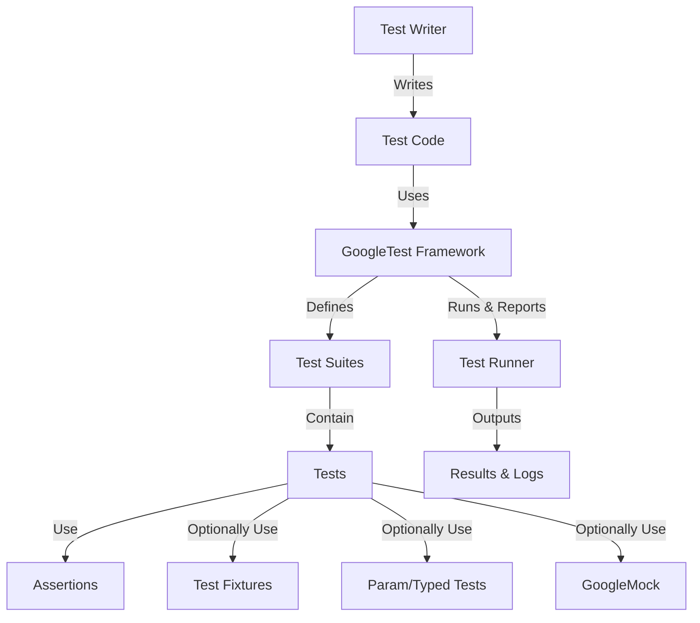

# What Is GoogleTest?

Discover GoogleTest, Google's robust C++ testing framework now merged with GoogleMock for unified unit testing and mocking capabilities. GoogleTest is widely adopted by leading open source and internal projects, offering a seamless way to build confidence in codebases through automatic test discovery, an extensive set of assertion macros, and a flexible, scalable testing infrastructure.

---

## Introduction and Value Proposition

GoogleTest provides a reliable and expressive framework for writing and running C++ tests. By integrating both testing and mocking into a single, cohesive system, it simplifies your development workflow and accelerates debugging and validation.

### Why Choose GoogleTest?

- **Automatic test discovery and organization:** Define tests and test suites without tedious manual registration.
- **Comprehensive assertion macros:** Check everything from simple conditions to complex data structures.
- **Powerful mocking (via GoogleMock integration):** Easily create and manage mock objects to isolate code under test.
- **Cross-platform support:** Works across Linux, Windows, and Mac OS.
- **Robust test infrastructure:** Supports parameterized tests, typed tests, death tests, and rich test event listeners.

Whether you are building unit tests, integration tests, or want to perform fine-grained control over test execution, GoogleTest offers the tools and conventions to make testing efficient and clear.

## What Is GoogleTest?

GoogleTest is a C++ testing framework designed to help developers write robust, maintainable tests for their code. It provides macros and classes to group tests into suites, execute them, and report detailed results.

At its core, GoogleTest helps you write tests that:

- Are independent and repeatable.
- Provide clear, informative failure messages.
- Support shared setup/teardown through test fixtures.
- Enable flexible customization via parameterized and typed tests.

This testing framework is seamlessly integrated with GoogleMock, allowing test developers to mock dependencies and verify interactions with minimal boilerplate.

## Key Features & Capabilities

### Test Macros

- `TEST(TestSuiteName, TestName)`: Defines an individual test case within a test suite.
- `TEST_F(TestFixtureName, TestName)`: Defines a test that uses a test fixture class.
- `TEST_P(TestFixtureName, TestName)`: Defines a value-parameterized test case.
- `INSTANTIATE_TEST_SUITE_P`: Instantiates value-parameterized tests with sets of parameters.
- `TYPED_TEST_SUITE` and `TYPED_TEST`: Create typed test suites to run tests across multiple types.

### Assertions

GoogleTest provides a rich set of assertion macros for verifying your program’s behavior:

- Boolean conditions: `EXPECT_TRUE`, `ASSERT_FALSE`
- Equality and inequality: `EXPECT_EQ`, `ASSERT_NE`
- String comparisons: `EXPECT_STREQ`, `EXPECT_STRCASEEQ`
- Floating-point comparisons: `EXPECT_FLOAT_EQ`, `EXPECT_NEAR`
- Exception assertions: `EXPECT_THROW`, `ASSERT_NO_THROW`
- Death tests: `EXPECT_DEATH` and related macros check if your program fails safely

These assertions provide detailed diagnostics when they fail, helping you quickly pinpoint issues.

### Test Fixtures

Write reusable setup and teardown code shared across multiple tests by deriving fixtures from `testing::Test`. Each test runs with a fresh fixture instance to maintain isolation.

### Parameterized and Typed Tests

Run the same test logic against multiple data values or types:

- **Value-Parameterized Tests:** Vary input values efficiently using `TEST_P` and `INSTANTIATE_TEST_SUITE_P`.
- **Typed Tests:** Run tests for multiple types using `TYPED_TEST_SUITE` and `TYPED_TEST`.
- **Type-Parameterized Tests:** Define type-parameterized tests that can be instantiated multiple times with different type lists.

This coverage ensures your code behaves correctly across a broad range of inputs and types.

### Test Event Listeners

Extend or customize test reporting by implementing event listeners. Receive notifications for test lifecycle events such as:

- Test program start/finish
- Test suite start/end
- Individual test start, end, and assertion results

This enables custom logging formats, integration with external systems, or complex test monitoring.

### Global Test Environment

GoogleTest allows global setup and teardown through the `::testing::Environment` interface. This is particularly useful for initializing expensive resources or test-wide configurations once across all tests.

### Friendly Test Output

GoogleTest produces concise, color-coded test output in terminals and can also emit detailed XML or JSON reports, facilitating integration with continuous integration systems.

---

## Why Should I Care?

GoogleTest empowers you to achieve reliable C++ code quality confidently and efficiently. By minimizing boilerplate and maximizing expressive power, it enables:

- Faster test writing and maintenance
- Clear, actionable failure diagnostics to speed up debugging
- Improved test coverage across parameter and type variations
- Seamless integration with mocking to isolate test subjects
- Portability across development environments

Whether you’re a solo developer delivering quality software or part of a large team practicing test-driven development, GoogleTest is your foundation for precision testing.

## Getting Started Preview

To begin using GoogleTest:

1. **Include** the primary header with `#include <gtest/gtest.h>`.
2. **Write your first test** using the `TEST` macro.
3. **Initialize GoogleTest** in your `main()` function with `testing::InitGoogleTest(&argc, argv);`.
4. **Run all tests** by calling `RUN_ALL_TESTS();`.

For example:

```cpp
#include <gtest/gtest.h>

TEST(FactorialTest, HandlesZeroInput) {
  EXPECT_EQ(Factorial(0), 1);
}

int main(int argc, char **argv) {
  testing::InitGoogleTest(&argc, argv);
  return RUN_ALL_TESTS();
}
```

Refer to the [Testing Reference](reference/testing.md) for detailed usage of test macros and parameterized tests.

---

## Additional Tips & Best Practices

- Avoid underscores in test suite and test names to prevent naming collisions per GoogleTest's conventions.
- Use `SCOPED_TRACE` to add additional context when failures occur in common subroutines.
- Prefer non-fatal assertions (`EXPECT_`) when continuing after failures is safe, and fatal assertions (`ASSERT_`) when it is not.
- Declare `SetUpTestSuite()` and `TearDownTestSuite()` public when using `TEST_P`.
- Use `FRIEND_TEST` to grant your tests access to private members when needed.

---

## Troubleshooting

Common issues include:

- **Missing default constructor** for test fixtures: Ensure your fixture class has an accessible default constructor.
- **Tests not running:** Confirm you call `testing::InitGoogleTest()` before `RUN_ALL_TESTS()`.
- **Assertion macros usage:** Remember that `ASSERT_*` macros must be used in functions returning void.
- **Skipping tests:** Use `GTEST_SKIP()` to conditionally skip tests at runtime with clear reasons.

For more, see the detailed FAQ section in the documentation.

---

## Learn More

Explore related documentation:

- [GoogleTest Primer](guides/core-testing-workflows/writing-basic-tests)
- [Assertions Reference](reference/assertions.md)
- [Parameterized and Typed Tests Guide](guides/advanced-features-and-patterns/parameterized-and-typed-tests)
- [GoogleMock Integration](googlemock/README.md)
- [Advanced GoogleTest Topics](docs/advanced.md)

Embrace the full power of GoogleTest to write maintainable and reliable C++ tests that scale with your project needs.

---

## Source and Contributions

GoogleTest is maintained openly on GitHub under a permissive license: [GoogleTest on GitHub](https://github.com/google/googletest)

You can explore the source code or contribute to its improvement.

---

## Diagram: GoogleTest Core Components Flow


