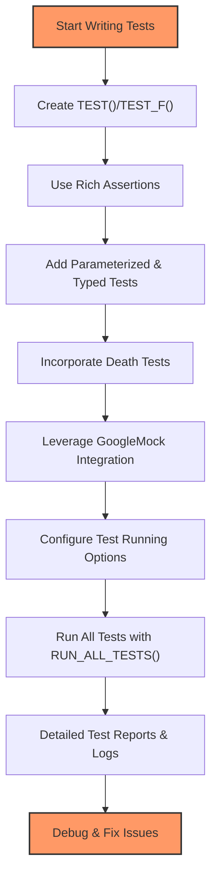

# Key Features At a Glance

GoogleTest gathers a powerful set of capabilities designed to help C++ developers write and maintain robust, readable, and portable tests with ease. This at-a-glance overview highlights the major features that make GoogleTest a flexible and user-friendly testing framework.

---

## Streamlined xUnit-Style Testing

GoogleTest implements the familiar xUnit architecture, where tests are grouped logically and run independently. This design promotes clarity and modularity in your test suites.

- **Test Suites and Tests:** Organize tests by functionality or component using test suites, each containing individual tests.
- **Independent Execution:** Each test runs in isolation to avoid side effects, making debugging straightforward.

> *Example:* Define tests with `TEST()` macros where each test checks a specific functionality, grouped by a descriptive test suite name.

```c++
TEST(MathUtils, HandlesPositiveInput) {
  EXPECT_EQ(Factorial(3), 6);
}
```


## Automatic Test Discovery and Execution

Forget manually enumerating tests. GoogleTest automatically discovers all tests registered via `TEST()` or `TEST_F()`, streamlining your test runs.

- **No Manual Listing:** Tests are registered at compile time.
- **`RUN_ALL_TESTS()` Macro:** Runs every discovered test, ensuring full coverage with a single call.

> *Outcome:* Run your entire suite confidently without missing a single test.


## Rich and Expressive Assertions

Assert your expectations with detailed and versatile macros.

- **Fatal vs. Nonfatal Assertions:** `ASSERT_*` macros stop test execution on failure, while `EXPECT_*` continue to gather multiple failures in one run.
- **Wide Assertion Support:** From simple equality to complex predicates and floating-point comparisons.
- **Custom Failure Messages:** Stream additional info for easier diagnosis.

```c++
ASSERT_EQ(result, expected) << "Calculation failed at index " << i;
```


## Parameterized and Typed Tests

Write a test once, run it with multiple inputs or types for extensive coverage without code duplication.

- **Value-Parameterized Tests (`TEST_P`):** Run tests with various input values easily.
- **Typed Tests (`TYPED_TEST`):** Reuse test logic for different data types.

> *Use case:* Validate algorithms over several data types or parameter combinations efficiently.


## Support for Death Tests

Test your program’s behavior when it crashes or exits abruptly.

- **Ensures Precondition Checks:** Verify critical failure points trigger as expected.
- **Flexible Styles:** Choose between speed or thread safety for death tests.

Example of death test macro usage:

```c++
ASSERT_DEATH({ TriggerCrash(); }, "expected message");
```


## Flexible Test Running Options

Control your testing with powerful built-in features.

- **Selective Execution:** Filter tests by name patterns.
- **Shuffling and Repeating:** Detect flaky tests by running tests in random order or many times.
- **Disabling Tests:** Temporarily exclude problematic tests without removing code.
- **Detailed Output Controls:** Adjust verbosity, colorization, timing info, and output formats.


## Seamless Integration with GoogleMock

GoogleTest fully integrates with GoogleMock for easy mocking and verification in unit tests.

- **Mock Classes:** Define mocks alongside tests for high fidelity testing.
- **Matchers and Expectations:** Fine-tune test behaviors and validate calls.

*Note:* This enriches GoogleTest with advanced mocking capabilities, completing your testing toolbox.

---

## Why These Features Matter

GoogleTest’s comprehensive feature set empowers you to:

- Build clear, maintainable, and portable test suites.
- Rapidly locate and fix bugs with rich failure information.
- Achieve better test coverage efficiently through parameterization.
- Safeguard your code with death tests and controlled assertions.
- Manage large test codebases with flexible running options.
- Leverage robust mocks for complex integration scenarios.


## Next Steps

Start exploring hands-on with [Writing Your First Test](/getting-started/first-steps-validation/write-your-first-test) and dive deeper into features with [Parameterized and Typed Tests](/guides/real-world-usage-and-best-practices/parameterized-and-typed-tests) and [Writing and Using Death Tests](/guides/performance-and-specialized-use-cases/writing-and-using-death-tests).


---

## Additional Resources

- [GoogleTest Primer](docs/primer.md): A comprehensive introduction to writing tests
- [CMake Build Script Overview](googletest/CMakeLists.txt): Details on building GoogleTest
- [Bazel Build Configuration](BUILD.bazel): How to build and link GoogleTest using Bazel
- [Advanced Topics](docs/advanced.md): For mastering assertion techniques and test composition


---

## Diagram: Feature Overview Flow



---

## Practical Tip

When starting out, link your tests with `gtest_main` to avoid writing your own `main()` function. This lets you focus purely on writing tests and be confident GoogleTest handles the rest.


<Note>
Remember to build with C++17 support as GoogleTest requires it and verify compiler options with the `gtest_force_shared_crt` flag on Windows to avoid runtime library mismatches.
</Note>

<Caution>
Avoid mixing shared and static CRT runtimes in your project to prevent subtle crashes, especially on Windows platforms.
</Caution>

---

Harness the full power of GoogleTest’s major features to deliver high-quality, maintainable, and scalable tests in your C++ projects.